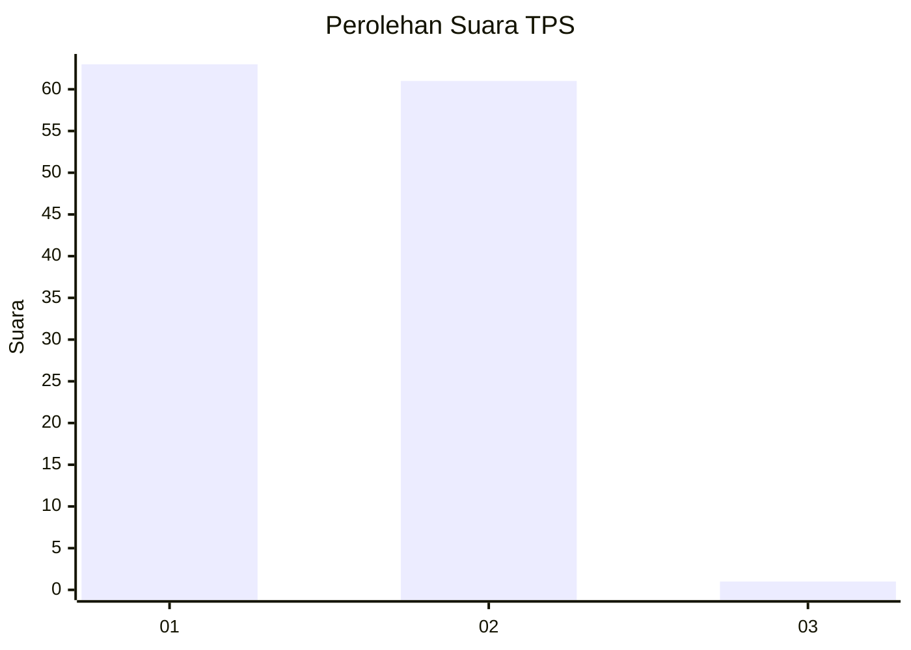
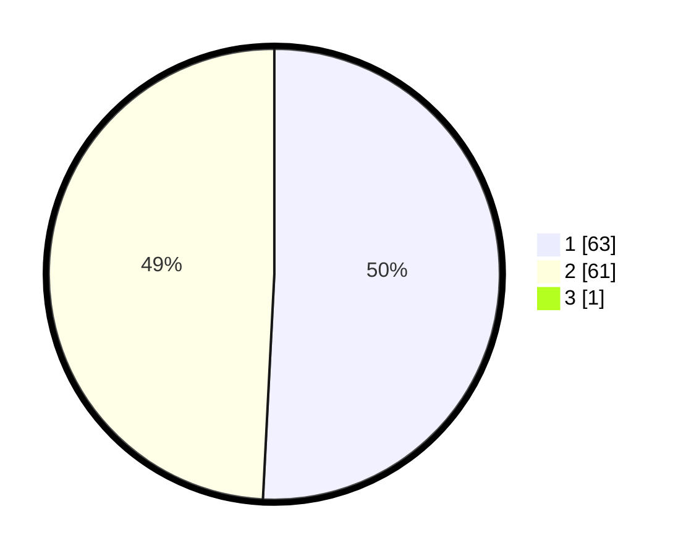

# Hasil

## Grafik

## Tabel

| No. | Nama Paslon    | Suara | Suara (raw) | Persentase |
|:--- |:-------------- | -----:| -----------:| ----------:|
| 1   | ANIES MUHAIMIN | 63    | [63][p-1]   | 50,40      |
| 2   | PRABOWO GIBRAN | 61    | [61][p-2]   | 48,80      |
| 3   | GANJAR MAHFUD  | 1     | [1][p-3]    | 0,80       |

[p-1]: https://github.com/gigit-pemilu/pemilu-2024-11-aceh/blob/main/pilpres/hitung-suara/sub/11-aceh/sub/02-aceh-tenggara/sub/08-lawe-bulan/sub/2023-pulonas-baru/sub/004-tps/sub/paslon-1.txt
[p-2]: https://github.com/gigit-pemilu/pemilu-2024-11-aceh/blob/main/pilpres/hitung-suara/sub/11-aceh/sub/02-aceh-tenggara/sub/08-lawe-bulan/sub/2023-pulonas-baru/sub/004-tps/sub/paslon-2.txt
[p-3]: https://github.com/gigit-pemilu/pemilu-2024-11-aceh/blob/main/pilpres/hitung-suara/sub/11-aceh/sub/02-aceh-tenggara/sub/08-lawe-bulan/sub/2023-pulonas-baru/sub/004-tps/sub/paslon-3.txt

## Foto C Plano

https://sirekap-obj-formc.kpu.go.id/78f3/pemilu/ppwp/11/02/08/20/23/1102082023004-20240214-233338--e3a9cecc-6219-4db6-8472-0d43c6df1782.jpg

https://sirekap-obj-formc.kpu.go.id/78f3/pemilu/ppwp/11/02/08/20/23/1102082023004-20240215-024354--b112ba6e-d0d7-4e8a-b667-2f82284977ce.jpg

https://sirekap-obj-formc.kpu.go.id/78f3/pemilu/ppwp/11/02/08/20/23/1102082023004-20240215-024555--8d843121-f1cc-4b55-8be1-0a343164d79d.jpg

## Metadata

| Key        | Value               |
| ---------- | ------------------- |
| Time Stamp | 2024-02-15 21:30:27 |

