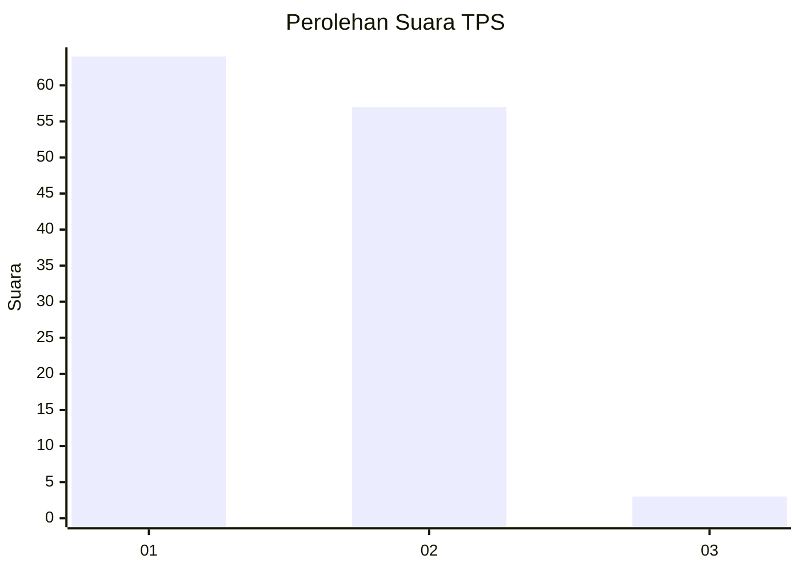
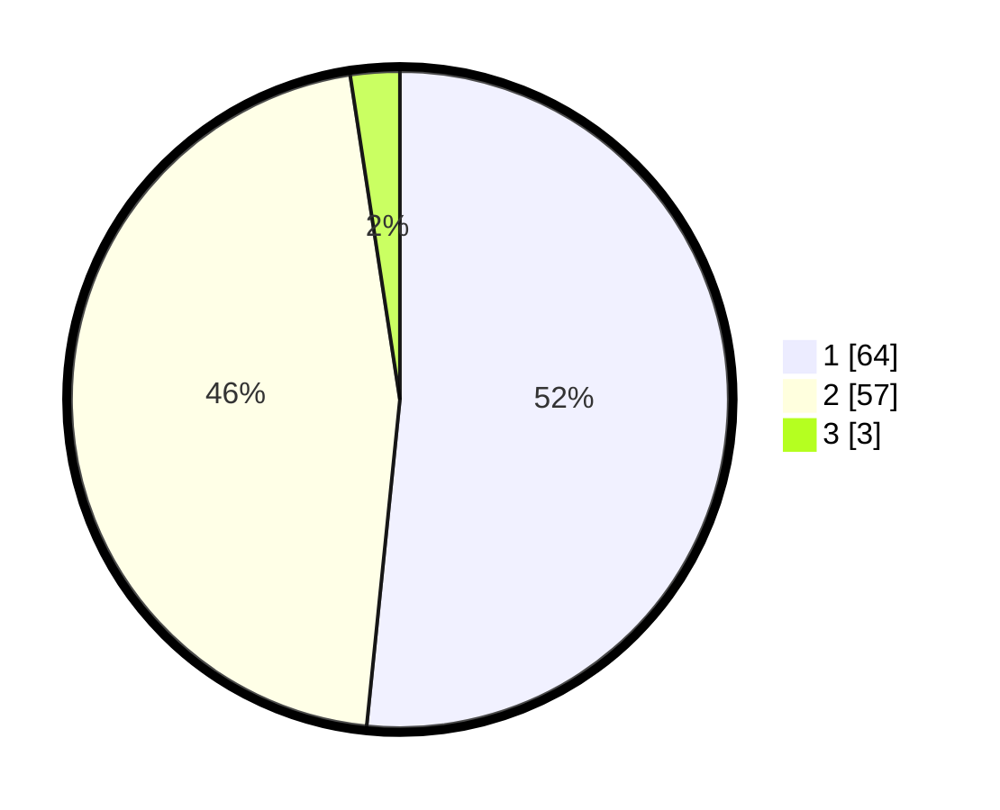

# Hasil

## Grafik

## Tabel

| No. | Nama Paslon    | Suara | Suara (raw) | Persentase |
|:--- |:-------------- | -----:| -----------:| ----------:|
| 1   | ANIES MUHAIMIN | 64    | [64][p-1]   | 51,61      |
| 2   | PRABOWO GIBRAN | 57    | [57][p-2]   | 45,97      |
| 3   | GANJAR MAHFUD  | 3     | [3][p-3]    | 2,42       |

[p-1]: https://github.com/gigit-pemilu/pemilu-2024-11-aceh/blob/main/pilpres/hitung-suara/sub/11-aceh/sub/02-aceh-tenggara/sub/08-lawe-bulan/sub/2023-pulonas-baru/sub/005-tps/sub/paslon-1.txt
[p-2]: https://github.com/gigit-pemilu/pemilu-2024-11-aceh/blob/main/pilpres/hitung-suara/sub/11-aceh/sub/02-aceh-tenggara/sub/08-lawe-bulan/sub/2023-pulonas-baru/sub/005-tps/sub/paslon-2.txt
[p-3]: https://github.com/gigit-pemilu/pemilu-2024-11-aceh/blob/main/pilpres/hitung-suara/sub/11-aceh/sub/02-aceh-tenggara/sub/08-lawe-bulan/sub/2023-pulonas-baru/sub/005-tps/sub/paslon-3.txt

## Foto C Plano

https://sirekap-obj-formc.kpu.go.id/ae09/pemilu/ppwp/11/02/08/20/23/1102082023005-20240214-211113--5868f623-7208-42d7-a15e-4d8763dbc647.jpg

https://sirekap-obj-formc.kpu.go.id/ae09/pemilu/ppwp/11/02/08/20/23/1102082023005-20240214-211936--5ec6f73f-6291-4393-b166-2403ee9b8194.jpg

https://sirekap-obj-formc.kpu.go.id/ae09/pemilu/ppwp/11/02/08/20/23/1102082023005-20240214-211510--3115d64d-8d4e-4e27-a020-954abcffba44.jpg

## Metadata

| Key        | Value               |
| ---------- | ------------------- |
| Time Stamp | 2024-02-15 21:30:27 |

