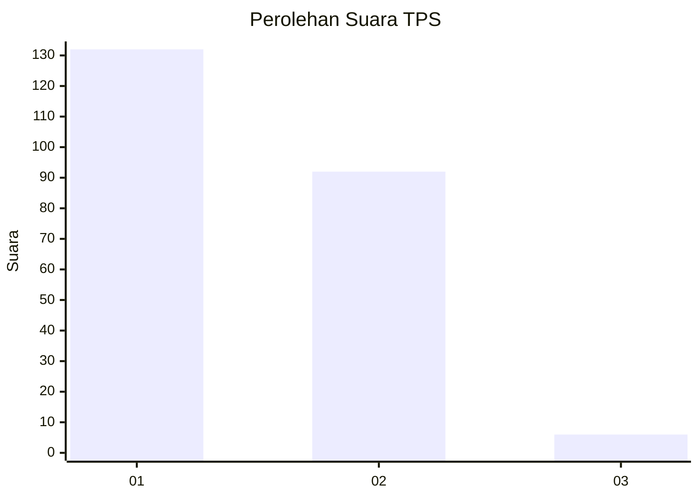
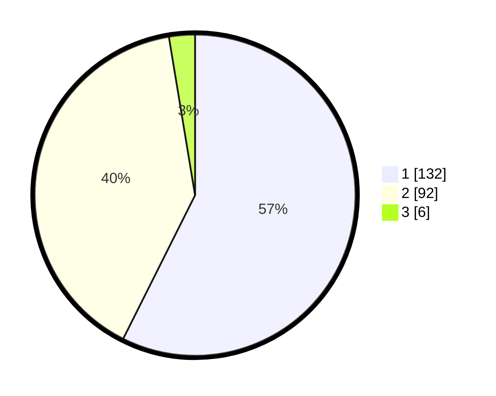

# Hasil

## Grafik

## Tabel

| No. | Nama Paslon    | Suara | Suara (raw) | Persentase |
|:--- |:-------------- | -----:| -----------:| ----------:|
| 1   | ANIES MUHAIMIN | 132   | [132][p-1]  | 57,39      |
| 2   | PRABOWO GIBRAN | 92    | [92][p-2]   | 40,00      |
| 3   | GANJAR MAHFUD  | 6     | [6][p-3]    | 2,61       |

[p-1]: https://github.com/gigit-pemilu/pemilu-2024-11-aceh/blob/main/pilpres/hitung-suara/sub/11-aceh/sub/02-aceh-tenggara/sub/08-lawe-bulan/sub/2025-kuta-genting/sub/001-tps/sub/paslon-1.txt
[p-2]: https://github.com/gigit-pemilu/pemilu-2024-11-aceh/blob/main/pilpres/hitung-suara/sub/11-aceh/sub/02-aceh-tenggara/sub/08-lawe-bulan/sub/2025-kuta-genting/sub/001-tps/sub/paslon-2.txt
[p-3]: https://github.com/gigit-pemilu/pemilu-2024-11-aceh/blob/main/pilpres/hitung-suara/sub/11-aceh/sub/02-aceh-tenggara/sub/08-lawe-bulan/sub/2025-kuta-genting/sub/001-tps/sub/paslon-3.txt

## Foto C Plano

https://sirekap-obj-formc.kpu.go.id/558b/pemilu/ppwp/11/02/08/20/25/1102082025001-20240220-154630--0a118d66-7db3-43ad-b7bc-d5f9f6e3fd62.jpg

https://sirekap-obj-formc.kpu.go.id/558b/pemilu/ppwp/11/02/08/20/25/1102082025001-20240220-154735--a2b4d384-2b11-44ae-96cd-fc846db9164a.jpg

https://sirekap-obj-formc.kpu.go.id/558b/pemilu/ppwp/11/02/08/20/25/1102082025001-20240220-154835--349e8173-4854-474a-99ec-6f9249414e74.jpg

## Metadata

| Key        | Value               |
| ---------- | ------------------- |
| Time Stamp | 2024-02-24 22:31:28 |

