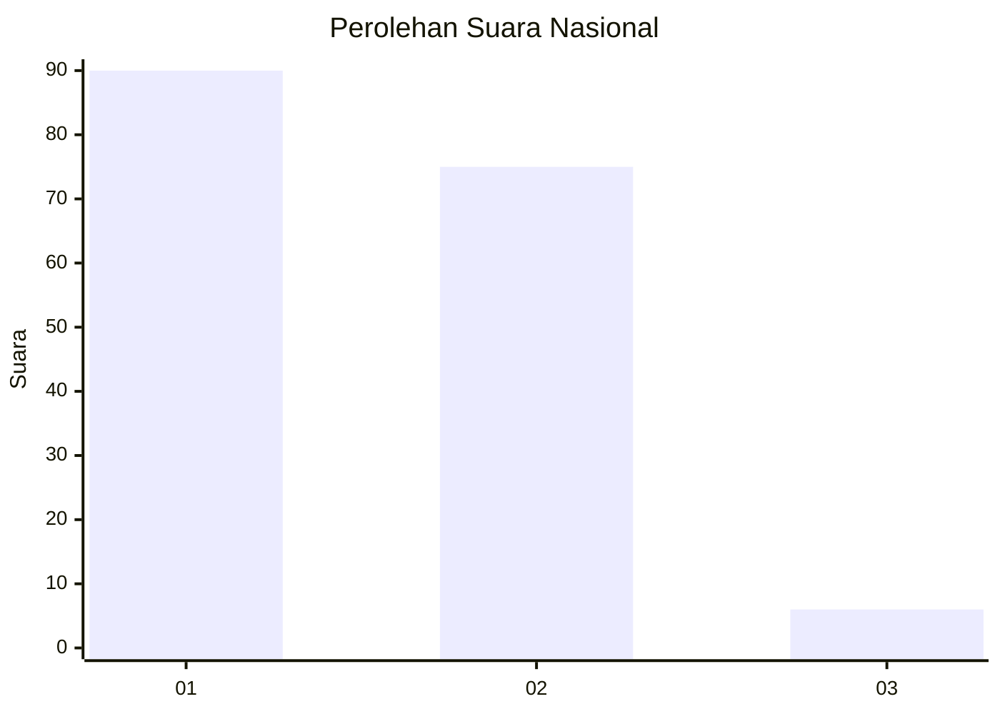
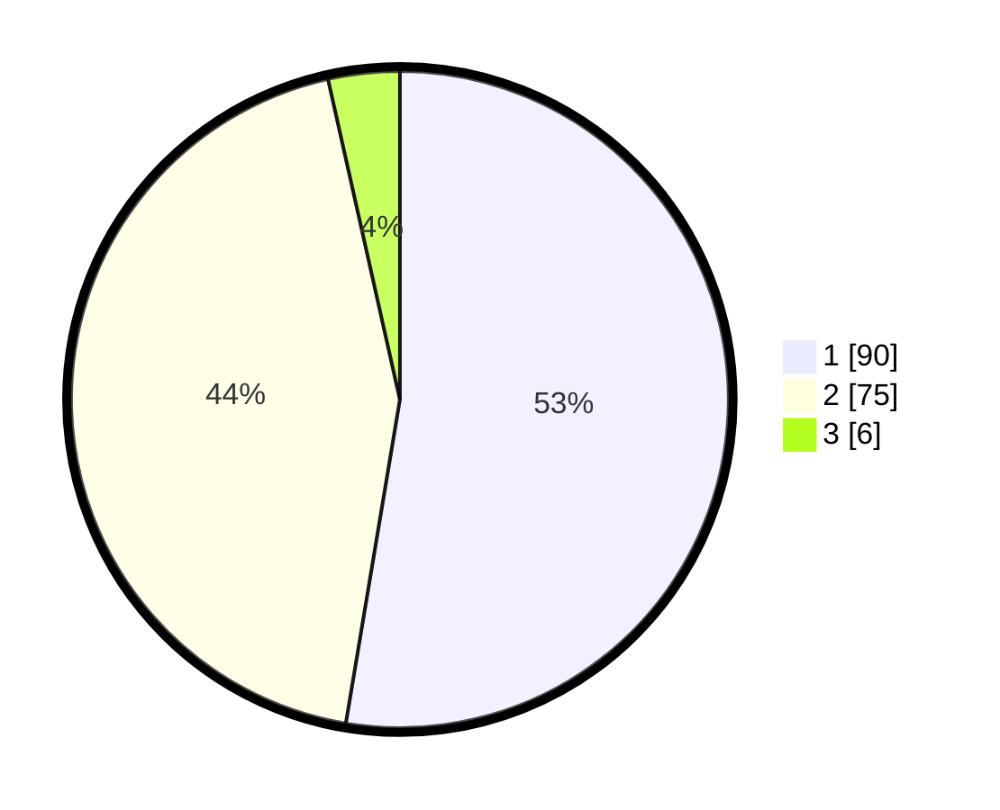

# Hasil

## Grafik

## Tabel

| No. | Nama Paslon    | Suara | Suara (raw) | Persentase |
|:--- |:-------------- | -----:| -----------:| ----------:|
| 1   | ANIES MUHAIMIN | 90    | [90][p-1]   | 52,63      |
| 2   | PRABOWO GIBRAN | 75    | [75][p-2]   | 43,86      |
| 3   | GANJAR MAHFUD  | 6     | [6][p-3]    | 3,51       |

[p-1]: https://github.com/gigit-pemilu/pemilu-2024/blob/main/pilpres/hitung-suara/sub/11-aceh/sub/02-aceh-tenggara/sub/08-lawe-bulan/sub/2026-pangguh/sub/001-tps/sub/paslon-1.txt
[p-2]: https://github.com/gigit-pemilu/pemilu-2024/blob/main/pilpres/hitung-suara/sub/11-aceh/sub/02-aceh-tenggara/sub/08-lawe-bulan/sub/2026-pangguh/sub/001-tps/sub/paslon-2.txt
[p-3]: https://github.com/gigit-pemilu/pemilu-2024/blob/main/pilpres/hitung-suara/sub/11-aceh/sub/02-aceh-tenggara/sub/08-lawe-bulan/sub/2026-pangguh/sub/001-tps/sub/paslon-3.txt

## Foto C Plano

https://sirekap-obj-formc.kpu.go.id/fe3c/pemilu/ppwp/11/02/08/20/26/1102082026001-20240218-100119--f21e21fe-83d3-4d46-a910-a12924c0b71e.jpg

https://sirekap-obj-formc.kpu.go.id/fe3c/pemilu/ppwp/11/02/08/20/26/1102082026001-20240218-100402--1361e2b0-a296-48eb-862b-665e0ff2df18.jpg

https://sirekap-obj-formc.kpu.go.id/fe3c/pemilu/ppwp/11/02/08/20/26/1102082026001-20240218-095242--9074b7b7-e9ff-4c44-a532-fb4ff6de82b2.jpg

## Metadata

| Key        | Value               |
| ---------- | ------------------- |
| Time Stamp | 2024-02-19 11:00:00 |

