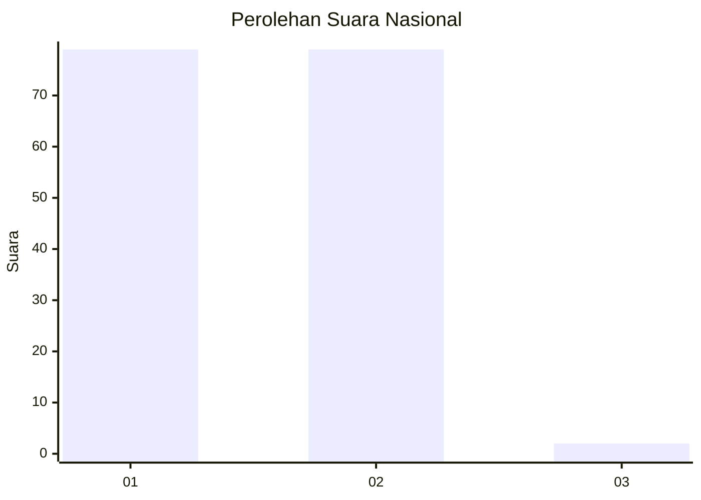
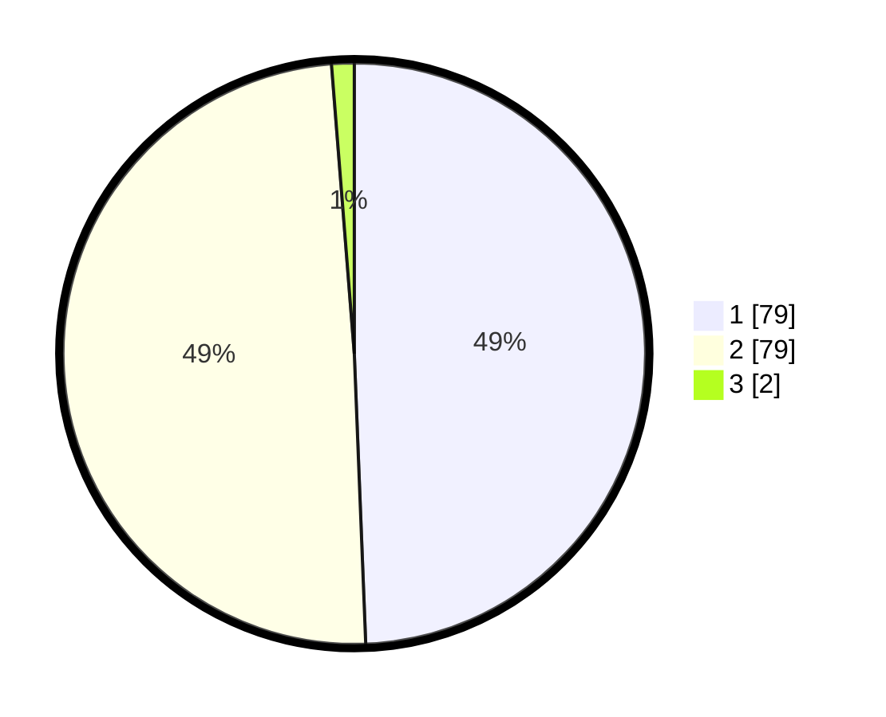

# Hasil

## Grafik

## Tabel

| No. | Nama Paslon    | Suara | Suara (raw) | Persentase |
|:--- |:-------------- | -----:| -----------:| ----------:|
| 1   | ANIES MUHAIMIN | 79    | [79][p-1]   | 49,38      |
| 2   | PRABOWO GIBRAN | 79    | [79][p-2]   | 49,38      |
| 3   | GANJAR MAHFUD  | 2     | [2][p-3]    | 1,25       |

[p-1]: https://github.com/gigit-pemilu/pemilu-2024/blob/main/pilpres/hitung-suara/sub/11-aceh/sub/02-aceh-tenggara/sub/08-lawe-bulan/sub/2026-pangguh/sub/002-tps/sub/paslon-1.txt
[p-2]: https://github.com/gigit-pemilu/pemilu-2024/blob/main/pilpres/hitung-suara/sub/11-aceh/sub/02-aceh-tenggara/sub/08-lawe-bulan/sub/2026-pangguh/sub/002-tps/sub/paslon-2.txt
[p-3]: https://github.com/gigit-pemilu/pemilu-2024/blob/main/pilpres/hitung-suara/sub/11-aceh/sub/02-aceh-tenggara/sub/08-lawe-bulan/sub/2026-pangguh/sub/002-tps/sub/paslon-3.txt

## Foto C Plano

https://sirekap-obj-formc.kpu.go.id/6a79/pemilu/ppwp/11/02/08/20/26/1102082026002-20240217-224721--f9355dd6-4abc-4305-aeff-68304ceb05cd.jpg

https://sirekap-obj-formc.kpu.go.id/6a79/pemilu/ppwp/11/02/08/20/26/1102082026002-20240217-230942--81eb99ae-eea0-44d0-a6e3-3e7173a942d8.jpg

## Metadata

| Key        | Value               |
| ---------- | ------------------- |
| Time Stamp | 2024-02-19 12:00:00 |

