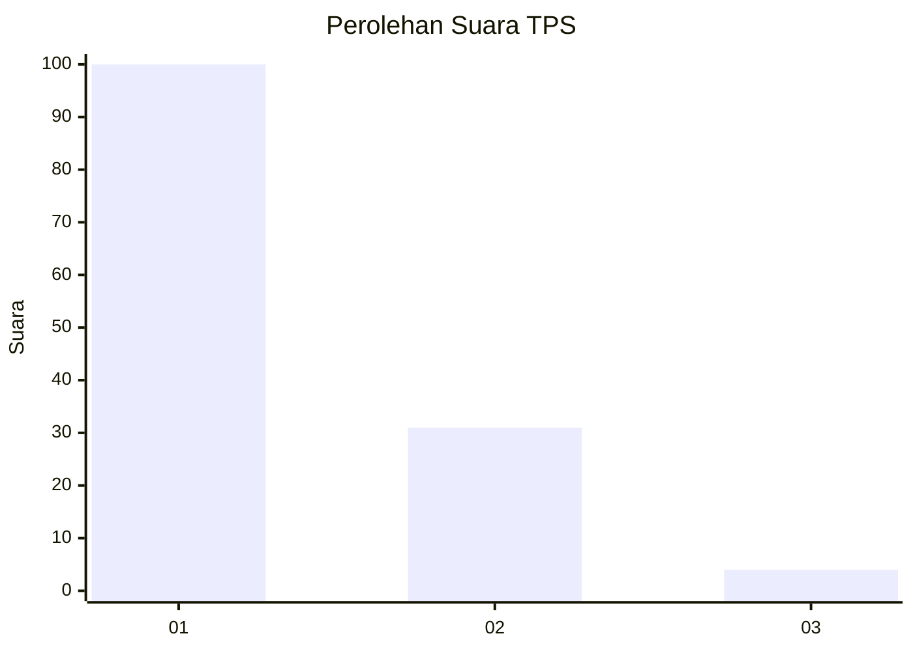
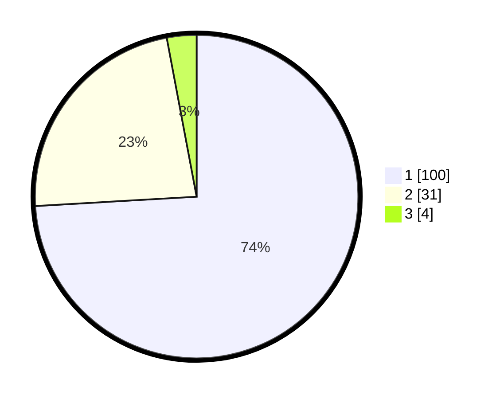

# Hasil

## Grafik

## Tabel

| No. | Nama Paslon    | Suara | Suara (raw) | Persentase |
|:--- |:-------------- | -----:| -----------:| ----------:|
| 1   | ANIES MUHAIMIN | 100   | [100][p-1]  | 74,07      |
| 2   | PRABOWO GIBRAN | 31    | [31][p-2]   | 22,96      |
| 3   | GANJAR MAHFUD  | 4     | [4][p-3]    | 2,96       |

[p-1]: https://github.com/gigit-pemilu/pemilu-2024-11-aceh/blob/main/pilpres/hitung-suara/sub/11-aceh/sub/02-aceh-tenggara/sub/08-lawe-bulan/sub/2027-lawe-sagu/sub/001-tps/sub/paslon-1.txt
[p-2]: https://github.com/gigit-pemilu/pemilu-2024-11-aceh/blob/main/pilpres/hitung-suara/sub/11-aceh/sub/02-aceh-tenggara/sub/08-lawe-bulan/sub/2027-lawe-sagu/sub/001-tps/sub/paslon-2.txt
[p-3]: https://github.com/gigit-pemilu/pemilu-2024-11-aceh/blob/main/pilpres/hitung-suara/sub/11-aceh/sub/02-aceh-tenggara/sub/08-lawe-bulan/sub/2027-lawe-sagu/sub/001-tps/sub/paslon-3.txt

## Foto C Plano

https://sirekap-obj-formc.kpu.go.id/1617/pemilu/ppwp/11/02/08/20/27/1102082027001-20240217-205403--95058d63-44fe-4187-81f5-09b5ce08f218.jpg

https://sirekap-obj-formc.kpu.go.id/1617/pemilu/ppwp/11/02/08/20/27/1102082027001-20240217-205122--02d0db08-fcd8-4700-9b8b-80c4fd4a8b90.jpg

https://sirekap-obj-formc.kpu.go.id/1617/pemilu/ppwp/11/02/08/20/27/1102082027001-20240217-205459--8e8f00b8-1497-4ccc-ad4e-5b555e6784f1.jpg

## Metadata

| Key        | Value               |
| ---------- | ------------------- |
| Time Stamp | 2024-02-24 22:31:28 |

