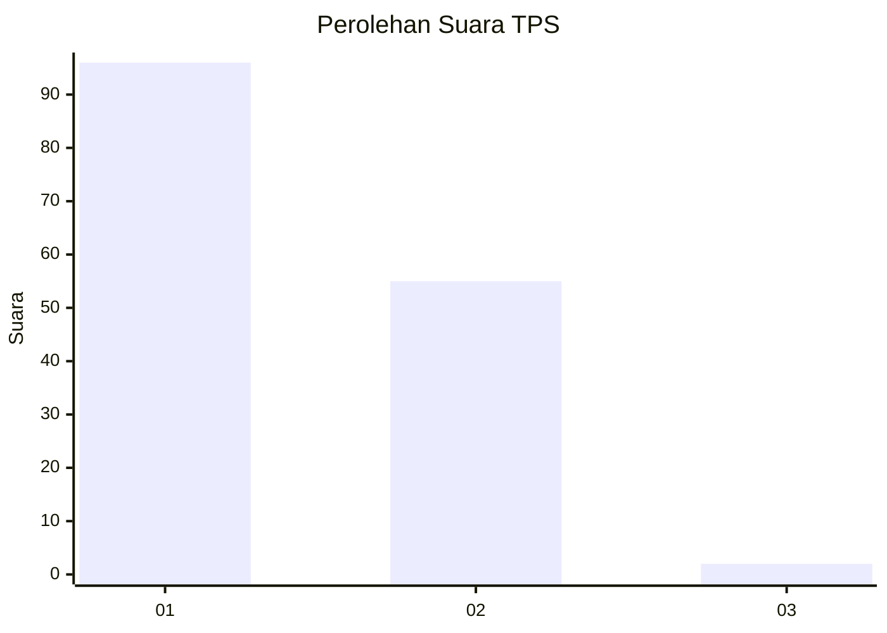
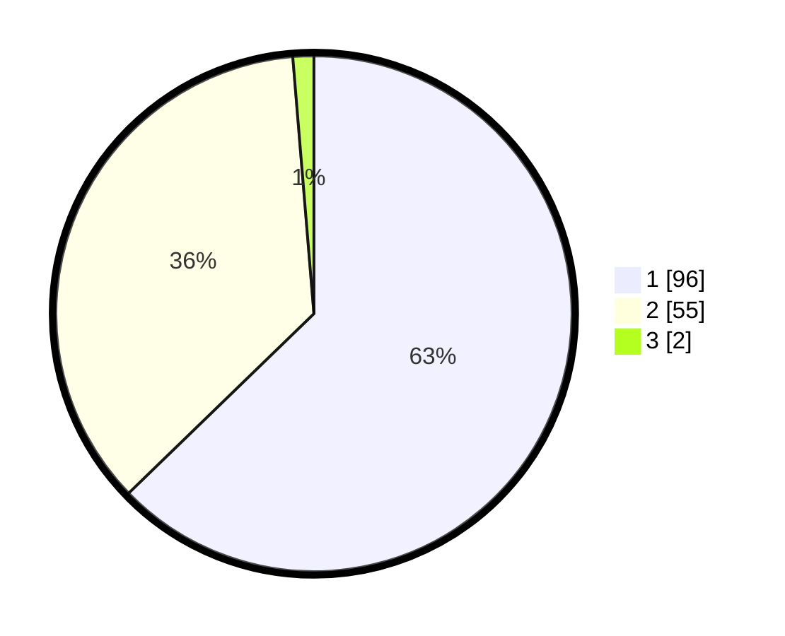

# Hasil

## Grafik

## Tabel

| No. | Nama Paslon    | Suara | Suara (raw) | Persentase |
|:--- |:-------------- | -----:| -----------:| ----------:|
| 1   | ANIES MUHAIMIN | 96    | [96][p-1]   | 62,75      |
| 2   | PRABOWO GIBRAN | 55    | [55][p-2]   | 35,95      |
| 3   | GANJAR MAHFUD  | 2     | [2][p-3]    | 1,31       |

[p-1]: https://github.com/gigit-pemilu/pemilu-2024-11-aceh/blob/main/pilpres/hitung-suara/sub/11-aceh/sub/02-aceh-tenggara/sub/08-lawe-bulan/sub/2027-lawe-sagu/sub/002-tps/sub/paslon-1.txt
[p-2]: https://github.com/gigit-pemilu/pemilu-2024-11-aceh/blob/main/pilpres/hitung-suara/sub/11-aceh/sub/02-aceh-tenggara/sub/08-lawe-bulan/sub/2027-lawe-sagu/sub/002-tps/sub/paslon-2.txt
[p-3]: https://github.com/gigit-pemilu/pemilu-2024-11-aceh/blob/main/pilpres/hitung-suara/sub/11-aceh/sub/02-aceh-tenggara/sub/08-lawe-bulan/sub/2027-lawe-sagu/sub/002-tps/sub/paslon-3.txt

## Foto C Plano

https://sirekap-obj-formc.kpu.go.id/ad0f/pemilu/ppwp/11/02/08/20/27/1102082027002-20240217-205517--826449c9-46d8-49ec-a104-fb82ae288c36.jpg

https://sirekap-obj-formc.kpu.go.id/ad0f/pemilu/ppwp/11/02/08/20/27/1102082027002-20240217-205605--fb32d45c-60c8-4b9d-8352-4de93db87532.jpg

https://sirekap-obj-formc.kpu.go.id/ad0f/pemilu/ppwp/11/02/08/20/27/1102082027002-20240217-205629--607fe39d-8bab-406b-97a4-7ff0713bcbe5.jpg

## Metadata

| Key        | Value               |
| ---------- | ------------------- |
| Time Stamp | 2024-02-25 17:00:00 |

