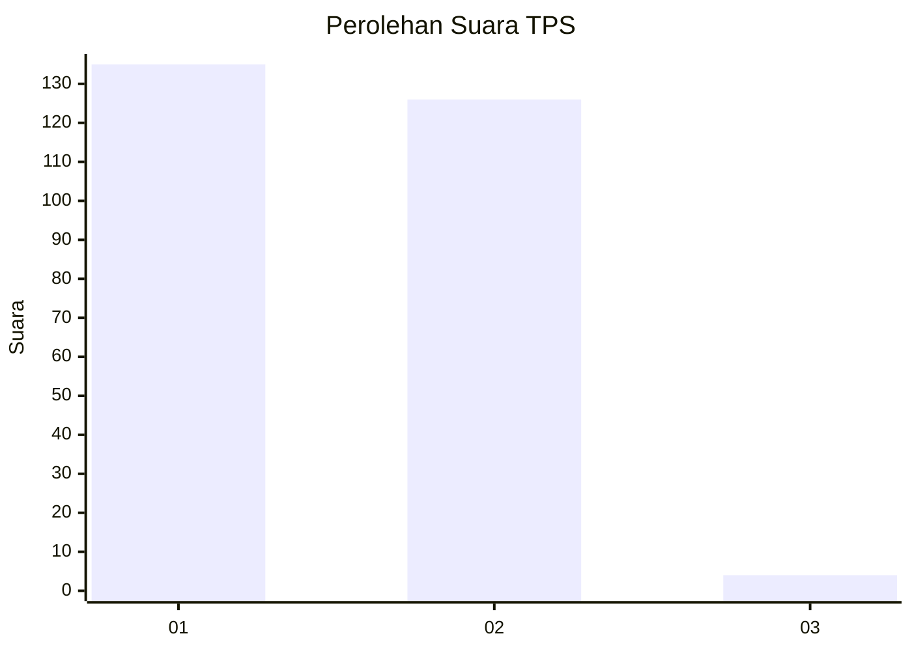
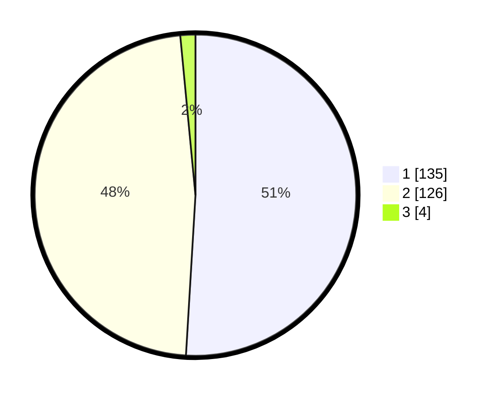

# Hasil

## Grafik

## Tabel

| No. | Nama Paslon    | Suara | Suara (raw) | Persentase |
|:--- |:-------------- | -----:| -----------:| ----------:|
| 1   | ANIES MUHAIMIN | 135   | [135][p-1]  | 50,94      |
| 2   | PRABOWO GIBRAN | 126   | [126][p-2]  | 47,55      |
| 3   | GANJAR MAHFUD  | 4     | [4][p-3]    | 1,51       |

[p-1]: https://github.com/gigit-pemilu/pemilu-2024-11-aceh/blob/main/pilpres/hitung-suara/sub/11-aceh/sub/02-aceh-tenggara/sub/08-lawe-bulan/sub/2028-pekhapet-timur/sub/001-tps/sub/paslon-1.txt
[p-2]: https://github.com/gigit-pemilu/pemilu-2024-11-aceh/blob/main/pilpres/hitung-suara/sub/11-aceh/sub/02-aceh-tenggara/sub/08-lawe-bulan/sub/2028-pekhapet-timur/sub/001-tps/sub/paslon-2.txt
[p-3]: https://github.com/gigit-pemilu/pemilu-2024-11-aceh/blob/main/pilpres/hitung-suara/sub/11-aceh/sub/02-aceh-tenggara/sub/08-lawe-bulan/sub/2028-pekhapet-timur/sub/001-tps/sub/paslon-3.txt

## Foto C Plano

https://sirekap-obj-formc.kpu.go.id/8337/pemilu/ppwp/11/02/08/20/28/1102082028001-20240218-160018--0934fa10-ada7-4d43-a9c2-5e6bf8fd5755.jpg

https://sirekap-obj-formc.kpu.go.id/8337/pemilu/ppwp/11/02/08/20/28/1102082028001-20240218-155845--4e19da2d-bed8-49a2-833f-f4a854a9dbf3.jpg

https://sirekap-obj-formc.kpu.go.id/8337/pemilu/ppwp/11/02/08/20/28/1102082028001-20240218-155811--0bd724da-8bd8-4a4d-8432-d7c9684053de.jpg

## Metadata

| Key        | Value               |
| ---------- | ------------------- |
| Time Stamp | 2024-02-24 22:31:28 |

