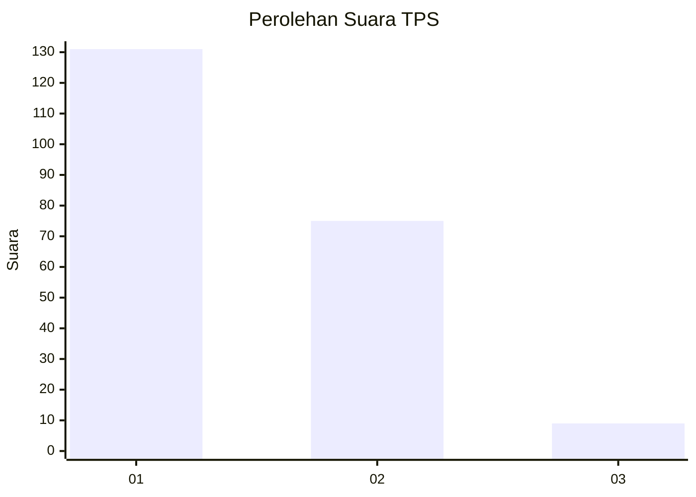
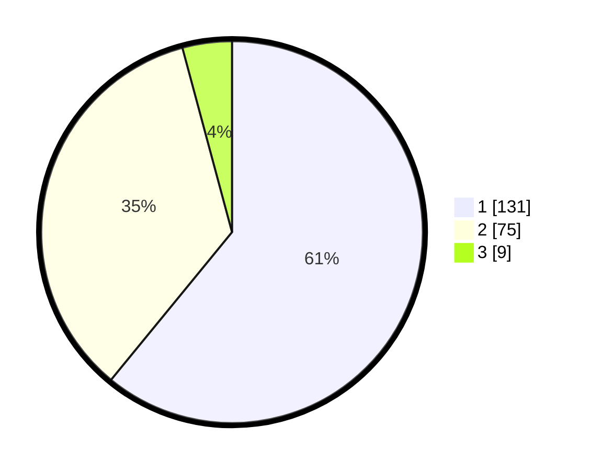

# Hasil

## Grafik

## Tabel

| No. | Nama Paslon    | Suara | Suara (raw) | Persentase |
|:--- |:-------------- | -----:| -----------:| ----------:|
| 1   | ANIES MUHAIMIN | 131   | [131][p-1]  | 60,93      |
| 2   | PRABOWO GIBRAN | 75    | [75][p-2]   | 34,88      |
| 3   | GANJAR MAHFUD  | 9     | [9][p-3]    | 4,19       |

[p-1]: https://github.com/gigit-pemilu/pemilu-2024-11-aceh/blob/main/pilpres/hitung-suara/sub/11-aceh/sub/02-aceh-tenggara/sub/08-lawe-bulan/sub/2029-bahagia/sub/001-tps/sub/paslon-1.txt
[p-2]: https://github.com/gigit-pemilu/pemilu-2024-11-aceh/blob/main/pilpres/hitung-suara/sub/11-aceh/sub/02-aceh-tenggara/sub/08-lawe-bulan/sub/2029-bahagia/sub/001-tps/sub/paslon-2.txt
[p-3]: https://github.com/gigit-pemilu/pemilu-2024-11-aceh/blob/main/pilpres/hitung-suara/sub/11-aceh/sub/02-aceh-tenggara/sub/08-lawe-bulan/sub/2029-bahagia/sub/001-tps/sub/paslon-3.txt

## Foto C Plano

https://sirekap-obj-formc.kpu.go.id/9d9f/pemilu/ppwp/11/02/08/20/29/1102082029001-20240218-225644--76534cc5-3d0c-43da-9d8d-ea29cce41e93.jpg

https://sirekap-obj-formc.kpu.go.id/9d9f/pemilu/ppwp/11/02/08/20/29/1102082029001-20240218-225817--2499e551-5c46-475f-a993-583bfcb20205.jpg

https://sirekap-obj-formc.kpu.go.id/9d9f/pemilu/ppwp/11/02/08/20/29/1102082029001-20240219-164134--cf439a85-5cb1-4afb-ac07-61b4face0d75.jpg

## Metadata

| Key        | Value               |
| ---------- | ------------------- |
| Time Stamp | 2024-02-24 22:31:28 |

