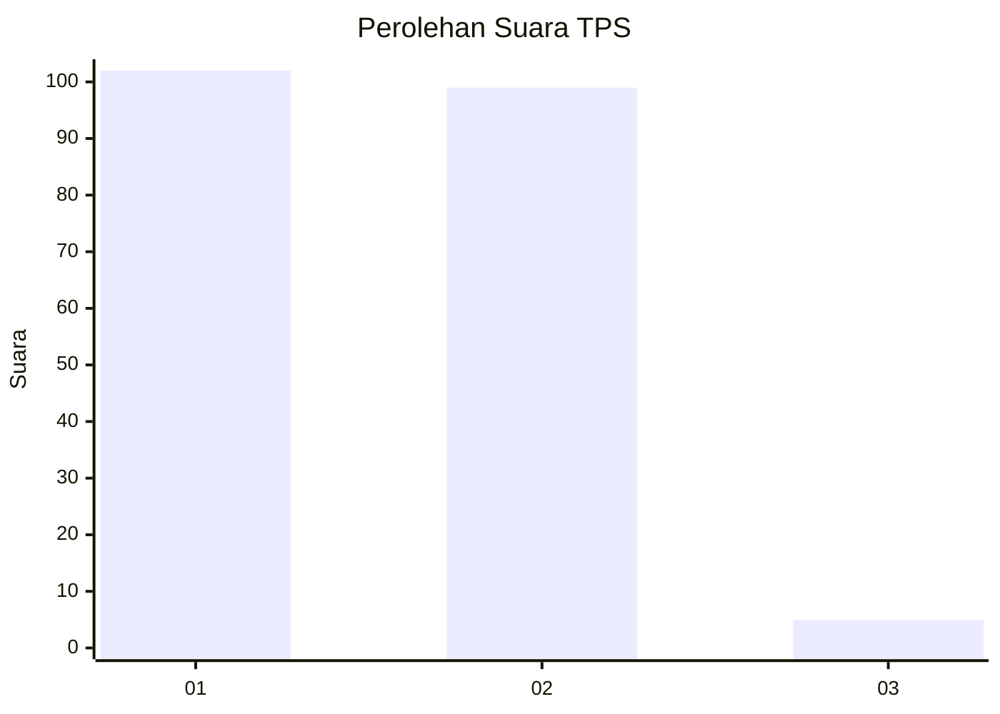
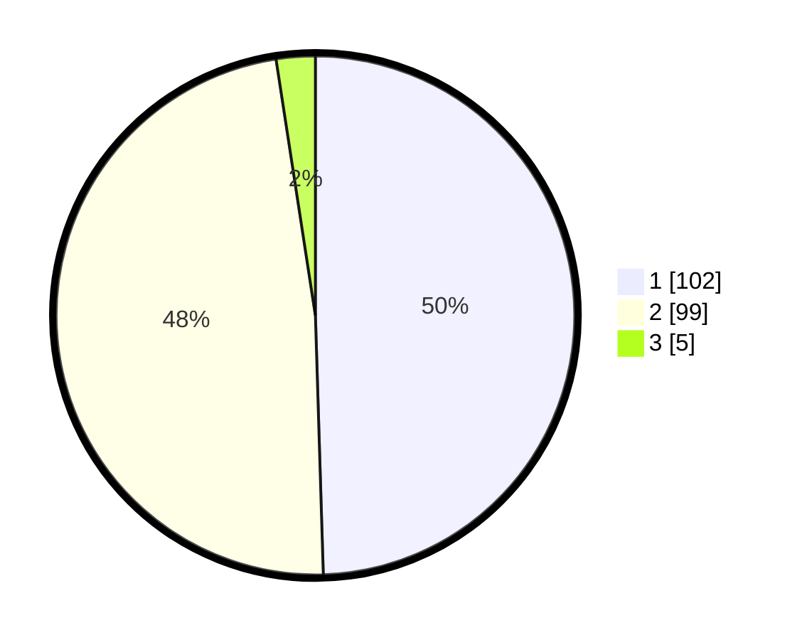

# Hasil

## Grafik

## Tabel

| No. | Nama Paslon    | Suara | Suara (raw) | Persentase |
|:--- |:-------------- | -----:| -----------:| ----------:|
| 1   | ANIES MUHAIMIN | 102   | [102][p-1]  | 49,51      |
| 2   | PRABOWO GIBRAN | 99    | [99][p-2]   | 48,06      |
| 3   | GANJAR MAHFUD  | 5     | [5][p-3]    | 2,43       |

[p-1]: https://github.com/gigit-pemilu/pemilu-2024-11-aceh/blob/main/pilpres/hitung-suara/sub/11-aceh/sub/02-aceh-tenggara/sub/08-lawe-bulan/sub/2030-kute-galuh-asli/sub/002-tps/sub/paslon-1.txt
[p-2]: https://github.com/gigit-pemilu/pemilu-2024-11-aceh/blob/main/pilpres/hitung-suara/sub/11-aceh/sub/02-aceh-tenggara/sub/08-lawe-bulan/sub/2030-kute-galuh-asli/sub/002-tps/sub/paslon-2.txt
[p-3]: https://github.com/gigit-pemilu/pemilu-2024-11-aceh/blob/main/pilpres/hitung-suara/sub/11-aceh/sub/02-aceh-tenggara/sub/08-lawe-bulan/sub/2030-kute-galuh-asli/sub/002-tps/sub/paslon-3.txt

## Foto C Plano

https://sirekap-obj-formc.kpu.go.id/110c/pemilu/ppwp/11/02/08/20/30/1102082030002-20240221-215945--717a7f70-97d7-41bd-bc84-f56dc926ec51.jpg

https://sirekap-obj-formc.kpu.go.id/110c/pemilu/ppwp/11/02/08/20/30/1102082030002-20240221-220035--62409287-71e1-435f-bf98-d017876c24bf.jpg

https://sirekap-obj-formc.kpu.go.id/110c/pemilu/ppwp/11/02/08/20/30/1102082030002-20240221-220224--5dc46e2c-1335-4aaa-93c8-e3a2b36574f1.jpg

## Metadata

| Key        | Value               |
| ---------- | ------------------- |
| Time Stamp | 2024-02-24 22:31:28 |

