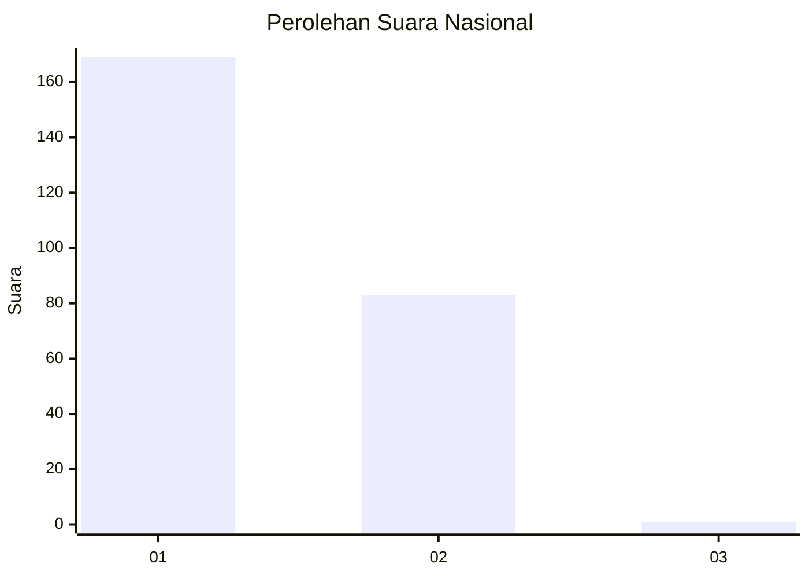
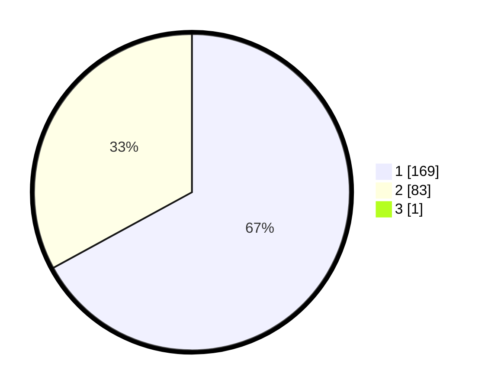

# Hasil

## Grafik

## Tabel

| No. | Nama Paslon    | Suara | Suara (raw) | Persentase |
|:--- |:-------------- | -----:| -----------:| ----------:|
| 1   | ANIES MUHAIMIN | 169   | [169][p-1]  | 66,80      |
| 2   | PRABOWO GIBRAN | 83    | [83][p-2]   | 32,81      |
| 3   | GANJAR MAHFUD  | 1     | [1][p-3]    | 0,40       |

[p-1]: https://github.com/gigit-pemilu/pemilu-2024/blob/main/pilpres/hitung-suara/sub/11-aceh/sub/02-aceh-tenggara/sub/09-bukit-tusam/sub/2002-kute-lengat-selian/sub/001-tps/sub/paslon-1.txt
[p-2]: https://github.com/gigit-pemilu/pemilu-2024/blob/main/pilpres/hitung-suara/sub/11-aceh/sub/02-aceh-tenggara/sub/09-bukit-tusam/sub/2002-kute-lengat-selian/sub/001-tps/sub/paslon-2.txt
[p-3]: https://github.com/gigit-pemilu/pemilu-2024/blob/main/pilpres/hitung-suara/sub/11-aceh/sub/02-aceh-tenggara/sub/09-bukit-tusam/sub/2002-kute-lengat-selian/sub/001-tps/sub/paslon-3.txt

## Foto C Plano

https://sirekap-obj-formc.kpu.go.id/78a8/pemilu/ppwp/11/02/09/20/02/1102092002001-20240216-190001--baa2f4c9-4470-46a7-a484-ee8242d1ae72.jpg

https://sirekap-obj-formc.kpu.go.id/78a8/pemilu/ppwp/11/02/09/20/02/1102092002001-20240216-190002--4cf682fe-403a-4c94-a970-cdd250d9be84.jpg

https://sirekap-obj-formc.kpu.go.id/78a8/pemilu/ppwp/11/02/09/20/02/1102092002001-20240216-190002--33d701a8-eb16-4d1d-9d53-608a8bb5fad3.jpg

## Metadata

| Key        | Value               |
| ---------- | ------------------- |
| Time Stamp | 2024-02-21 16:00:00 |

## DATA PEMILIH TETAP

Jumlah pemilih dalam DPT: **265**.
 * L: **115**.
 * P: **150**.

## DATA PENGGUNA HAK PILIH

Jumlah pengguna hak pilih dalam DPT: **248**.
 * L: **113**.
 * P: **135**.

Jumlah pengguna hak pilih dalam DPTb: **0**.
 * L: **0**.
 * P: **0**.

Jumlah pengguna hak pilih dalam DPK: **5**.
 * L: **1**.
 * P: **4**.

Jumlah pengguna hak pilih: **253**.
 * L: **114**.
 * P: **139**.

## JUMLAH SUARA SAH DAN TIDAK SAH

JUMLAH SELURUH SUARA SAH: **253**.

JUMLAH SUARA TIDAK SAH: **0**.

JUMLAH SELURUH SUARA SAH DAN SUARA TIDAK SAH: **253**.

