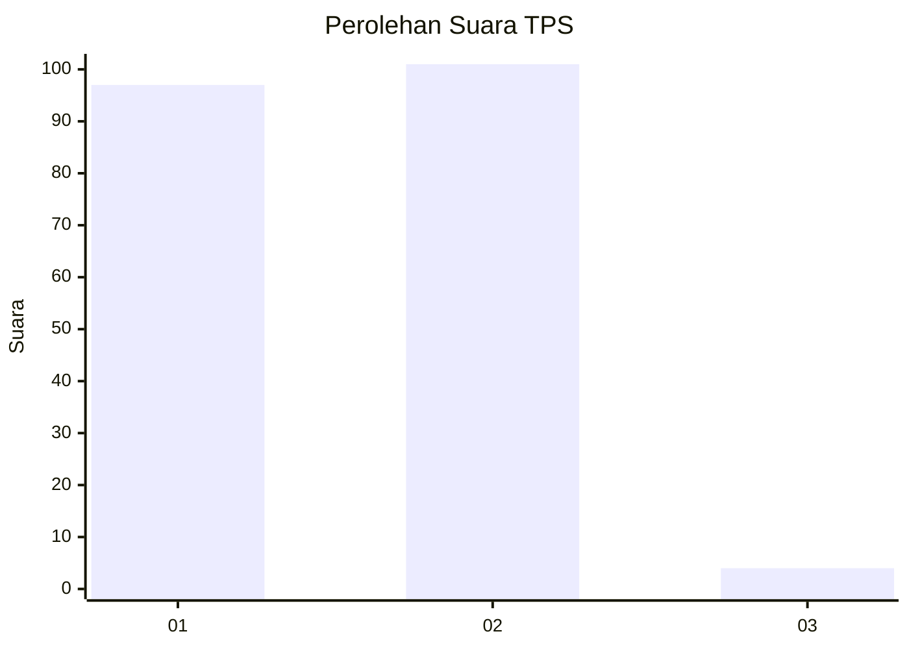
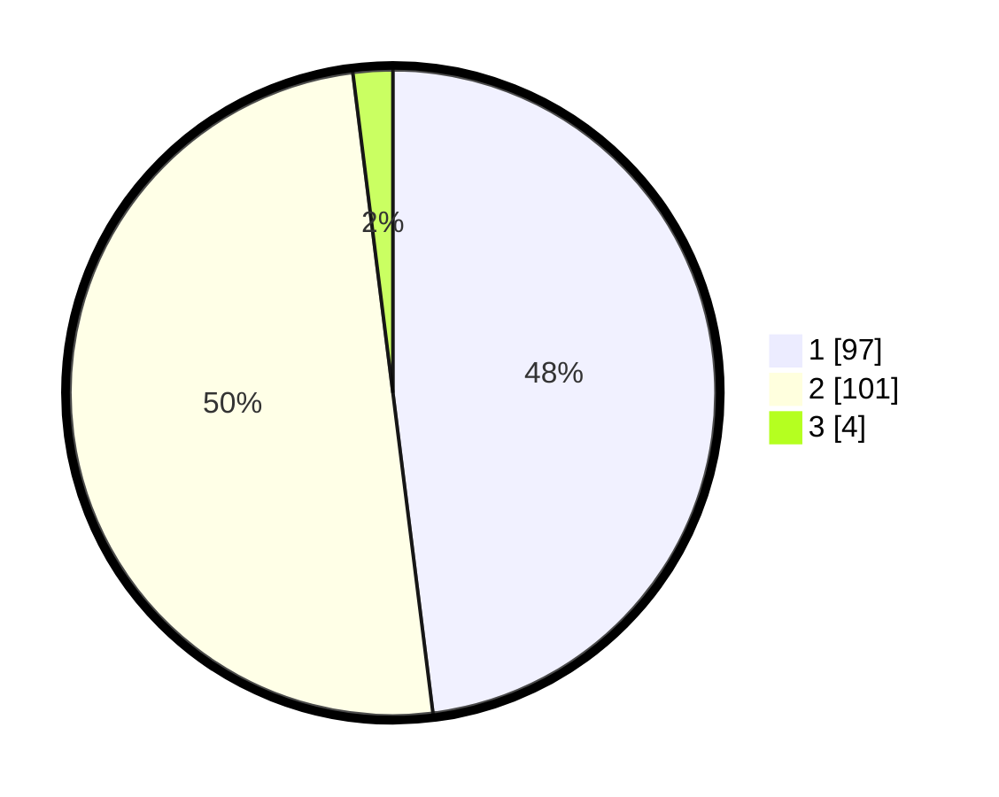

# Hasil

## Grafik

## Tabel

| No. | Nama Paslon    | Suara | Suara (raw) | Persentase |
|:--- |:-------------- | -----:| -----------:| ----------:|
| 1   | ANIES MUHAIMIN | 97    | [97][p-1]   | 48,02      |
| 2   | PRABOWO GIBRAN | 101   | [101][p-2]  | 50,00      |
| 3   | GANJAR MAHFUD  | 4     | [4][p-3]    | 1,98       |

[p-1]: https://github.com/gigit-pemilu/pemilu-2024-11-aceh/blob/main/pilpres/hitung-suara/sub/11-aceh/sub/02-aceh-tenggara/sub/09-bukit-tusam/sub/2003-tualang-baru/sub/001-tps/sub/paslon-1.txt
[p-2]: https://github.com/gigit-pemilu/pemilu-2024-11-aceh/blob/main/pilpres/hitung-suara/sub/11-aceh/sub/02-aceh-tenggara/sub/09-bukit-tusam/sub/2003-tualang-baru/sub/001-tps/sub/paslon-2.txt
[p-3]: https://github.com/gigit-pemilu/pemilu-2024-11-aceh/blob/main/pilpres/hitung-suara/sub/11-aceh/sub/02-aceh-tenggara/sub/09-bukit-tusam/sub/2003-tualang-baru/sub/001-tps/sub/paslon-3.txt

## Foto C Plano

https://sirekap-obj-formc.kpu.go.id/60bb/pemilu/ppwp/11/02/09/20/03/1102092003001-20240221-114952--70ef89e1-40f7-44fb-878d-e8ee362feeef.jpg

https://sirekap-obj-formc.kpu.go.id/60bb/pemilu/ppwp/11/02/09/20/03/1102092003001-20240221-114954--c7ebee48-5ff7-43c3-922a-8cfa8a8c97b2.jpg

https://sirekap-obj-formc.kpu.go.id/60bb/pemilu/ppwp/11/02/09/20/03/1102092003001-20240221-114953--a35a32c5-6550-47a2-9e42-1f763ca0742e.jpg

## Metadata

| Key        | Value               |
| ---------- | ------------------- |
| Time Stamp | 2024-02-24 22:31:28 |

## DATA PEMILIH TETAP

Jumlah pemilih dalam DPT: **252**.
 * L: **123**.
 * P: **129**.

## DATA PENGGUNA HAK PILIH

Jumlah pengguna hak pilih dalam DPT: **201**.
 * L: **100**.
 * P: **101**.

Jumlah pengguna hak pilih dalam DPTb: **0**.
 * L: **0**.
 * P: **0**.

Jumlah pengguna hak pilih dalam DPK: **4**.
 * L: **3**.
 * P: **1**.

Jumlah pengguna hak pilih: **205**.
 * L: **103**.
 * P: **102**.

## JUMLAH SUARA SAH DAN TIDAK SAH

JUMLAH SELURUH SUARA SAH: **202**.

JUMLAH SUARA TIDAK SAH: **3**.

JUMLAH SELURUH SUARA SAH DAN SUARA TIDAK SAH: **205**.

