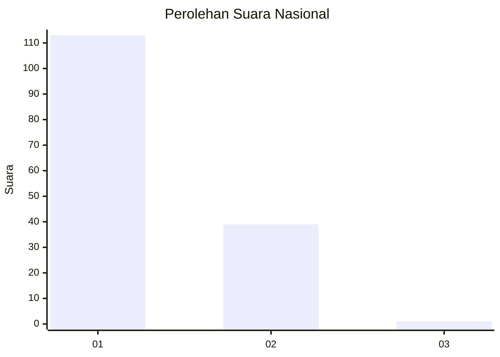
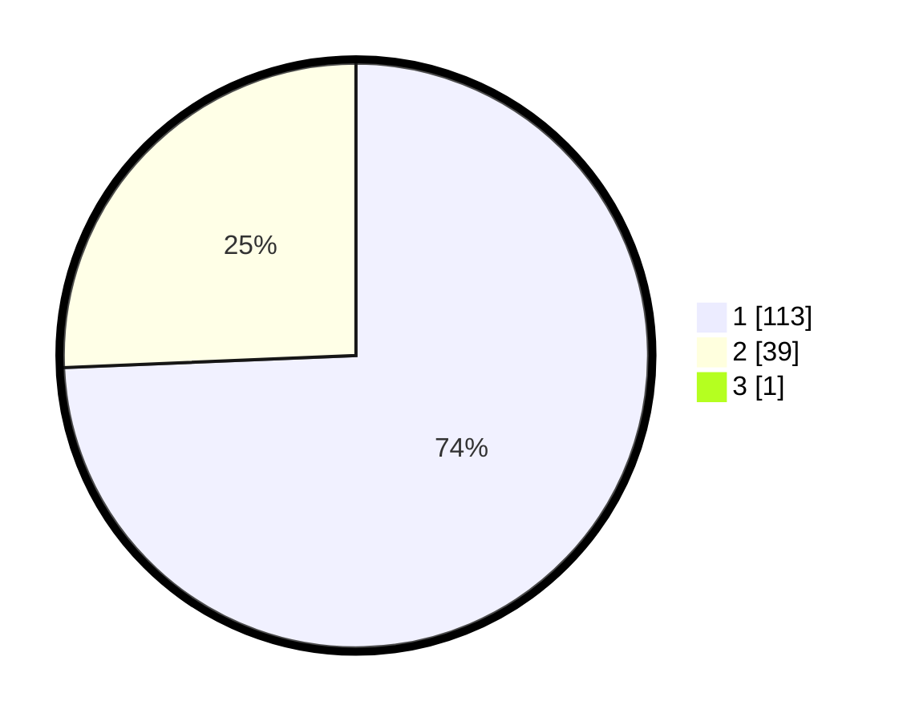

# Hasil

## Grafik

## Tabel

| No. | Nama Paslon    | Suara | Suara (raw) | Persentase |
|:--- |:-------------- | -----:| -----------:| ----------:|
| 1   | ANIES MUHAIMIN | 113   | [113][p-1]  | 73,86      |
| 2   | PRABOWO GIBRAN | 39    | [39][p-2]   | 25,49      |
| 3   | GANJAR MAHFUD  | 1     | [1][p-3]    | 0,65       |

[p-1]: https://github.com/gigit-pemilu/pemilu-2024/blob/main/pilpres/hitung-suara/sub/11-aceh/sub/02-aceh-tenggara/sub/09-bukit-tusam/sub/2004-alur-buluh/sub/001-tps/sub/paslon-1.txt
[p-2]: https://github.com/gigit-pemilu/pemilu-2024/blob/main/pilpres/hitung-suara/sub/11-aceh/sub/02-aceh-tenggara/sub/09-bukit-tusam/sub/2004-alur-buluh/sub/001-tps/sub/paslon-2.txt
[p-3]: https://github.com/gigit-pemilu/pemilu-2024/blob/main/pilpres/hitung-suara/sub/11-aceh/sub/02-aceh-tenggara/sub/09-bukit-tusam/sub/2004-alur-buluh/sub/001-tps/sub/paslon-3.txt

## Foto C Plano

https://sirekap-obj-formc.kpu.go.id/fefc/pemilu/ppwp/11/02/09/20/04/1102092004001-20240222-083718--516adeb7-1f7c-4ad5-82d5-dc14d2b451f6.jpg

https://sirekap-obj-formc.kpu.go.id/fefc/pemilu/ppwp/11/02/09/20/04/1102092004001-20240222-083719--08f8e27e-73e4-4692-8de3-8f7d02061614.jpg

https://sirekap-obj-formc.kpu.go.id/fefc/pemilu/ppwp/11/02/09/20/04/1102092004001-20240222-083718--197ea2f5-9d41-40d9-acb3-9878dcb95b2c.jpg

## Metadata

| Key        | Value               |
| ---------- | ------------------- |
| Time Stamp | 2024-02-24 22:31:28 |

## DATA PEMILIH TETAP

Jumlah pemilih dalam DPT: **183**.
 * L: **93**.
 * P: **90**.

## DATA PENGGUNA HAK PILIH

Jumlah pengguna hak pilih dalam DPT: **147**.
 * L: **71**.
 * P: **76**.

Jumlah pengguna hak pilih dalam DPTb: **0**.
 * L: **0**.
 * P: **0**.

Jumlah pengguna hak pilih dalam DPK: **6**.
 * L: **3**.
 * P: **3**.

Jumlah pengguna hak pilih: **153**.
 * L: **74**.
 * P: **79**.

## JUMLAH SUARA SAH DAN TIDAK SAH

JUMLAH SELURUH SUARA SAH: **153**.

JUMLAH SUARA TIDAK SAH: **0**.

JUMLAH SELURUH SUARA SAH DAN SUARA TIDAK SAH: **153**.

