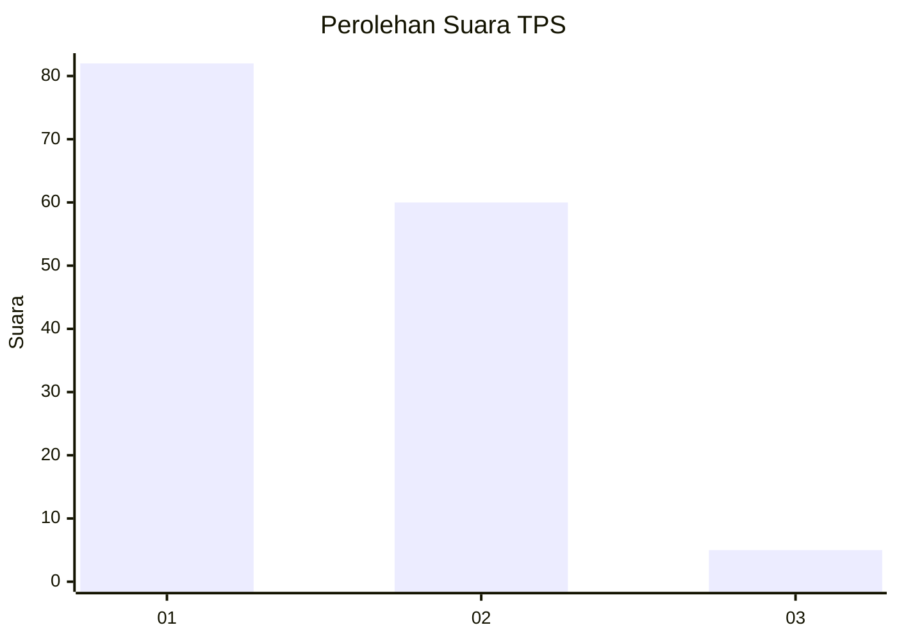
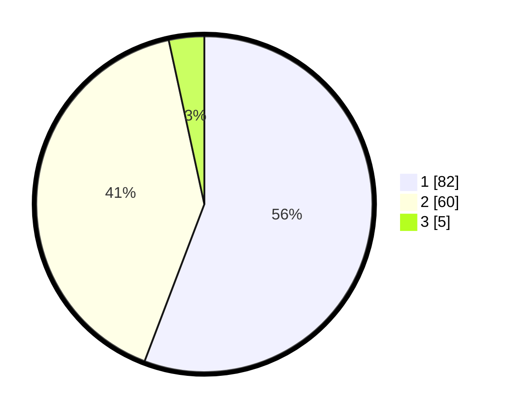

# Hasil

## Grafik

## Tabel

| No. | Nama Paslon    | Suara | Suara (raw) | Persentase |
|:--- |:-------------- | -----:| -----------:| ----------:|
| 1   | ANIES MUHAIMIN | 82    | [82][p-1]   | 55,78      |
| 2   | PRABOWO GIBRAN | 60    | [60][p-2]   | 40,82      |
| 3   | GANJAR MAHFUD  | 5     | [5][p-3]    | 3,40       |

[p-1]: https://github.com/gigit-pemilu/pemilu-2024-11-aceh/blob/main/pilpres/hitung-suara/sub/11-aceh/sub/02-aceh-tenggara/sub/09-bukit-tusam/sub/2014-pejuang/sub/001-tps/sub/paslon-1.txt
[p-2]: https://github.com/gigit-pemilu/pemilu-2024-11-aceh/blob/main/pilpres/hitung-suara/sub/11-aceh/sub/02-aceh-tenggara/sub/09-bukit-tusam/sub/2014-pejuang/sub/001-tps/sub/paslon-2.txt
[p-3]: https://github.com/gigit-pemilu/pemilu-2024-11-aceh/blob/main/pilpres/hitung-suara/sub/11-aceh/sub/02-aceh-tenggara/sub/09-bukit-tusam/sub/2014-pejuang/sub/001-tps/sub/paslon-3.txt

## Foto C Plano

https://sirekap-obj-formc.kpu.go.id/79b5/pemilu/ppwp/11/02/09/20/14/1102092014001-20240215-132023--087b5a3d-a449-4ad2-aad3-c6eba8f499a7.jpg

https://sirekap-obj-formc.kpu.go.id/79b5/pemilu/ppwp/11/02/09/20/14/1102092014001-20240215-132235--57c6fbfe-b82d-4354-bc06-a0b4d024f691.jpg

https://sirekap-obj-formc.kpu.go.id/79b5/pemilu/ppwp/11/02/09/20/14/1102092014001-20240215-132353--7177afa4-0e61-4d24-b82f-fbc01c2c935e.jpg

## Metadata

| Key        | Value               |
| ---------- | ------------------- |
| Time Stamp | 2024-02-15 21:30:27 |

