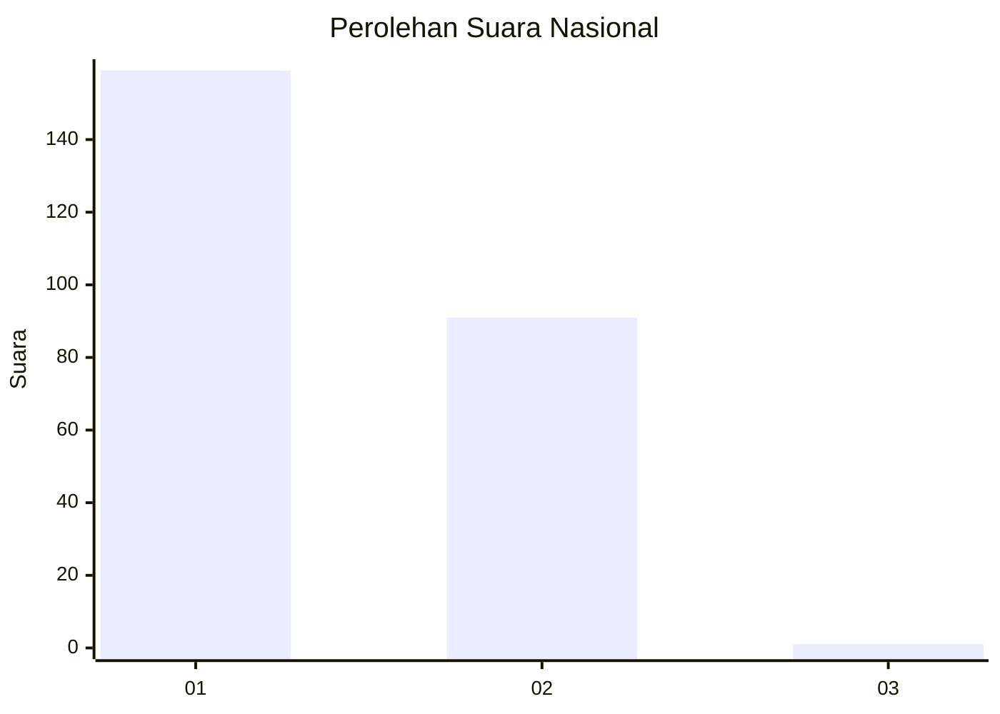
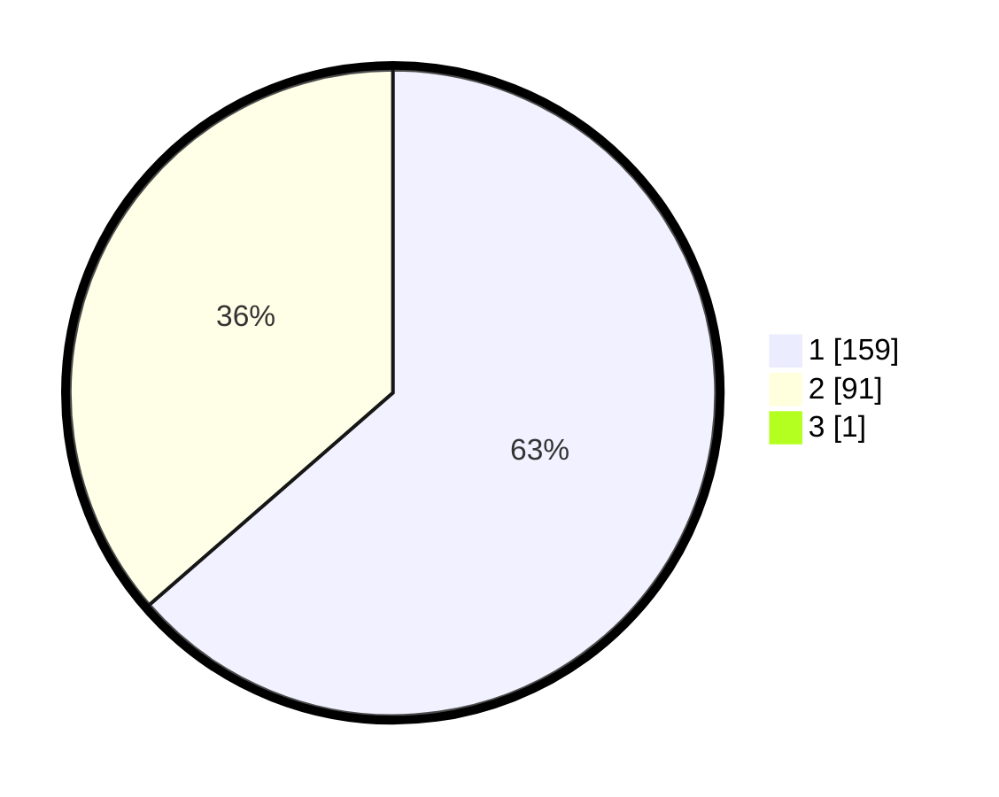

# Hasil

## Grafik

## Tabel

| No. | Nama Paslon    | Suara | Suara (raw) | Persentase |
|:--- |:-------------- | -----:| -----------:| ----------:|
| 1   | ANIES MUHAIMIN | 159   | [159][p-1]  | 63,35      |
| 2   | PRABOWO GIBRAN | 91    | [91][p-2]   | 36,25      |
| 3   | GANJAR MAHFUD  | 1     | [1][p-3]    | 0,40       |

[p-1]: https://github.com/gigit-pemilu/pemilu-2024/blob/main/pilpres/hitung-suara/sub/11-aceh/sub/02-aceh-tenggara/sub/09-bukit-tusam/sub/2021-mbak-sako/sub/001-tps/sub/paslon-1.txt
[p-2]: https://github.com/gigit-pemilu/pemilu-2024/blob/main/pilpres/hitung-suara/sub/11-aceh/sub/02-aceh-tenggara/sub/09-bukit-tusam/sub/2021-mbak-sako/sub/001-tps/sub/paslon-2.txt
[p-3]: https://github.com/gigit-pemilu/pemilu-2024/blob/main/pilpres/hitung-suara/sub/11-aceh/sub/02-aceh-tenggara/sub/09-bukit-tusam/sub/2021-mbak-sako/sub/001-tps/sub/paslon-3.txt

## Foto C Plano

https://sirekap-obj-formc.kpu.go.id/ad33/pemilu/ppwp/11/02/09/20/21/1102092021001-20240222-203834--3302a1e8-e7a4-44eb-8edd-06b675a5f072.jpg

https://sirekap-obj-formc.kpu.go.id/ad33/pemilu/ppwp/11/02/09/20/21/1102092021001-20240222-203955--b9abbdbb-f104-420e-88b6-97522e3f8f4f.jpg

https://sirekap-obj-formc.kpu.go.id/ad33/pemilu/ppwp/11/02/09/20/21/1102092021001-20240222-204111--a30bfea5-d5a9-42b5-9a83-874616e9a714.jpg

## Metadata

| Key        | Value               |
| ---------- | ------------------- |
| Time Stamp | 2024-02-24 22:31:28 |

