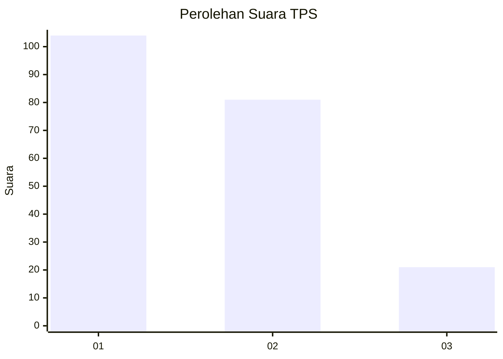
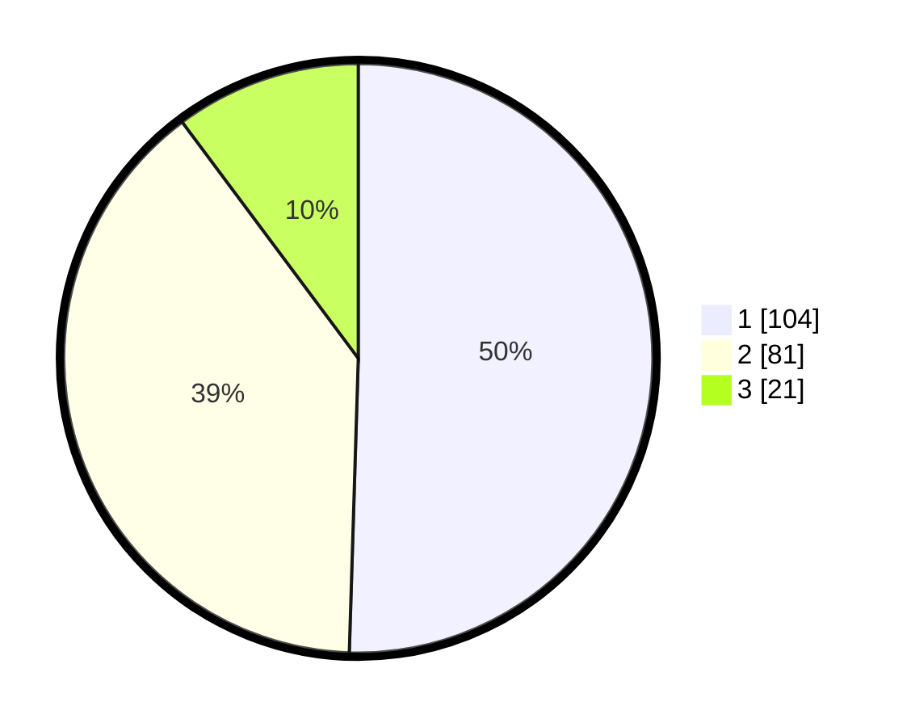

# Hasil

## Grafik

## Tabel

| No. | Nama Paslon    | Suara | Suara (raw) | Persentase |
|:--- |:-------------- | -----:| -----------:| ----------:|
| 1   | ANIES MUHAIMIN | 104   | [104][p-1]  | 50,49      |
| 2   | PRABOWO GIBRAN | 81    | [81][p-2]   | 39,32      |
| 3   | GANJAR MAHFUD  | 21    | [21][p-3]   | 10,19      |

[p-1]: https://github.com/gigit-pemilu/pemilu-2024-11-aceh/blob/main/pilpres/hitung-suara/sub/11-aceh/sub/02-aceh-tenggara/sub/10-semadam/sub/2001-simpang-semadam/sub/001-tps/sub/paslon-1.txt
[p-2]: https://github.com/gigit-pemilu/pemilu-2024-11-aceh/blob/main/pilpres/hitung-suara/sub/11-aceh/sub/02-aceh-tenggara/sub/10-semadam/sub/2001-simpang-semadam/sub/001-tps/sub/paslon-2.txt
[p-3]: https://github.com/gigit-pemilu/pemilu-2024-11-aceh/blob/main/pilpres/hitung-suara/sub/11-aceh/sub/02-aceh-tenggara/sub/10-semadam/sub/2001-simpang-semadam/sub/001-tps/sub/paslon-3.txt

## Foto C Plano

https://sirekap-obj-formc.kpu.go.id/18e7/pemilu/ppwp/11/02/10/20/01/1102102001001-20240215-131300--889f0e7d-5f3c-4bba-a06a-0771fbe7530d.jpg

https://sirekap-obj-formc.kpu.go.id/18e7/pemilu/ppwp/11/02/10/20/01/1102102001001-20240215-131434--fbfcea1a-1c07-4d12-9ca0-820865e536e9.jpg

https://sirekap-obj-formc.kpu.go.id/18e7/pemilu/ppwp/11/02/10/20/01/1102102001001-20240215-131644--f427417e-1bd3-4fee-81f3-ef273fe86eea.jpg

## Metadata

| Key        | Value               |
| ---------- | ------------------- |
| Time Stamp | 2024-02-24 22:31:28 |

