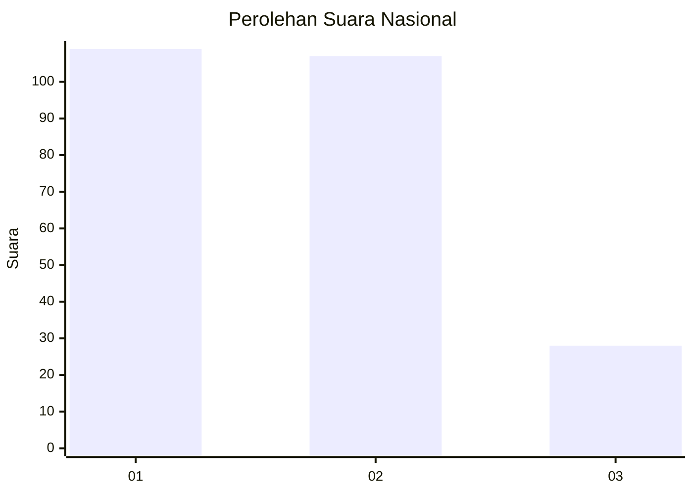
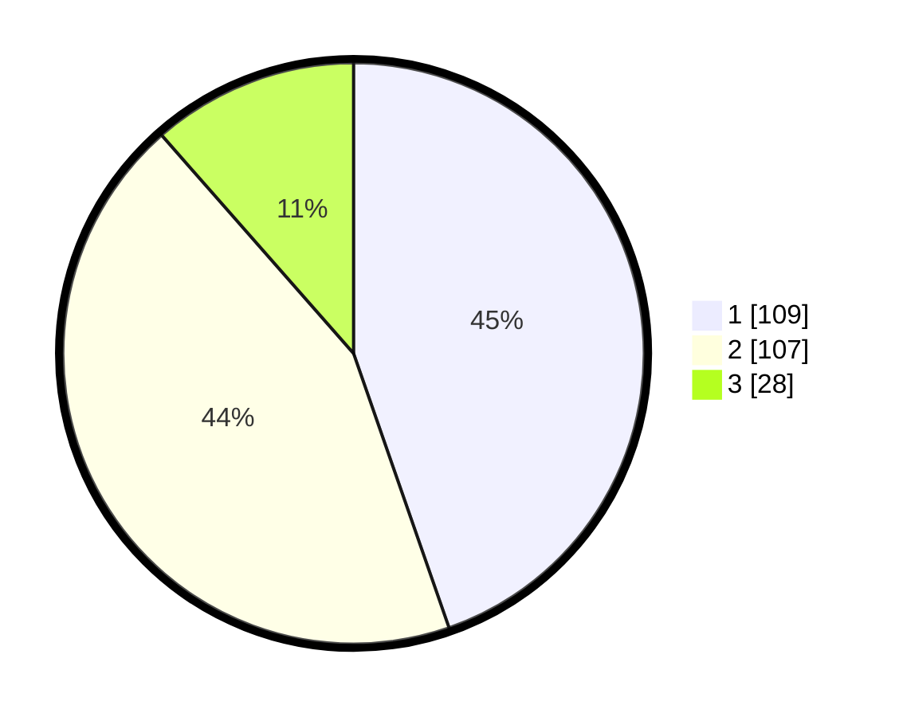

# Hasil

## Grafik

## Tabel

| No. | Nama Paslon    | Suara | Suara (raw) | Persentase |
|:--- |:-------------- | -----:| -----------:| ----------:|
| 1   | ANIES MUHAIMIN | 109   | [109][p-1]  | 44,67      |
| 2   | PRABOWO GIBRAN | 107   | [107][p-2]  | 43,85      |
| 3   | GANJAR MAHFUD  | 28    | [28][p-3]   | 11,48      |

[p-1]: https://github.com/gigit-pemilu/pemilu-2024/blob/main/pilpres/hitung-suara/sub/11-aceh/sub/02-aceh-tenggara/sub/10-semadam/sub/2001-simpang-semadam/sub/002-tps/sub/paslon-1.txt
[p-2]: https://github.com/gigit-pemilu/pemilu-2024/blob/main/pilpres/hitung-suara/sub/11-aceh/sub/02-aceh-tenggara/sub/10-semadam/sub/2001-simpang-semadam/sub/002-tps/sub/paslon-2.txt
[p-3]: https://github.com/gigit-pemilu/pemilu-2024/blob/main/pilpres/hitung-suara/sub/11-aceh/sub/02-aceh-tenggara/sub/10-semadam/sub/2001-simpang-semadam/sub/002-tps/sub/paslon-3.txt

## Foto C Plano

https://sirekap-obj-formc.kpu.go.id/4f7e/pemilu/ppwp/11/02/10/20/01/1102102001002-20240214-202812--66f5d09e-6a8f-4290-b88f-473a589b3ccf.jpg

https://sirekap-obj-formc.kpu.go.id/4f7e/pemilu/ppwp/11/02/10/20/01/1102102001002-20240214-162234--c7a4a64b-d91c-4035-9c49-3fcc940eff3e.jpg

https://sirekap-obj-formc.kpu.go.id/4f7e/pemilu/ppwp/11/02/10/20/01/1102102001002-20240214-202927--4118aa72-5f62-4037-8d3d-49c16d4d5016.jpg

## Metadata

| Key        | Value               |
| ---------- | ------------------- |
| Time Stamp | 2024-02-15 00:41:44 |

## DATA PEMILIH TETAP

Jumlah pemilih dalam DPT: **277**.
 * L: **141**.
 * P: **136**.

## DATA PENGGUNA HAK PILIH

Jumlah pengguna hak pilih dalam DPT: **237**.
 * L: **122**.
 * P: **115**.

Jumlah pengguna hak pilih dalam DPTb: **0**.
 * L: **0**.
 * P: **0**.

Jumlah pengguna hak pilih dalam DPK: **7**.
 * L: **4**.
 * P: **3**.

Jumlah pengguna hak pilih: **244**.
 * L: **126**.
 * P: **118**.

## JUMLAH SUARA SAH DAN TIDAK SAH

JUMLAH SELURUH SUARA SAH: **244**.

JUMLAH SUARA TIDAK SAH: **0**.

JUMLAH SELURUH SUARA SAH DAN SUARA TIDAK SAH: **244**.

