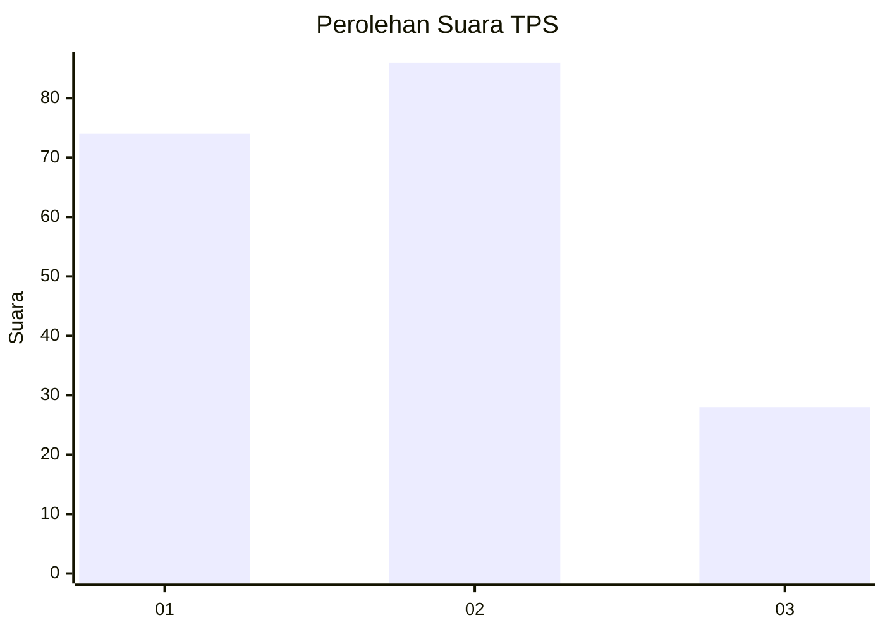
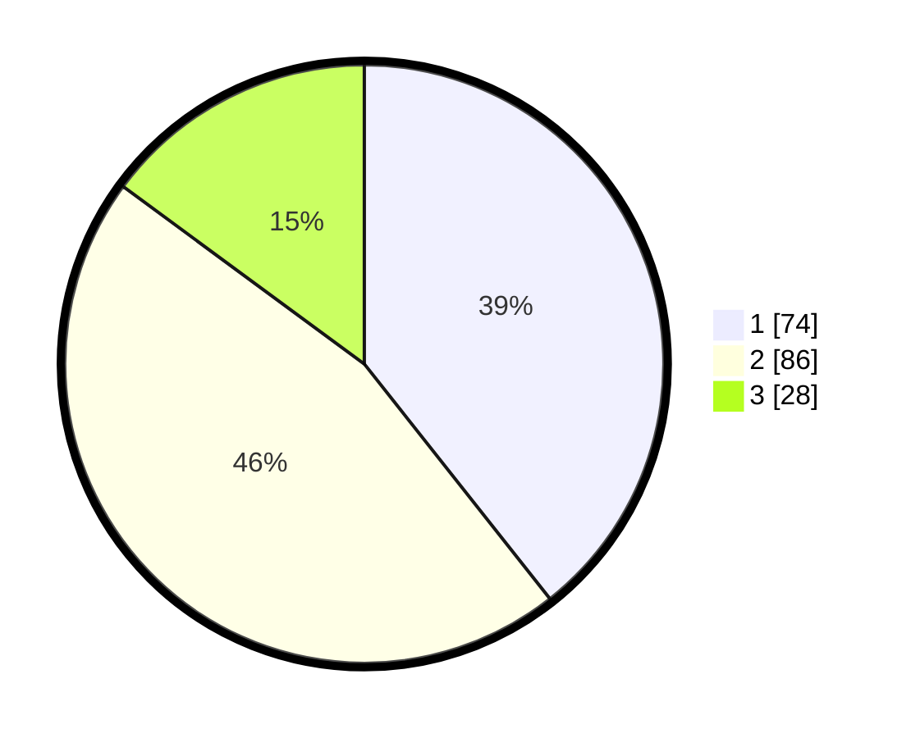

# Hasil

## Grafik

## Tabel

| No. | Nama Paslon    | Suara | Suara (raw) | Persentase |
|:--- |:-------------- | -----:| -----------:| ----------:|
| 1   | ANIES MUHAIMIN | 74    | [74][p-1]   | 39,36      |
| 2   | PRABOWO GIBRAN | 86    | [86][p-2]   | 45,74      |
| 3   | GANJAR MAHFUD  | 28    | [28][p-3]   | 14,89      |

[p-1]: https://github.com/gigit-pemilu/pemilu-2024-11-aceh/blob/main/pilpres/hitung-suara/sub/11-aceh/sub/02-aceh-tenggara/sub/10-semadam/sub/2001-simpang-semadam/sub/003-tps/sub/paslon-1.txt
[p-2]: https://github.com/gigit-pemilu/pemilu-2024-11-aceh/blob/main/pilpres/hitung-suara/sub/11-aceh/sub/02-aceh-tenggara/sub/10-semadam/sub/2001-simpang-semadam/sub/003-tps/sub/paslon-2.txt
[p-3]: https://github.com/gigit-pemilu/pemilu-2024-11-aceh/blob/main/pilpres/hitung-suara/sub/11-aceh/sub/02-aceh-tenggara/sub/10-semadam/sub/2001-simpang-semadam/sub/003-tps/sub/paslon-3.txt

## Foto C Plano

https://sirekap-obj-formc.kpu.go.id/c10c/pemilu/ppwp/11/02/10/20/01/1102102001003-20240218-150122--dd513dd2-015b-4c9e-9a97-fbdc9cc0545c.jpg

https://sirekap-obj-formc.kpu.go.id/c10c/pemilu/ppwp/11/02/10/20/01/1102102001003-20240218-150417--e33a661a-f8e9-4ee5-b7ae-8cb9bc14f4e1.jpg

https://sirekap-obj-formc.kpu.go.id/c10c/pemilu/ppwp/11/02/10/20/01/1102102001003-20240218-150442--3a857bc2-1262-4c19-8ae8-4269c3bb8f2a.jpg

## Metadata

| Key        | Value               |
| ---------- | ------------------- |
| Time Stamp | 2024-02-25 17:00:00 |

## DATA PEMILIH TETAP

Jumlah pemilih dalam DPT: **220**.
 * L: **99**.
 * P: **121**.

## DATA PENGGUNA HAK PILIH

Jumlah pengguna hak pilih dalam DPT: **178**.
 * L: **83**.
 * P: **95**.

Jumlah pengguna hak pilih dalam DPTb: **0**.
 * L: **0**.
 * P: **0**.

Jumlah pengguna hak pilih dalam DPK: **11**.
 * L: **3**.
 * P: **8**.

Jumlah pengguna hak pilih: **189**.
 * L: **86**.
 * P: **103**.

## JUMLAH SUARA SAH DAN TIDAK SAH

JUMLAH SELURUH SUARA SAH: **188**.

JUMLAH SUARA TIDAK SAH: **1**.

JUMLAH SELURUH SUARA SAH DAN SUARA TIDAK SAH: **189**.

