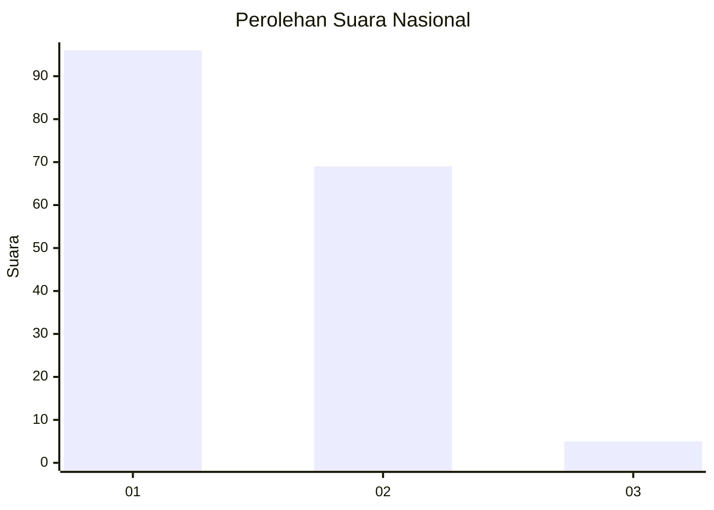
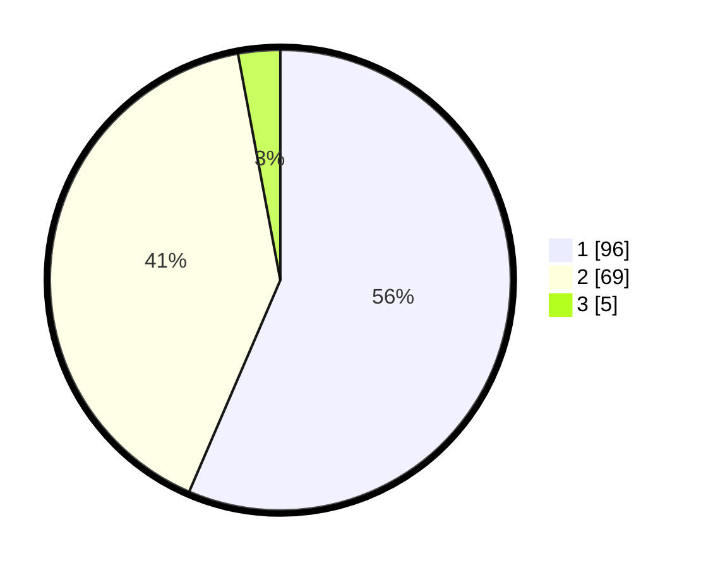

# Hasil

## Grafik

## Tabel

| No. | Nama Paslon    | Suara | Suara (raw) | Persentase |
|:--- |:-------------- | -----:| -----------:| ----------:|
| 1   | ANIES MUHAIMIN | 96    | [96][p-1]   | 56,47      |
| 2   | PRABOWO GIBRAN | 69    | [69][p-2]   | 40,59      |
| 3   | GANJAR MAHFUD  | 5     | [5][p-3]    | 2,94       |

[p-1]: https://github.com/gigit-pemilu/pemilu-2024/blob/main/pilpres/hitung-suara/sub/11-aceh/sub/02-aceh-tenggara/sub/10-semadam/sub/2002-semadam-awal/sub/002-tps/sub/paslon-1.txt
[p-2]: https://github.com/gigit-pemilu/pemilu-2024/blob/main/pilpres/hitung-suara/sub/11-aceh/sub/02-aceh-tenggara/sub/10-semadam/sub/2002-semadam-awal/sub/002-tps/sub/paslon-2.txt
[p-3]: https://github.com/gigit-pemilu/pemilu-2024/blob/main/pilpres/hitung-suara/sub/11-aceh/sub/02-aceh-tenggara/sub/10-semadam/sub/2002-semadam-awal/sub/002-tps/sub/paslon-3.txt

## Foto C Plano

https://sirekap-obj-formc.kpu.go.id/d738/pemilu/ppwp/11/02/10/20/02/1102102002002-20240215-082955--345ef0f8-5599-4f20-be7e-f303fc9b0e04.jpg

https://sirekap-obj-formc.kpu.go.id/d738/pemilu/ppwp/11/02/10/20/02/1102102002002-20240214-232221--1efdf549-f013-420e-8b4f-46eb7d740d48.jpg

https://sirekap-obj-formc.kpu.go.id/d738/pemilu/ppwp/11/02/10/20/02/1102102002002-20240214-232358--2ac7839b-acb3-43d1-9694-65f6d2ad7f76.jpg

## Metadata

| Key        | Value               |
| ---------- | ------------------- |
| Time Stamp | 2024-02-15 21:30:27 |

