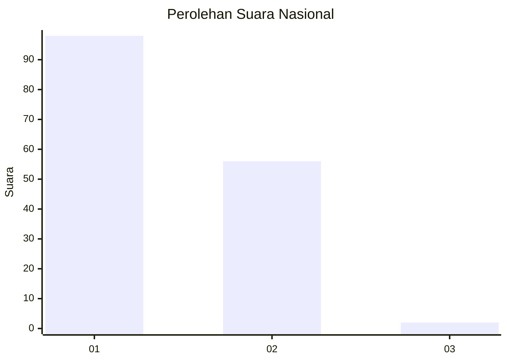
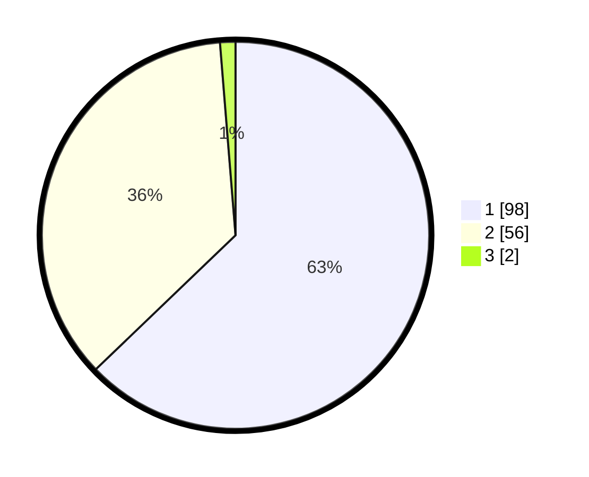

# Hasil

## Grafik

## Tabel

| No. | Nama Paslon    | Suara | Suara (raw) | Persentase |
|:--- |:-------------- | -----:| -----------:| ----------:|
| 1   | ANIES MUHAIMIN | 98    | [98][p-1]   | 62,82      |
| 2   | PRABOWO GIBRAN | 56    | [56][p-2]   | 35,90      |
| 3   | GANJAR MAHFUD  | 2     | [2][p-3]    | 1,28       |

[p-1]: https://github.com/gigit-pemilu/pemilu-2024/blob/main/pilpres/hitung-suara/sub/11-aceh/sub/02-aceh-tenggara/sub/10-semadam/sub/2002-semadam-awal/sub/003-tps/sub/paslon-1.txt
[p-2]: https://github.com/gigit-pemilu/pemilu-2024/blob/main/pilpres/hitung-suara/sub/11-aceh/sub/02-aceh-tenggara/sub/10-semadam/sub/2002-semadam-awal/sub/003-tps/sub/paslon-2.txt
[p-3]: https://github.com/gigit-pemilu/pemilu-2024/blob/main/pilpres/hitung-suara/sub/11-aceh/sub/02-aceh-tenggara/sub/10-semadam/sub/2002-semadam-awal/sub/003-tps/sub/paslon-3.txt

## Foto C Plano

https://sirekap-obj-formc.kpu.go.id/7103/pemilu/ppwp/11/02/10/20/02/1102102002003-20240216-152348--145329c3-58b3-40e1-b61c-62dc2803e932.jpg

https://sirekap-obj-formc.kpu.go.id/7103/pemilu/ppwp/11/02/10/20/02/1102102002003-20240216-152349--db567b20-d912-43e0-a7c0-758ac3568473.jpg

https://sirekap-obj-formc.kpu.go.id/7103/pemilu/ppwp/11/02/10/20/02/1102102002003-20240216-152348--727101b4-15e8-4df5-88e6-c8e8870d21ec.jpg

## Metadata

| Key        | Value               |
| ---------- | ------------------- |
| Time Stamp | 2024-02-24 22:31:28 |

## DATA PEMILIH TETAP

Jumlah pemilih dalam DPT: **176**.
 * L: **88**.
 * P: **88**.

## DATA PENGGUNA HAK PILIH

Jumlah pengguna hak pilih dalam DPT: **155**.
 * L: **72**.
 * P: **83**.

Jumlah pengguna hak pilih dalam DPTb: **0**.
 * L: **0**.
 * P: **0**.

Jumlah pengguna hak pilih dalam DPK: **1**.
 * L: **0**.
 * P: **1**.

Jumlah pengguna hak pilih: **156**.
 * L: **72**.
 * P: **84**.

## JUMLAH SUARA SAH DAN TIDAK SAH

JUMLAH SELURUH SUARA SAH: **156**.

JUMLAH SUARA TIDAK SAH: **0**.

JUMLAH SELURUH SUARA SAH DAN SUARA TIDAK SAH: **156**.

