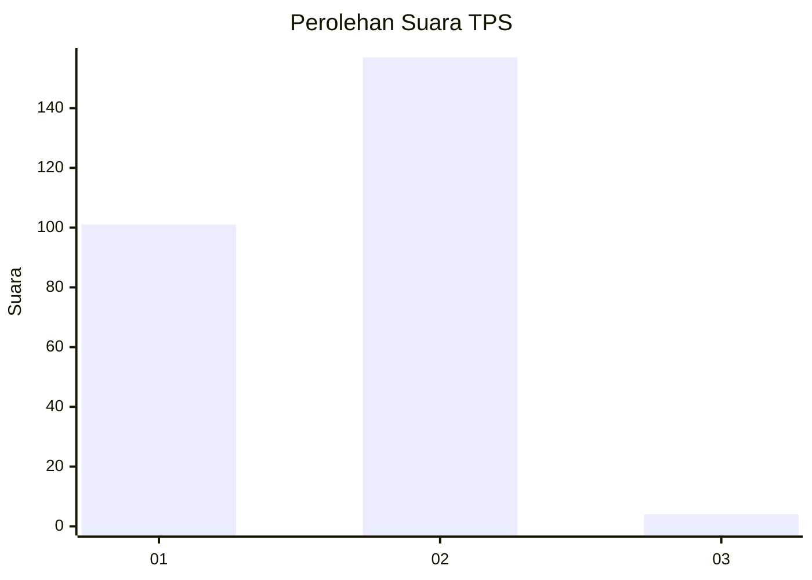
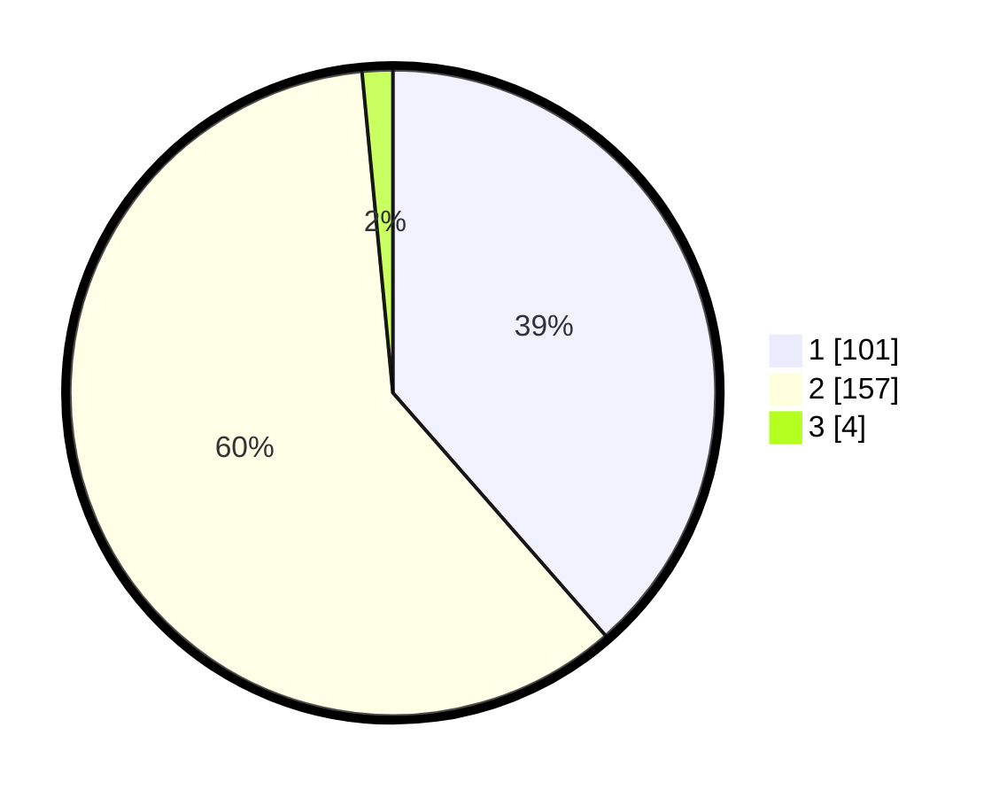

# Hasil

## Grafik

## Tabel

| No. | Nama Paslon    | Suara | Suara (raw) | Persentase |
|:--- |:-------------- | -----:| -----------:| ----------:|
| 1   | ANIES MUHAIMIN | 101   | [101][p-1]  | 38,55      |
| 2   | PRABOWO GIBRAN | 157   | [157][p-2]  | 59,92      |
| 3   | GANJAR MAHFUD  | 4     | [4][p-3]    | 1,53       |

[p-1]: https://github.com/gigit-pemilu/pemilu-2024-11-aceh/blob/main/pilpres/hitung-suara/sub/11-aceh/sub/02-aceh-tenggara/sub/10-semadam/sub/2003-semadam-asal/sub/001-tps/sub/paslon-1.txt
[p-2]: https://github.com/gigit-pemilu/pemilu-2024-11-aceh/blob/main/pilpres/hitung-suara/sub/11-aceh/sub/02-aceh-tenggara/sub/10-semadam/sub/2003-semadam-asal/sub/001-tps/sub/paslon-2.txt
[p-3]: https://github.com/gigit-pemilu/pemilu-2024-11-aceh/blob/main/pilpres/hitung-suara/sub/11-aceh/sub/02-aceh-tenggara/sub/10-semadam/sub/2003-semadam-asal/sub/001-tps/sub/paslon-3.txt

## Foto C Plano

https://sirekap-obj-formc.kpu.go.id/b357/pemilu/ppwp/11/02/10/20/03/1102102003001-20240215-093222--2a497ebd-50fc-49d2-a205-3af79b276193.jpg

https://sirekap-obj-formc.kpu.go.id/b357/pemilu/ppwp/11/02/10/20/03/1102102003001-20240215-094227--7d1c3358-570b-41b2-b8b8-5cb9ebef56c6.jpg

https://sirekap-obj-formc.kpu.go.id/b357/pemilu/ppwp/11/02/10/20/03/1102102003001-20240215-094421--6b7746e1-a3b9-483c-bf30-a2625f48e288.jpg

## Metadata

| Key        | Value               |
| ---------- | ------------------- |
| Time Stamp | 2024-02-25 11:00:00 |

