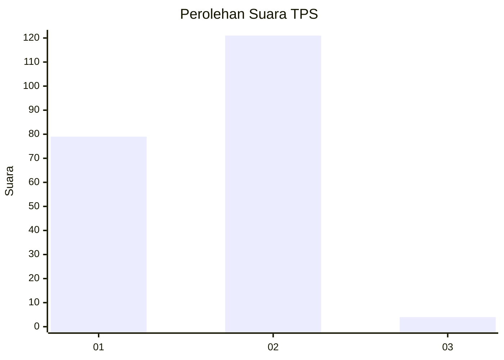
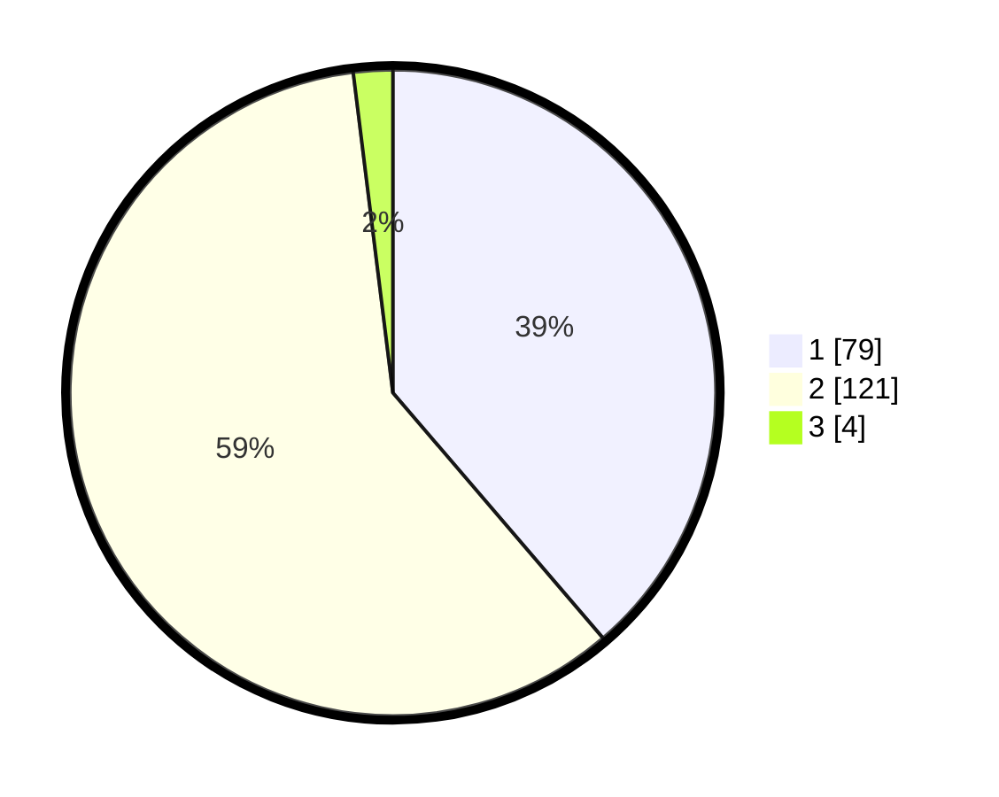

# Hasil

## Grafik

## Tabel

| No. | Nama Paslon    | Suara | Suara (raw) | Persentase |
|:--- |:-------------- | -----:| -----------:| ----------:|
| 1   | ANIES MUHAIMIN | 79    | [79][p-1]   | 38,73      |
| 2   | PRABOWO GIBRAN | 121   | [121][p-2]  | 59,31      |
| 3   | GANJAR MAHFUD  | 4     | [4][p-3]    | 1,96       |

[p-1]: https://github.com/gigit-pemilu/pemilu-2024-11-aceh/blob/main/pilpres/hitung-suara/sub/11-aceh/sub/02-aceh-tenggara/sub/10-semadam/sub/2003-semadam-asal/sub/002-tps/sub/paslon-1.txt
[p-2]: https://github.com/gigit-pemilu/pemilu-2024-11-aceh/blob/main/pilpres/hitung-suara/sub/11-aceh/sub/02-aceh-tenggara/sub/10-semadam/sub/2003-semadam-asal/sub/002-tps/sub/paslon-2.txt
[p-3]: https://github.com/gigit-pemilu/pemilu-2024-11-aceh/blob/main/pilpres/hitung-suara/sub/11-aceh/sub/02-aceh-tenggara/sub/10-semadam/sub/2003-semadam-asal/sub/002-tps/sub/paslon-3.txt

## Foto C Plano

https://sirekap-obj-formc.kpu.go.id/4a69/pemilu/ppwp/11/02/10/20/03/1102102003002-20240218-152344--eab68801-ebb1-49b5-9b2d-0951729ba902.jpg

https://sirekap-obj-formc.kpu.go.id/4a69/pemilu/ppwp/11/02/10/20/03/1102102003002-20240218-152453--59ddb6b6-87b2-4bb6-8567-8934cd4a582c.jpg

https://sirekap-obj-formc.kpu.go.id/4a69/pemilu/ppwp/11/02/10/20/03/1102102003002-20240218-152854--0f5d8153-d3d5-4ec7-b9b9-8d9b182d89fa.jpg

## Metadata

| Key        | Value               |
| ---------- | ------------------- |
| Time Stamp | 2024-02-24 22:31:28 |

