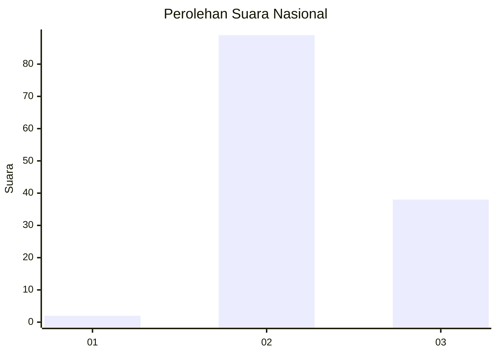
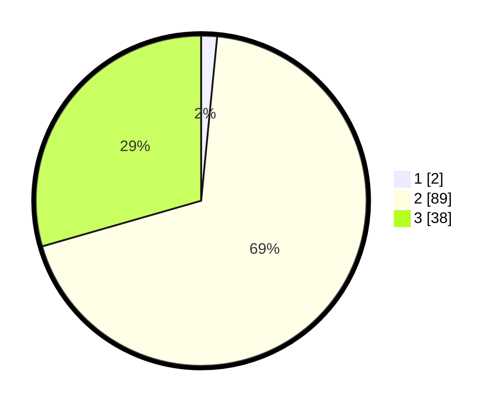

# Hasil

## Grafik

## Tabel

| No. | Nama Paslon    | Suara | Suara (raw) | Persentase |
|:--- |:-------------- | -----:| -----------:| ----------:|
| 1   | ANIES MUHAIMIN | 2     | [2][p-1]    | 1,55       |
| 2   | PRABOWO GIBRAN | 89    | [89][p-2]   | 68,99      |
| 3   | GANJAR MAHFUD  | 38    | [38][p-3]   | 29,46      |

[p-1]: https://github.com/gigit-pemilu/pemilu-2024/blob/main/pilpres/hitung-suara/sub/11-aceh/sub/02-aceh-tenggara/sub/10-semadam/sub/2004-lawe-kinga-gabungan/sub/001-tps/sub/paslon-1.txt
[p-2]: https://github.com/gigit-pemilu/pemilu-2024/blob/main/pilpres/hitung-suara/sub/11-aceh/sub/02-aceh-tenggara/sub/10-semadam/sub/2004-lawe-kinga-gabungan/sub/001-tps/sub/paslon-2.txt
[p-3]: https://github.com/gigit-pemilu/pemilu-2024/blob/main/pilpres/hitung-suara/sub/11-aceh/sub/02-aceh-tenggara/sub/10-semadam/sub/2004-lawe-kinga-gabungan/sub/001-tps/sub/paslon-3.txt

## Foto C Plano

https://sirekap-obj-formc.kpu.go.id/5ac5/pemilu/ppwp/11/02/10/20/04/1102102004001-20240218-182956--1cba7918-4a2b-4a08-9ca2-42de2b18964c.jpg

https://sirekap-obj-formc.kpu.go.id/5ac5/pemilu/ppwp/11/02/10/20/04/1102102004001-20240218-183533--1ae07550-4d25-407a-8721-5006ff286db0.jpg

https://sirekap-obj-formc.kpu.go.id/5ac5/pemilu/ppwp/11/02/10/20/04/1102102004001-20240218-183646--7fc976a2-0ec1-485c-afa1-43c4b140c97b.jpg

## Metadata

| Key        | Value               |
| ---------- | ------------------- |
| Time Stamp | 2024-02-24 22:31:28 |

