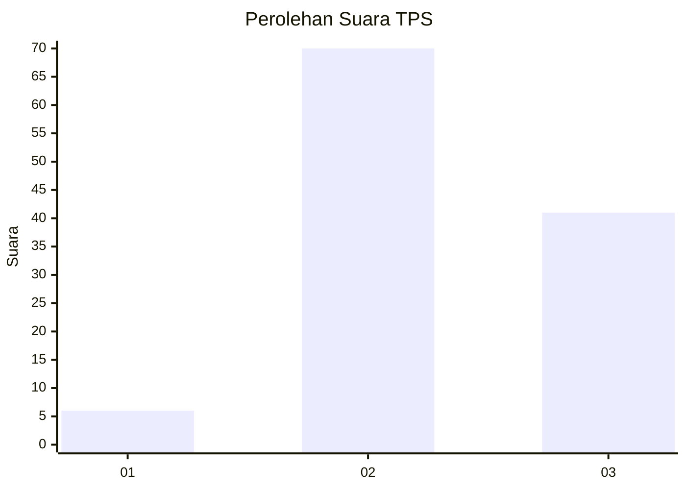
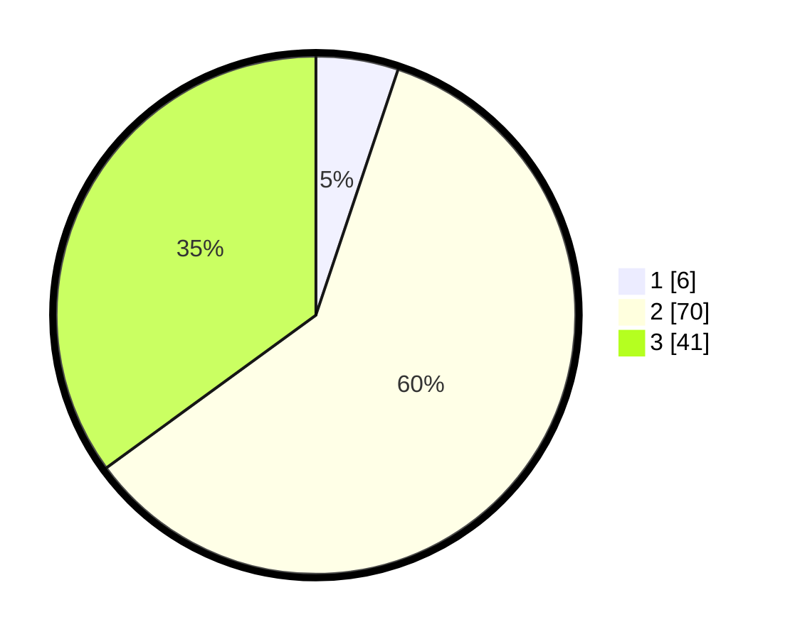

# Hasil

## Grafik

## Tabel

| No. | Nama Paslon    | Suara | Suara (raw) | Persentase |
|:--- |:-------------- | -----:| -----------:| ----------:|
| 1   | ANIES MUHAIMIN | 6     | [6][p-1]    | 5,13       |
| 2   | PRABOWO GIBRAN | 70    | [70][p-2]   | 59,83      |
| 3   | GANJAR MAHFUD  | 41    | [41][p-3]   | 35,04      |

[p-1]: https://github.com/gigit-pemilu/pemilu-2024-11-aceh/blob/main/pilpres/hitung-suara/sub/11-aceh/sub/02-aceh-tenggara/sub/10-semadam/sub/2004-lawe-kinga-gabungan/sub/002-tps/sub/paslon-1.txt
[p-2]: https://github.com/gigit-pemilu/pemilu-2024-11-aceh/blob/main/pilpres/hitung-suara/sub/11-aceh/sub/02-aceh-tenggara/sub/10-semadam/sub/2004-lawe-kinga-gabungan/sub/002-tps/sub/paslon-2.txt
[p-3]: https://github.com/gigit-pemilu/pemilu-2024-11-aceh/blob/main/pilpres/hitung-suara/sub/11-aceh/sub/02-aceh-tenggara/sub/10-semadam/sub/2004-lawe-kinga-gabungan/sub/002-tps/sub/paslon-3.txt

## Foto C Plano

https://sirekap-obj-formc.kpu.go.id/4e6d/pemilu/ppwp/11/02/10/20/04/1102102004002-20240217-213453--4d7d9f83-f410-4096-8e73-25bef18df0cb.jpg

https://sirekap-obj-formc.kpu.go.id/4e6d/pemilu/ppwp/11/02/10/20/04/1102102004002-20240217-215043--4924d962-1881-4ad4-a6db-2a2c133c4536.jpg

https://sirekap-obj-formc.kpu.go.id/4e6d/pemilu/ppwp/11/02/10/20/04/1102102004002-20240217-213937--e29a06ad-41d1-4bd5-9592-90442862c7f6.jpg

## Metadata

| Key        | Value               |
| ---------- | ------------------- |
| Time Stamp | 2024-02-21 18:00:00 |

## DATA PEMILIH TETAP

Jumlah pemilih dalam DPT: **141**.
 * L: **72**.
 * P: **69**.

## DATA PENGGUNA HAK PILIH

Jumlah pengguna hak pilih dalam DPT: **109**.
 * L: **50**.
 * P: **59**.

Jumlah pengguna hak pilih dalam DPTb: **0**.
 * L: **0**.
 * P: **0**.

Jumlah pengguna hak pilih dalam DPK: **4**.
 * L: **2**.
 * P: **2**.

Jumlah pengguna hak pilih: **113**.
 * L: **52**.
 * P: **61**.

## JUMLAH SUARA SAH DAN TIDAK SAH

JUMLAH SELURUH SUARA SAH: **112**.

JUMLAH SUARA TIDAK SAH: **1**.

JUMLAH SELURUH SUARA SAH DAN SUARA TIDAK SAH: **113**.

