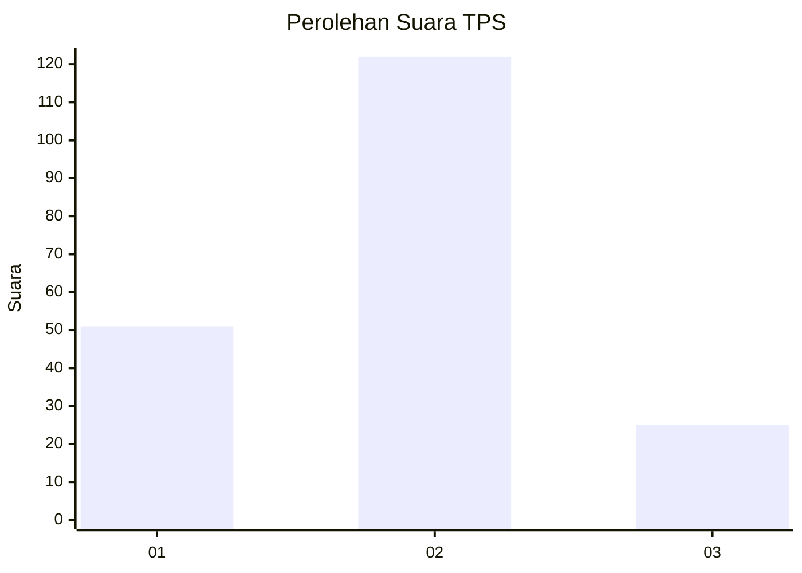
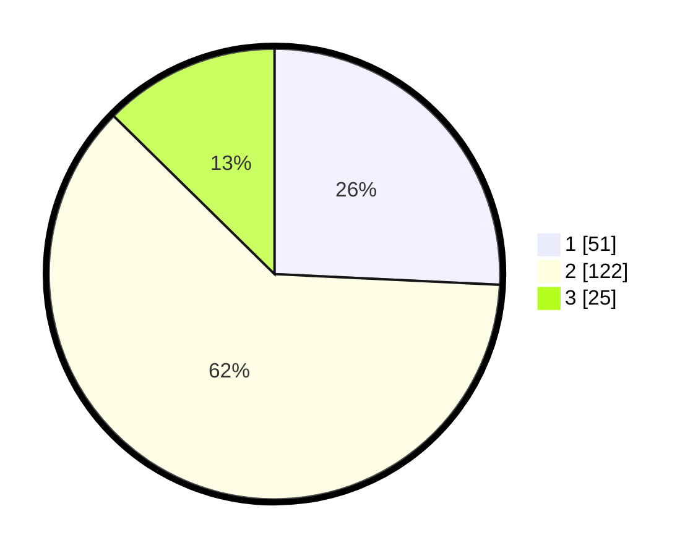

# Hasil

## Grafik

## Tabel

| No. | Nama Paslon    | Suara | Suara (raw) | Persentase |
|:--- |:-------------- | -----:| -----------:| ----------:|
| 1   | ANIES MUHAIMIN | 51    | [51][p-1]   | 25,76      |
| 2   | PRABOWO GIBRAN | 122   | [122][p-2]  | 61,62      |
| 3   | GANJAR MAHFUD  | 25    | [25][p-3]   | 12,63      |

[p-1]: https://github.com/gigit-pemilu/pemilu-2024-11-aceh/blob/main/pilpres/hitung-suara/sub/11-aceh/sub/02-aceh-tenggara/sub/10-semadam/sub/2005-lawe-kinga-tebing-tinggi/sub/001-tps/sub/paslon-1.txt
[p-2]: https://github.com/gigit-pemilu/pemilu-2024-11-aceh/blob/main/pilpres/hitung-suara/sub/11-aceh/sub/02-aceh-tenggara/sub/10-semadam/sub/2005-lawe-kinga-tebing-tinggi/sub/001-tps/sub/paslon-2.txt
[p-3]: https://github.com/gigit-pemilu/pemilu-2024-11-aceh/blob/main/pilpres/hitung-suara/sub/11-aceh/sub/02-aceh-tenggara/sub/10-semadam/sub/2005-lawe-kinga-tebing-tinggi/sub/001-tps/sub/paslon-3.txt

## Foto C Plano

https://sirekap-obj-formc.kpu.go.id/775b/pemilu/ppwp/11/02/10/20/05/1102102005001-20240218-172327--6280b7cc-c47a-4ed2-9e7e-4a7c4c67583e.jpg

https://sirekap-obj-formc.kpu.go.id/775b/pemilu/ppwp/11/02/10/20/05/1102102005001-20240218-172638--9627760f-23a2-49e8-bc8c-23c46aeff418.jpg

https://sirekap-obj-formc.kpu.go.id/775b/pemilu/ppwp/11/02/10/20/05/1102102005001-20240218-172928--931d133f-64f5-4325-939a-b987743f552a.jpg

## Metadata

| Key        | Value               |
| ---------- | ------------------- |
| Time Stamp | 2024-02-24 22:31:28 |

