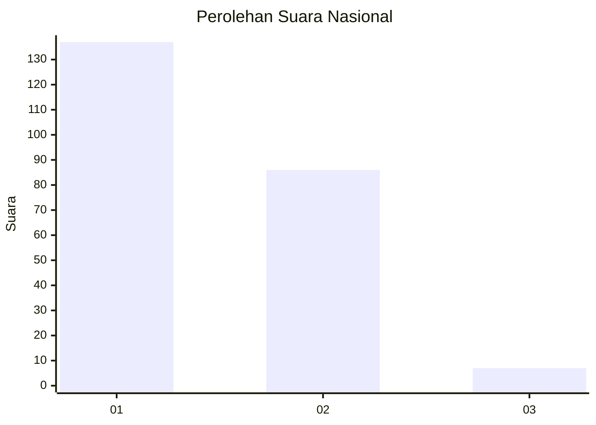
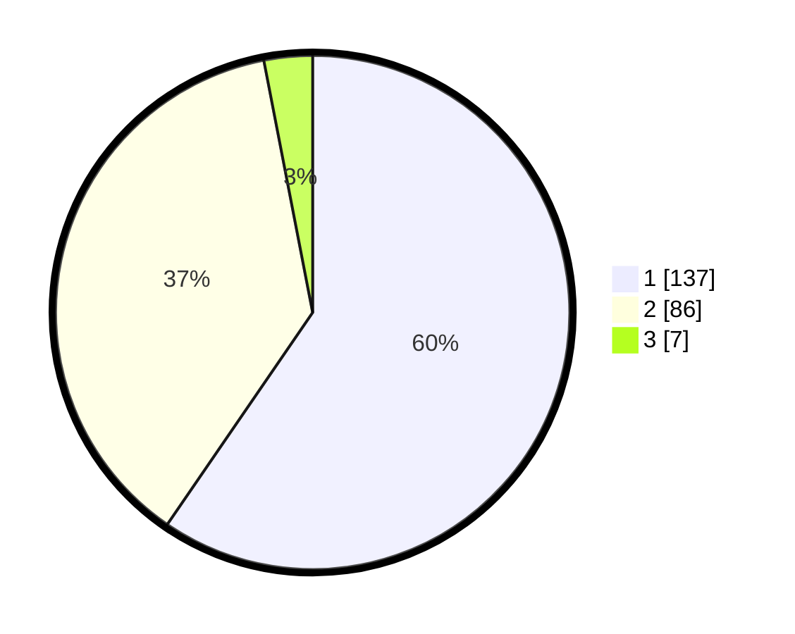

# Hasil

## Grafik

## Tabel

| No. | Nama Paslon    | Suara | Suara (raw) | Persentase |
|:--- |:-------------- | -----:| -----------:| ----------:|
| 1   | ANIES MUHAIMIN | 137   | [137][p-1]  | 59,57      |
| 2   | PRABOWO GIBRAN | 86    | [86][p-2]   | 37,39      |
| 3   | GANJAR MAHFUD  | 7     | [7][p-3]    | 3,04       |

[p-1]: https://github.com/gigit-pemilu/pemilu-2024/blob/main/pilpres/hitung-suara/sub/11-aceh/sub/02-aceh-tenggara/sub/10-semadam/sub/2008-lawe-berigin-gayo/sub/002-tps/sub/paslon-1.txt
[p-2]: https://github.com/gigit-pemilu/pemilu-2024/blob/main/pilpres/hitung-suara/sub/11-aceh/sub/02-aceh-tenggara/sub/10-semadam/sub/2008-lawe-berigin-gayo/sub/002-tps/sub/paslon-2.txt
[p-3]: https://github.com/gigit-pemilu/pemilu-2024/blob/main/pilpres/hitung-suara/sub/11-aceh/sub/02-aceh-tenggara/sub/10-semadam/sub/2008-lawe-berigin-gayo/sub/002-tps/sub/paslon-3.txt

## Foto C Plano

https://sirekap-obj-formc.kpu.go.id/c7b9/pemilu/ppwp/11/02/10/20/08/1102102008002-20240215-064258--8766b788-39a5-431e-b8bb-b4dfac498204.jpg

https://sirekap-obj-formc.kpu.go.id/c7b9/pemilu/ppwp/11/02/10/20/08/1102102008002-20240215-064354--a893fdda-dc4f-4415-8955-d83597da6fa2.jpg

https://sirekap-obj-formc.kpu.go.id/c7b9/pemilu/ppwp/11/02/10/20/08/1102102008002-20240215-064602--cbf64187-af08-4862-bd81-15ebc82e7964.jpg

## Metadata

| Key        | Value               |
| ---------- | ------------------- |
| Time Stamp | 2024-02-16 09:30:28 |

