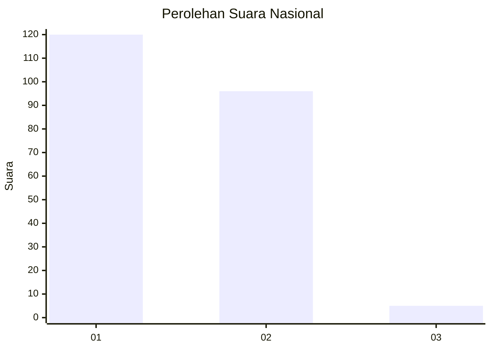
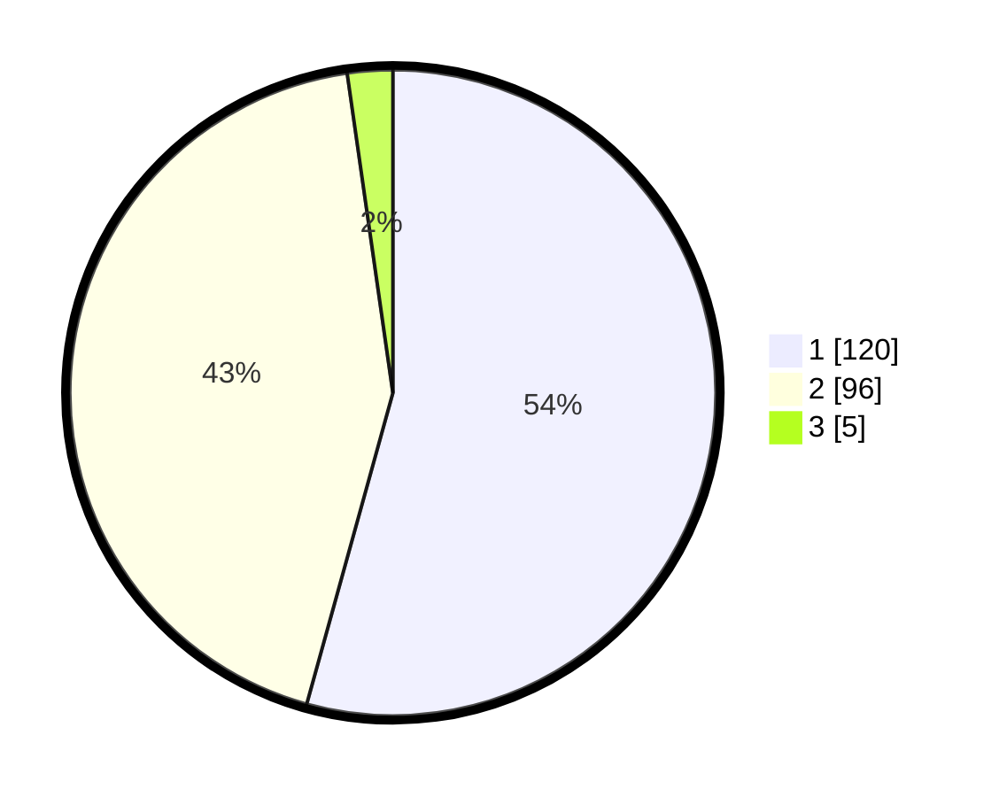

# Hasil

## Grafik

## Tabel

| No. | Nama Paslon    | Suara | Suara (raw) | Persentase |
|:--- |:-------------- | -----:| -----------:| ----------:|
| 1   | ANIES MUHAIMIN | 120   | [120][p-1]  | 54,30      |
| 2   | PRABOWO GIBRAN | 96    | [96][p-2]   | 43,44      |
| 3   | GANJAR MAHFUD  | 5     | [5][p-3]    | 2,26       |

[p-1]: https://github.com/gigit-pemilu/pemilu-2024/blob/main/pilpres/hitung-suara/sub/11-aceh/sub/02-aceh-tenggara/sub/10-semadam/sub/2010-pasar-puntung/sub/002-tps/sub/paslon-1.txt
[p-2]: https://github.com/gigit-pemilu/pemilu-2024/blob/main/pilpres/hitung-suara/sub/11-aceh/sub/02-aceh-tenggara/sub/10-semadam/sub/2010-pasar-puntung/sub/002-tps/sub/paslon-2.txt
[p-3]: https://github.com/gigit-pemilu/pemilu-2024/blob/main/pilpres/hitung-suara/sub/11-aceh/sub/02-aceh-tenggara/sub/10-semadam/sub/2010-pasar-puntung/sub/002-tps/sub/paslon-3.txt

## Foto C Plano

https://sirekap-obj-formc.kpu.go.id/977b/pemilu/ppwp/11/02/10/20/10/1102102010002-20240215-115432--6e3bec80-cc4e-424a-ae22-411890ec16cd.jpg

https://sirekap-obj-formc.kpu.go.id/977b/pemilu/ppwp/11/02/10/20/10/1102102010002-20240215-120803--5915ce94-7fd5-467c-bdcc-842112b27ad9.jpg

https://sirekap-obj-formc.kpu.go.id/977b/pemilu/ppwp/11/02/10/20/10/1102102010002-20240215-121045--1aae91ef-b255-4b6d-a86b-04c2a25b5487.jpg

## Metadata

| Key        | Value               |
| ---------- | ------------------- |
| Time Stamp | 2024-03-01 14:00:00 |

