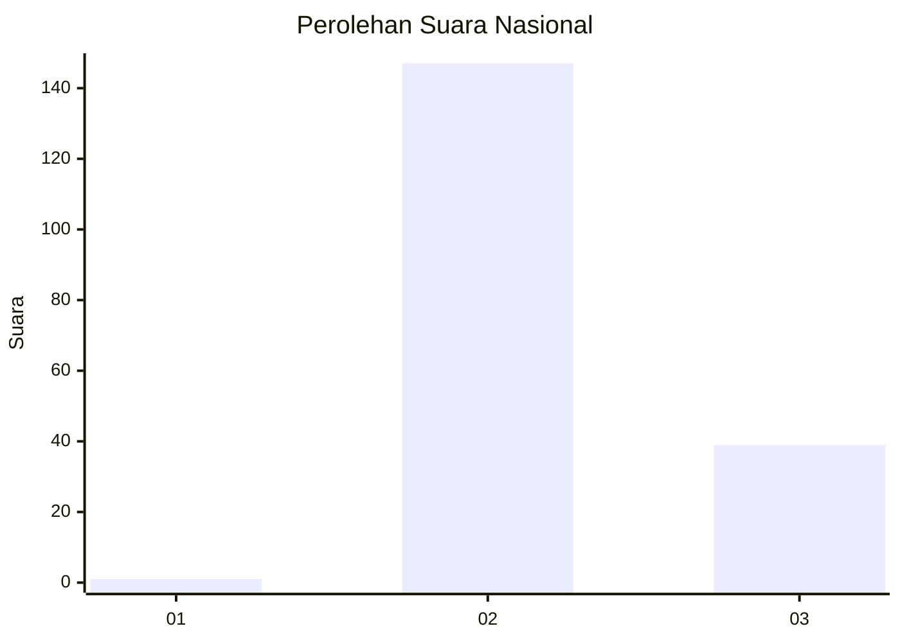
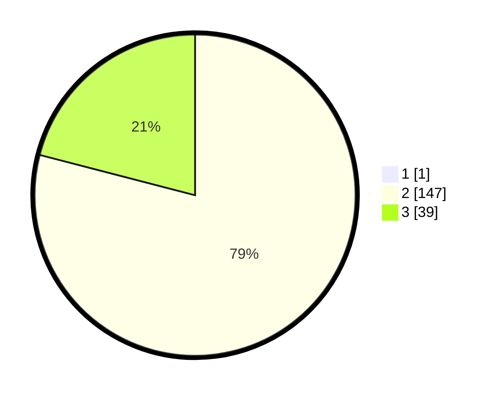

# Hasil

## Grafik

## Tabel

| No. | Nama Paslon    | Suara | Suara (raw) | Persentase |
|:--- |:-------------- | -----:| -----------:| ----------:|
| 1   | ANIES MUHAIMIN | 1     | [1][p-1]    | 0,53       |
| 2   | PRABOWO GIBRAN | 147   | [147][p-2]  | 78,61      |
| 3   | GANJAR MAHFUD  | 39    | [39][p-3]   | 20,86      |

[p-1]: https://github.com/gigit-pemilu/pemilu-2024/blob/main/pilpres/hitung-suara/sub/11-aceh/sub/02-aceh-tenggara/sub/10-semadam/sub/2012-lawe-petanduk-i/sub/001-tps/sub/paslon-1.txt
[p-2]: https://github.com/gigit-pemilu/pemilu-2024/blob/main/pilpres/hitung-suara/sub/11-aceh/sub/02-aceh-tenggara/sub/10-semadam/sub/2012-lawe-petanduk-i/sub/001-tps/sub/paslon-2.txt
[p-3]: https://github.com/gigit-pemilu/pemilu-2024/blob/main/pilpres/hitung-suara/sub/11-aceh/sub/02-aceh-tenggara/sub/10-semadam/sub/2012-lawe-petanduk-i/sub/001-tps/sub/paslon-3.txt

## Foto C Plano

https://sirekap-obj-formc.kpu.go.id/b684/pemilu/ppwp/11/02/10/20/12/1102102012001-20240218-121028--273774ce-b8e0-4e01-b50d-f79af5cbfe8c.jpg

https://sirekap-obj-formc.kpu.go.id/b684/pemilu/ppwp/11/02/10/20/12/1102102012001-20240218-121152--2ec49903-62d2-4787-b451-e82be4d649e9.jpg

https://sirekap-obj-formc.kpu.go.id/b684/pemilu/ppwp/11/02/10/20/12/1102102012001-20240218-121310--66f628b3-4155-406f-9a26-6f8275e1ae1c.jpg

## Metadata

| Key        | Value               |
| ---------- | ------------------- |
| Time Stamp | 2024-02-24 22:31:28 |

