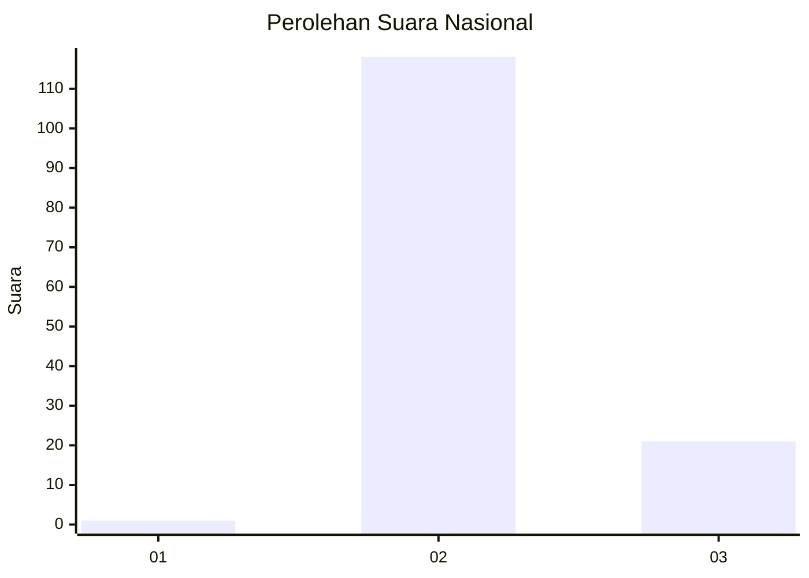
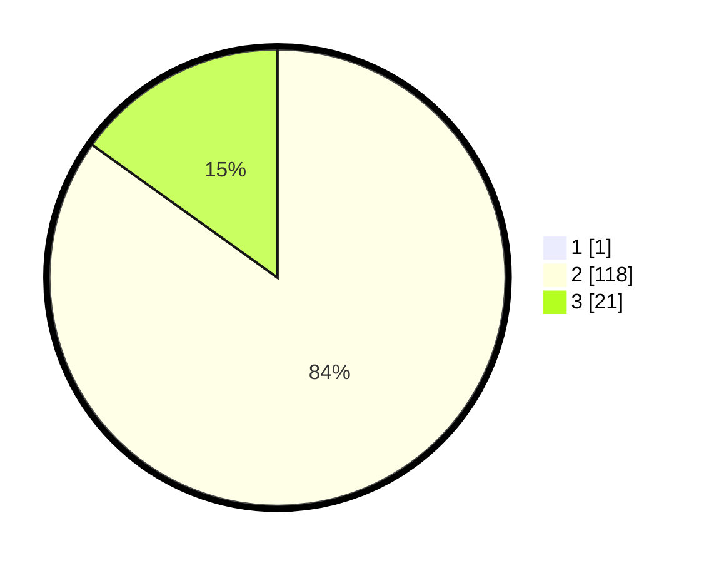

# Hasil

## Grafik

## Tabel

| No. | Nama Paslon    | Suara | Suara (raw) | Persentase |
|:--- |:-------------- | -----:| -----------:| ----------:|
| 1   | ANIES MUHAIMIN | 1     | [1][p-1]    | 0,71       |
| 2   | PRABOWO GIBRAN | 118   | [118][p-2]  | 84,29      |
| 3   | GANJAR MAHFUD  | 21    | [21][p-3]   | 15,00      |

[p-1]: https://github.com/gigit-pemilu/pemilu-2024/blob/main/pilpres/hitung-suara/sub/11-aceh/sub/02-aceh-tenggara/sub/10-semadam/sub/2012-lawe-petanduk-i/sub/002-tps/sub/paslon-1.txt
[p-2]: https://github.com/gigit-pemilu/pemilu-2024/blob/main/pilpres/hitung-suara/sub/11-aceh/sub/02-aceh-tenggara/sub/10-semadam/sub/2012-lawe-petanduk-i/sub/002-tps/sub/paslon-2.txt
[p-3]: https://github.com/gigit-pemilu/pemilu-2024/blob/main/pilpres/hitung-suara/sub/11-aceh/sub/02-aceh-tenggara/sub/10-semadam/sub/2012-lawe-petanduk-i/sub/002-tps/sub/paslon-3.txt

## Foto C Plano

https://sirekap-obj-formc.kpu.go.id/ecbd/pemilu/ppwp/11/02/10/20/12/1102102012002-20240217-221108--661edd56-6f20-4737-aabb-620398043d31.jpg

https://sirekap-obj-formc.kpu.go.id/ecbd/pemilu/ppwp/11/02/10/20/12/1102102012002-20240217-221110--92e81cdb-4581-4ae8-b1f6-420bc55b0ead.jpg

https://sirekap-obj-formc.kpu.go.id/ecbd/pemilu/ppwp/11/02/10/20/12/1102102012002-20240217-221109--f78420de-4400-46c1-8fa5-247d32890268.jpg

## Metadata

| Key        | Value               |
| ---------- | ------------------- |
| Time Stamp | 2024-02-24 22:31:28 |

## DATA PEMILIH TETAP

Jumlah pemilih dalam DPT: **157**.
 * L: **67**.
 * P: **90**.

## DATA PENGGUNA HAK PILIH

Jumlah pengguna hak pilih dalam DPT: **138**.
 * L: **55**.
 * P: **83**.

Jumlah pengguna hak pilih dalam DPTb: **0**.
 * L: **0**.
 * P: **0**.

Jumlah pengguna hak pilih dalam DPK: **16**.
 * L: **9**.
 * P: **7**.

Jumlah pengguna hak pilih: **154**.
 * L: **64**.
 * P: **90**.

## JUMLAH SUARA SAH DAN TIDAK SAH

JUMLAH SELURUH SUARA SAH: **140**.

JUMLAH SUARA TIDAK SAH: **14**.

JUMLAH SELURUH SUARA SAH DAN SUARA TIDAK SAH: **154**.

