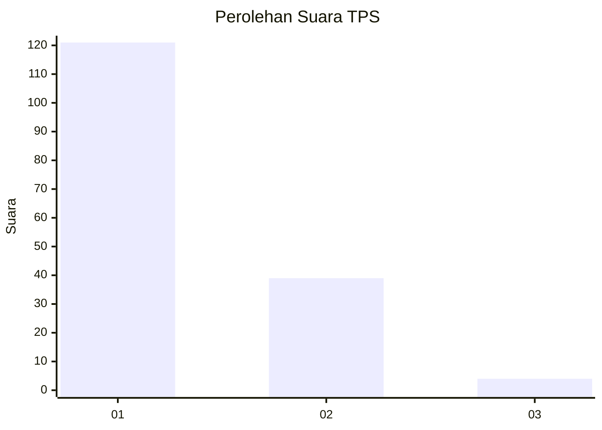
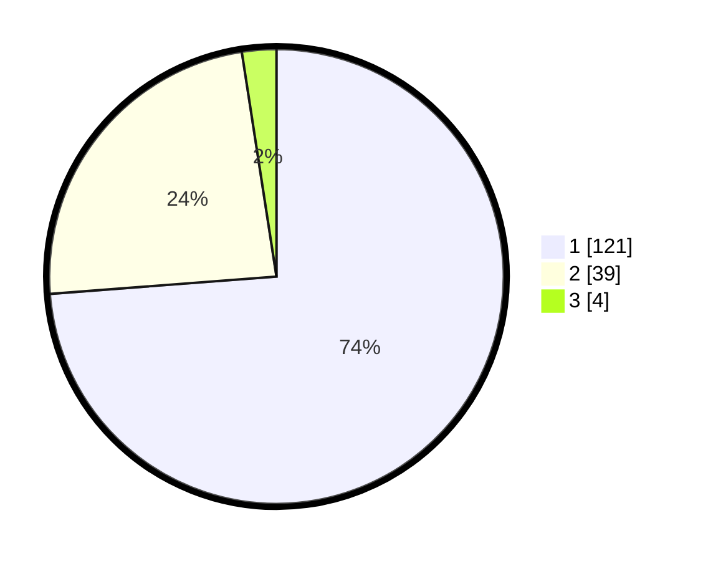

# Hasil

## Grafik

## Tabel

| No. | Nama Paslon    | Suara | Suara (raw) | Persentase |
|:--- |:-------------- | -----:| -----------:| ----------:|
| 1   | ANIES MUHAIMIN | 121   | [121][p-1]  | 73,78      |
| 2   | PRABOWO GIBRAN | 39    | [39][p-2]   | 23,78      |
| 3   | GANJAR MAHFUD  | 4     | [4][p-3]    | 2,44       |

[p-1]: https://github.com/gigit-pemilu/pemilu-2024-11-aceh/blob/main/pilpres/hitung-suara/sub/11-aceh/sub/02-aceh-tenggara/sub/10-semadam/sub/2013-ngkeran-alur-buluh/sub/001-tps/sub/paslon-1.txt
[p-2]: https://github.com/gigit-pemilu/pemilu-2024-11-aceh/blob/main/pilpres/hitung-suara/sub/11-aceh/sub/02-aceh-tenggara/sub/10-semadam/sub/2013-ngkeran-alur-buluh/sub/001-tps/sub/paslon-2.txt
[p-3]: https://github.com/gigit-pemilu/pemilu-2024-11-aceh/blob/main/pilpres/hitung-suara/sub/11-aceh/sub/02-aceh-tenggara/sub/10-semadam/sub/2013-ngkeran-alur-buluh/sub/001-tps/sub/paslon-3.txt

## Foto C Plano

https://sirekap-obj-formc.kpu.go.id/d6b9/pemilu/ppwp/11/02/10/20/13/1102102013001-20240218-210122--a1fb8ab6-afd9-48d0-a973-865e2d8dea27.jpg

https://sirekap-obj-formc.kpu.go.id/d6b9/pemilu/ppwp/11/02/10/20/13/1102102013001-20240218-210245--2982754b-efb5-470e-9b37-0753b5da58a9.jpg

https://sirekap-obj-formc.kpu.go.id/d6b9/pemilu/ppwp/11/02/10/20/13/1102102013001-20240218-210429--4e4abb92-a3e2-4f2f-b905-af2752f35ab6.jpg

## Metadata

| Key        | Value               |
| ---------- | ------------------- |
| Time Stamp | 2024-02-21 21:00:04 |

## DATA PEMILIH TETAP

Jumlah pemilih dalam DPT: **292**.
 * L: **700**.
 * P: **212**.

## DATA PENGGUNA HAK PILIH

Jumlah pengguna hak pilih dalam DPT: **364**.
 * L: **95**.
 * P: **173**.

Jumlah pengguna hak pilih dalam DPTb: **0**.
 * L: **7**.
 * P: **732**.

Jumlah pengguna hak pilih dalam DPK: **0**.
 * L: **733**.
 * P: **0**.

Jumlah pengguna hak pilih: **24**.
 * L: **751**.
 * P: **600**.

## JUMLAH SUARA SAH DAN TIDAK SAH

JUMLAH SELURUH SUARA SAH: **164**.

JUMLAH SUARA TIDAK SAH: **0**.

JUMLAH SELURUH SUARA SAH DAN SUARA TIDAK SAH: **164**.

