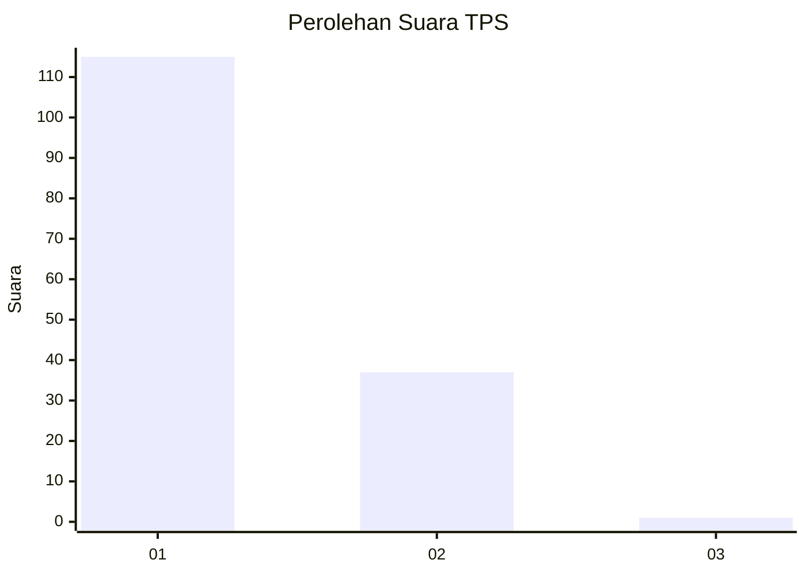
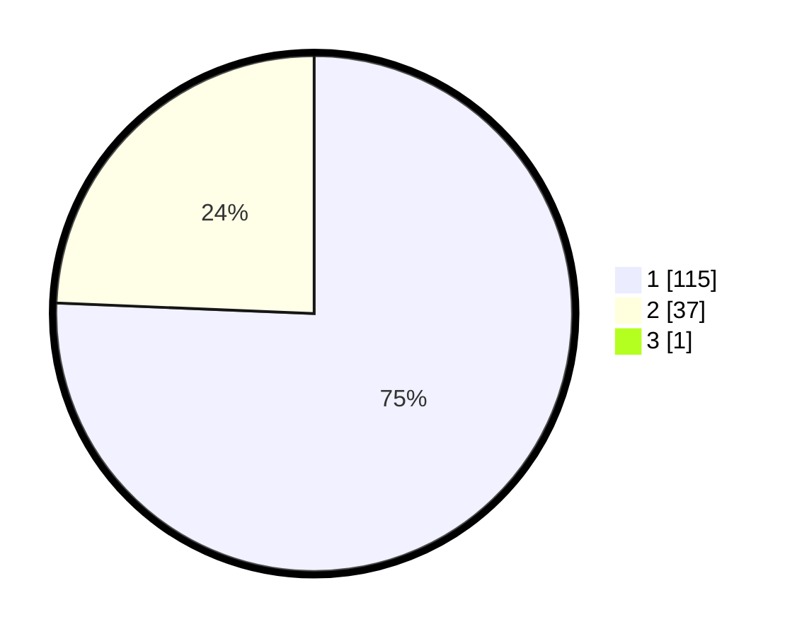

# Hasil

## Grafik

## Tabel

| No. | Nama Paslon    | Suara | Suara (raw) | Persentase |
|:--- |:-------------- | -----:| -----------:| ----------:|
| 1   | ANIES MUHAIMIN | 115   | [115][p-1]  | 75,16      |
| 2   | PRABOWO GIBRAN | 37    | [37][p-2]   | 24,18      |
| 3   | GANJAR MAHFUD  | 1     | [1][p-3]    | 0,65       |

[p-1]: https://github.com/gigit-pemilu/pemilu-2024-11-aceh/blob/main/pilpres/hitung-suara/sub/11-aceh/sub/02-aceh-tenggara/sub/10-semadam/sub/2013-ngkeran-alur-buluh/sub/002-tps/sub/paslon-1.txt
[p-2]: https://github.com/gigit-pemilu/pemilu-2024-11-aceh/blob/main/pilpres/hitung-suara/sub/11-aceh/sub/02-aceh-tenggara/sub/10-semadam/sub/2013-ngkeran-alur-buluh/sub/002-tps/sub/paslon-2.txt
[p-3]: https://github.com/gigit-pemilu/pemilu-2024-11-aceh/blob/main/pilpres/hitung-suara/sub/11-aceh/sub/02-aceh-tenggara/sub/10-semadam/sub/2013-ngkeran-alur-buluh/sub/002-tps/sub/paslon-3.txt

## Foto C Plano

https://sirekap-obj-formc.kpu.go.id/2248/pemilu/ppwp/11/02/10/20/13/1102102013002-20240218-205517--56908ecf-7bea-44f3-9b3b-b235500b5d6b.jpg

https://sirekap-obj-formc.kpu.go.id/2248/pemilu/ppwp/11/02/10/20/13/1102102013002-20240214-195005--2ff49d6f-5651-481d-aead-70c978c2bb8c.jpg

https://sirekap-obj-formc.kpu.go.id/2248/pemilu/ppwp/11/02/10/20/13/1102102013002-20240214-201317--e4ecf97d-ea11-496f-bcb9-f00efb8bd2a8.jpg

## Metadata

| Key        | Value               |
| ---------- | ------------------- |
| Time Stamp | 2024-02-24 22:31:28 |

