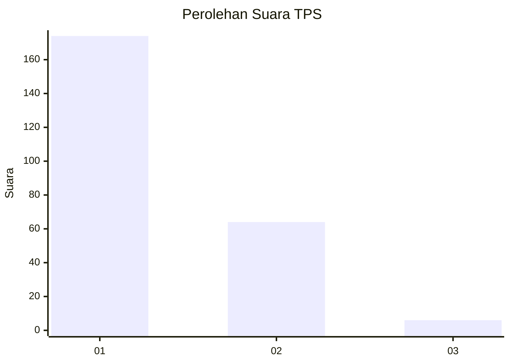
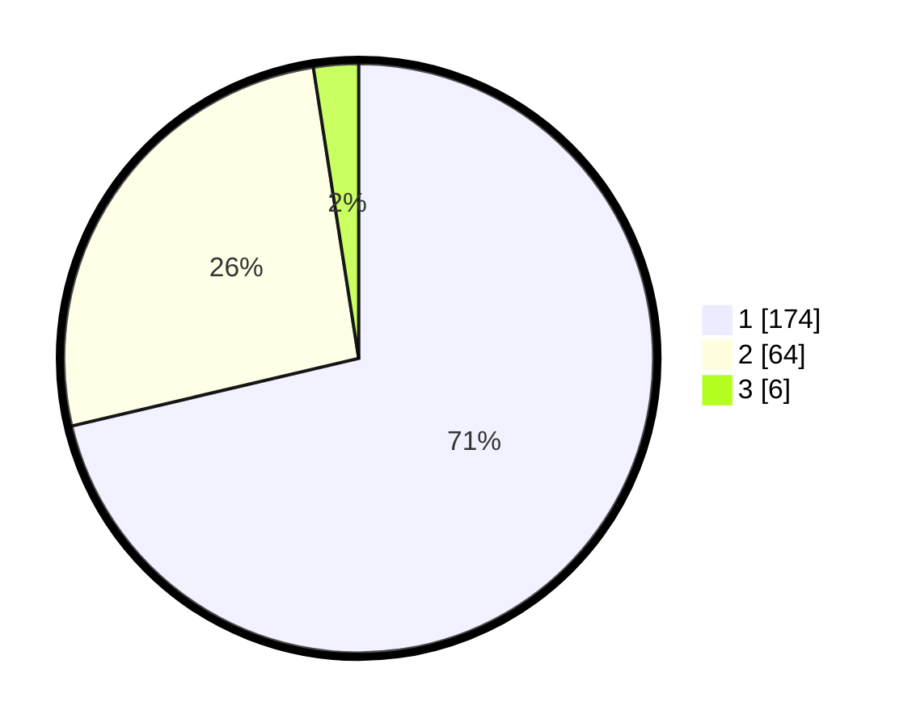

# Hasil

## Grafik

## Tabel

| No. | Nama Paslon    | Suara | Suara (raw) | Persentase |
|:--- |:-------------- | -----:| -----------:| ----------:|
| 1   | ANIES MUHAIMIN | 174   | [174][p-1]  | 71,31      |
| 2   | PRABOWO GIBRAN | 64    | [64][p-2]   | 26,23      |
| 3   | GANJAR MAHFUD  | 6     | [6][p-3]    | 2,46       |

[p-1]: https://github.com/gigit-pemilu/pemilu-2024-11-aceh/blob/main/pilpres/hitung-suara/sub/11-aceh/sub/02-aceh-tenggara/sub/10-semadam/sub/2014-kampung-baru/sub/001-tps/sub/paslon-1.txt
[p-2]: https://github.com/gigit-pemilu/pemilu-2024-11-aceh/blob/main/pilpres/hitung-suara/sub/11-aceh/sub/02-aceh-tenggara/sub/10-semadam/sub/2014-kampung-baru/sub/001-tps/sub/paslon-2.txt
[p-3]: https://github.com/gigit-pemilu/pemilu-2024-11-aceh/blob/main/pilpres/hitung-suara/sub/11-aceh/sub/02-aceh-tenggara/sub/10-semadam/sub/2014-kampung-baru/sub/001-tps/sub/paslon-3.txt

## Foto C Plano

https://sirekap-obj-formc.kpu.go.id/8eb0/pemilu/ppwp/11/02/10/20/14/1102102014001-20240215-100145--40bd941f-6629-4f73-9bab-8a0ebdce4b45.jpg

https://sirekap-obj-formc.kpu.go.id/8eb0/pemilu/ppwp/11/02/10/20/14/1102102014001-20240215-100212--d790bd68-9a36-405a-8c95-53cb19a4b31f.jpg

https://sirekap-obj-formc.kpu.go.id/8eb0/pemilu/ppwp/11/02/10/20/14/1102102014001-20240215-100301--385a29e1-168b-401e-9eb7-6a9bc2a24bc3.jpg

## Metadata

| Key        | Value               |
| ---------- | ------------------- |
| Time Stamp | 2024-02-25 15:00:00 |

