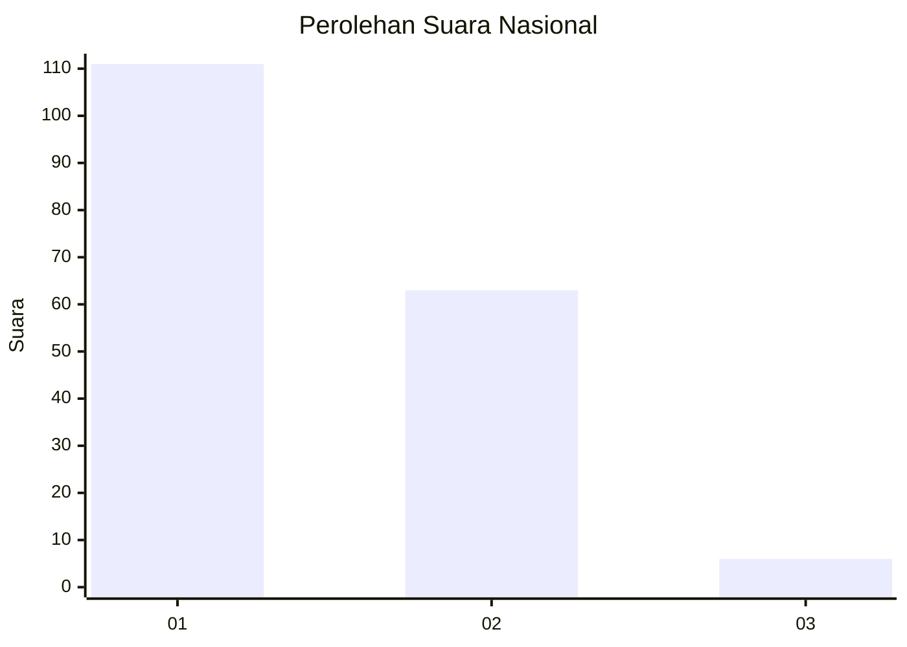
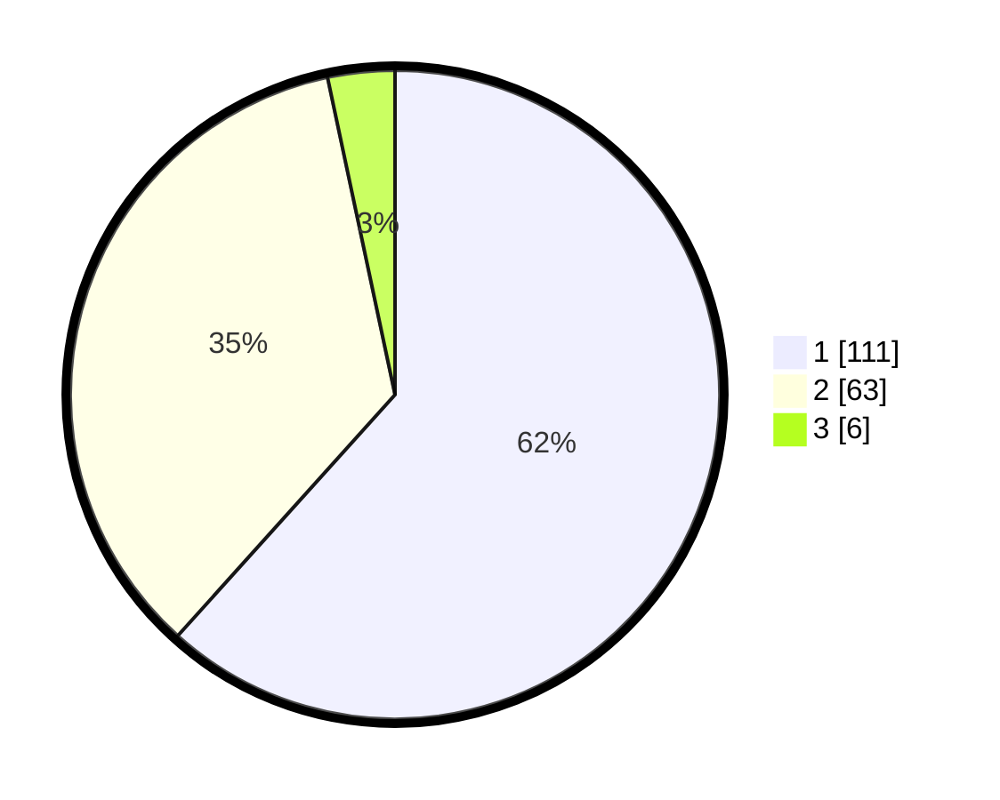

# Hasil

## Grafik

## Tabel

| No. | Nama Paslon    | Suara | Suara (raw) | Persentase |
|:--- |:-------------- | -----:| -----------:| ----------:|
| 1   | ANIES MUHAIMIN | 111   | [111][p-1]  | 61,67      |
| 2   | PRABOWO GIBRAN | 63    | [63][p-2]   | 35,00      |
| 3   | GANJAR MAHFUD  | 6     | [6][p-3]    | 3,33       |

[p-1]: https://github.com/gigit-pemilu/pemilu-2024/blob/main/pilpres/hitung-suara/sub/11-aceh/sub/02-aceh-tenggara/sub/10-semadam/sub/2015-sepakat-segenap/sub/002-tps/sub/paslon-1.txt
[p-2]: https://github.com/gigit-pemilu/pemilu-2024/blob/main/pilpres/hitung-suara/sub/11-aceh/sub/02-aceh-tenggara/sub/10-semadam/sub/2015-sepakat-segenap/sub/002-tps/sub/paslon-2.txt
[p-3]: https://github.com/gigit-pemilu/pemilu-2024/blob/main/pilpres/hitung-suara/sub/11-aceh/sub/02-aceh-tenggara/sub/10-semadam/sub/2015-sepakat-segenap/sub/002-tps/sub/paslon-3.txt

## Foto C Plano

https://sirekap-obj-formc.kpu.go.id/7f89/pemilu/ppwp/11/02/10/20/15/1102102015002-20240218-213601--ce4b4025-38a2-4114-b6a1-f79748a8b533.jpg

https://sirekap-obj-formc.kpu.go.id/7f89/pemilu/ppwp/11/02/10/20/15/1102102015002-20240218-213737--b9dfd5f7-5e22-4a7a-9232-d21381640d16.jpg

https://sirekap-obj-formc.kpu.go.id/7f89/pemilu/ppwp/11/02/10/20/15/1102102015002-20240218-213856--5dc43ab4-0930-482d-8044-a8cb8540ca36.jpg

## Metadata

| Key        | Value               |
| ---------- | ------------------- |
| Time Stamp | 2024-02-21 11:00:00 |

