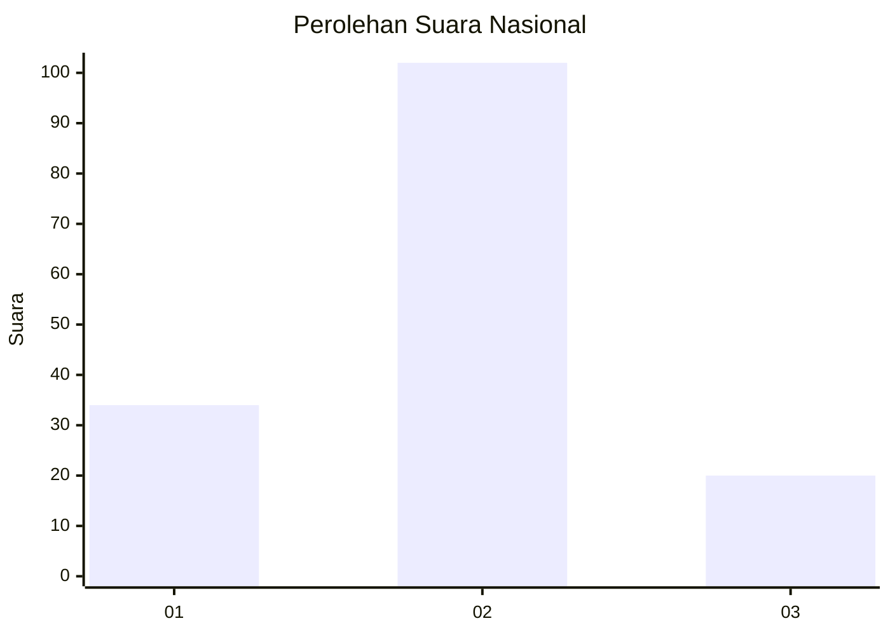
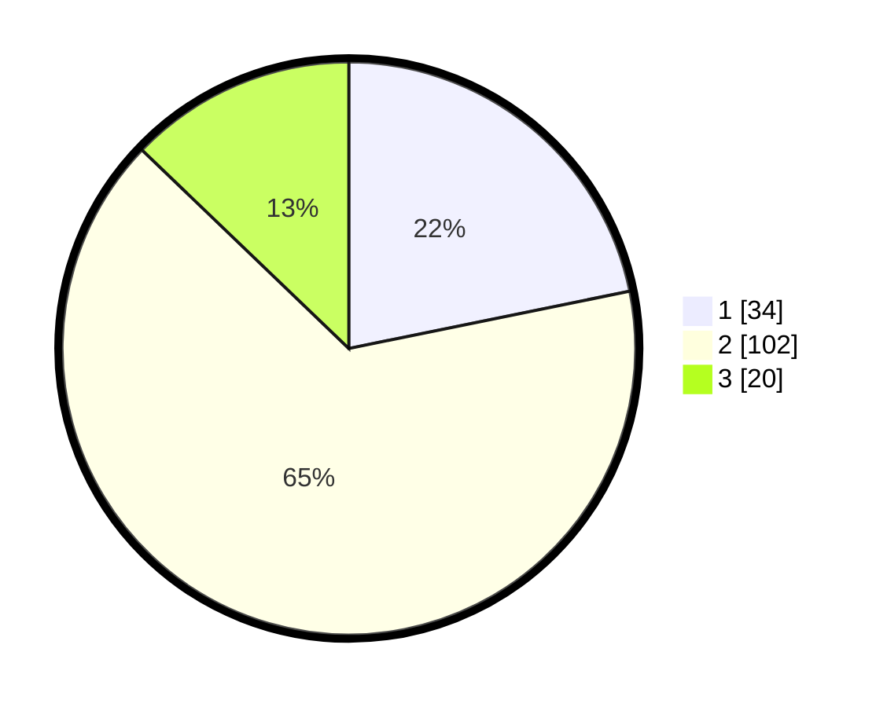

# Hasil

## Grafik

## Tabel

| No. | Nama Paslon    | Suara | Suara (raw) | Persentase |
|:--- |:-------------- | -----:| -----------:| ----------:|
| 1   | ANIES MUHAIMIN | 34    | [34][p-1]   | 21,79      |
| 2   | PRABOWO GIBRAN | 102   | [102][p-2]  | 65,38      |
| 3   | GANJAR MAHFUD  | 20    | [20][p-3]   | 12,82      |

[p-1]: https://github.com/gigit-pemilu/pemilu-2024/blob/main/pilpres/hitung-suara/sub/11-aceh/sub/02-aceh-tenggara/sub/10-semadam/sub/2018-lawe-mejile/sub/002-tps/sub/paslon-1.txt
[p-2]: https://github.com/gigit-pemilu/pemilu-2024/blob/main/pilpres/hitung-suara/sub/11-aceh/sub/02-aceh-tenggara/sub/10-semadam/sub/2018-lawe-mejile/sub/002-tps/sub/paslon-2.txt
[p-3]: https://github.com/gigit-pemilu/pemilu-2024/blob/main/pilpres/hitung-suara/sub/11-aceh/sub/02-aceh-tenggara/sub/10-semadam/sub/2018-lawe-mejile/sub/002-tps/sub/paslon-3.txt

## Foto C Plano

https://sirekap-obj-formc.kpu.go.id/1071/pemilu/ppwp/11/02/10/20/18/1102102018002-20240215-085803--a689cb53-9279-429d-8269-3479eec1d197.jpg

https://sirekap-obj-formc.kpu.go.id/1071/pemilu/ppwp/11/02/10/20/18/1102102018002-20240215-085838--937b7fbf-2daa-4959-a64b-5bbe2bdbcab9.jpg

https://sirekap-obj-formc.kpu.go.id/1071/pemilu/ppwp/11/02/10/20/18/1102102018002-20240215-085911--df8c6952-c6d2-4d03-8e37-5dc9d1a79b1d.jpg

## Metadata

| Key        | Value               |
| ---------- | ------------------- |
| Time Stamp | 2024-02-15 16:00:26 |

## DATA PEMILIH TETAP

Jumlah pemilih dalam DPT: **269**.
 * L: **134**.
 * P: **122**.

## DATA PENGGUNA HAK PILIH

Jumlah pengguna hak pilih dalam DPT: **269**.
 * L: **0**.
 * P: **0**.

Jumlah pengguna hak pilih dalam DPTb: **1**.
 * L: **640**.
 * P: **0**.

Jumlah pengguna hak pilih dalam DPK: **5**.
 * L: **7**.
 * P: **0**.

Jumlah pengguna hak pilih: **263**.
 * L: **0**.
 * P: **0**.

## JUMLAH SUARA SAH DAN TIDAK SAH

JUMLAH SELURUH SUARA SAH: **221**.

JUMLAH SUARA TIDAK SAH: **2**.

JUMLAH SELURUH SUARA SAH DAN SUARA TIDAK SAH: **223**.

