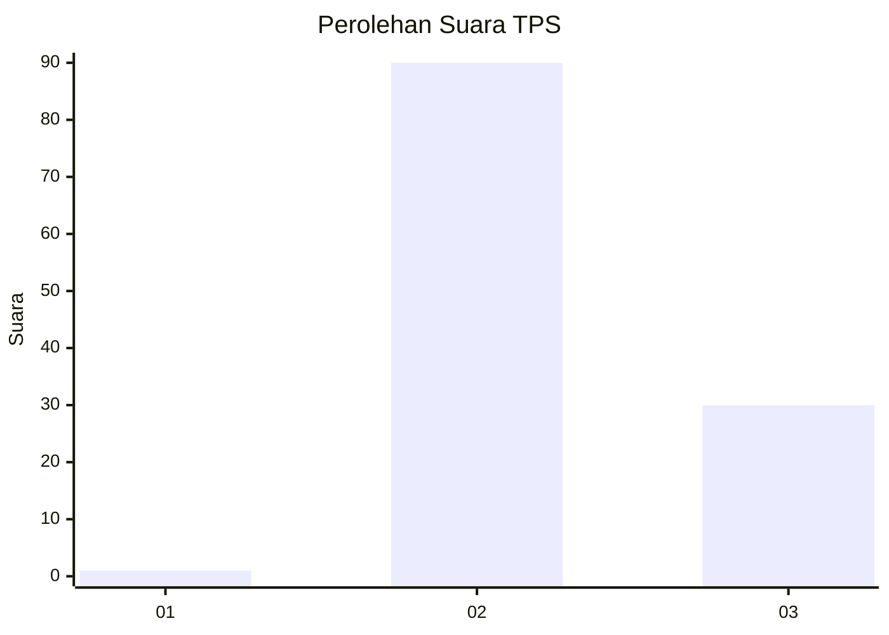
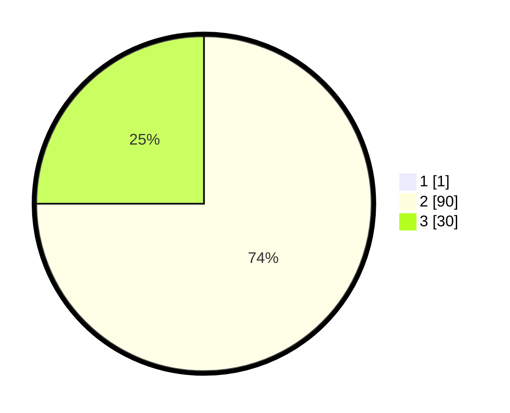

# Hasil

## Grafik

## Tabel

| No. | Nama Paslon    | Suara | Suara (raw) | Persentase |
|:--- |:-------------- | -----:| -----------:| ----------:|
| 1   | ANIES MUHAIMIN | 1     | [1][p-1]    | 0,83       |
| 2   | PRABOWO GIBRAN | 90    | [90][p-2]   | 74,38      |
| 3   | GANJAR MAHFUD  | 30    | [30][p-3]   | 24,79      |

[p-1]: https://github.com/gigit-pemilu/pemilu-2024-11-aceh/blob/main/pilpres/hitung-suara/sub/11-aceh/sub/02-aceh-tenggara/sub/10-semadam/sub/2019-lawe-petanduk-ii/sub/002-tps/sub/paslon-1.txt
[p-2]: https://github.com/gigit-pemilu/pemilu-2024-11-aceh/blob/main/pilpres/hitung-suara/sub/11-aceh/sub/02-aceh-tenggara/sub/10-semadam/sub/2019-lawe-petanduk-ii/sub/002-tps/sub/paslon-2.txt
[p-3]: https://github.com/gigit-pemilu/pemilu-2024-11-aceh/blob/main/pilpres/hitung-suara/sub/11-aceh/sub/02-aceh-tenggara/sub/10-semadam/sub/2019-lawe-petanduk-ii/sub/002-tps/sub/paslon-3.txt

## Foto C Plano

https://sirekap-obj-formc.kpu.go.id/4cdb/pemilu/ppwp/11/02/10/20/19/1102102019002-20240215-100022--b7a1a2a2-b6f4-4eb0-a29e-bb8792679169.jpg

https://sirekap-obj-formc.kpu.go.id/4cdb/pemilu/ppwp/11/02/10/20/19/1102102019002-20240215-100153--a4114577-90fe-4b22-8656-cfca76308ef6.jpg

https://sirekap-obj-formc.kpu.go.id/4cdb/pemilu/ppwp/11/02/10/20/19/1102102019002-20240215-100250--9d34f63b-c0e4-4da8-9a75-6e68e7570d6d.jpg

## Metadata

| Key        | Value               |
| ---------- | ------------------- |
| Time Stamp | 2024-02-19 06:16:00 |

## DATA PEMILIH TETAP

Jumlah pemilih dalam DPT: **149**.
 * L: **64**.
 * P: **2**.

## DATA PENGGUNA HAK PILIH

Jumlah pengguna hak pilih dalam DPT: **112**.
 * L: **54**.
 * P: **58**.

Jumlah pengguna hak pilih dalam DPTb: **0**.
 * L: **0**.
 * P: **0**.

Jumlah pengguna hak pilih dalam DPK: **12**.
 * L: **7**.
 * P: **5**.

Jumlah pengguna hak pilih: **124**.
 * L: **61**.
 * P: **63**.

## JUMLAH SUARA SAH DAN TIDAK SAH

JUMLAH SELURUH SUARA SAH: **121**.

JUMLAH SUARA TIDAK SAH: **3**.

JUMLAH SELURUH SUARA SAH DAN SUARA TIDAK SAH: **124**.

