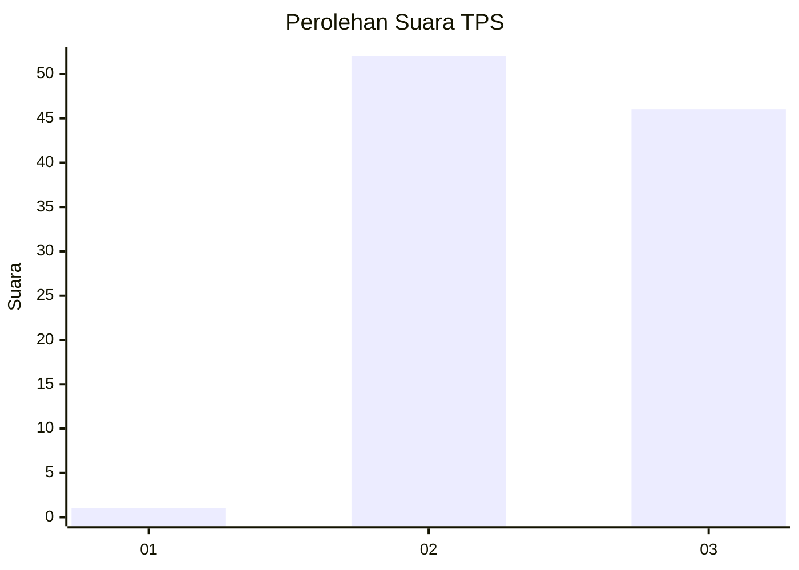
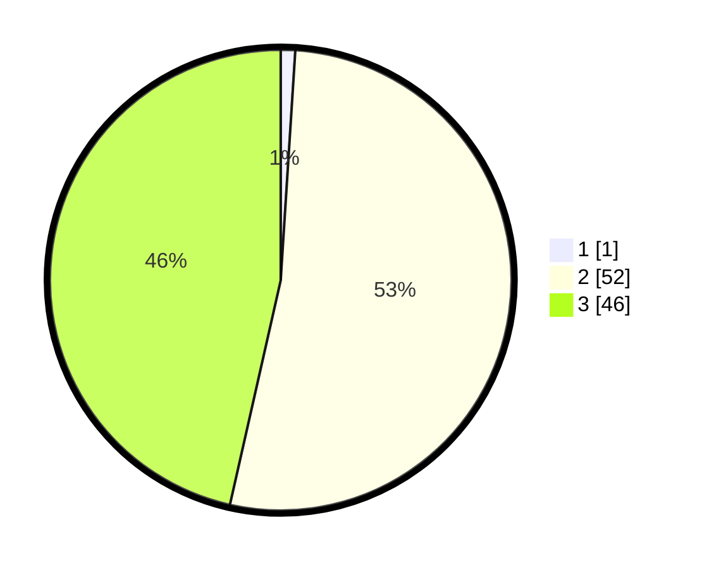

# Hasil

## Grafik

## Tabel

| No. | Nama Paslon    | Suara | Suara (raw) | Persentase |
|:--- |:-------------- | -----:| -----------:| ----------:|
| 1   | ANIES MUHAIMIN | 1     | [1][p-1]    | 1,01       |
| 2   | PRABOWO GIBRAN | 52    | [52][p-2]   | 52,53      |
| 3   | GANJAR MAHFUD  | 46    | [46][p-3]   | 46,46      |

[p-1]: https://github.com/gigit-pemilu/pemilu-2024-11-aceh/blob/main/pilpres/hitung-suara/sub/11-aceh/sub/02-aceh-tenggara/sub/11-babul-rahmah/sub/2005-meranti/sub/001-tps/sub/paslon-1.txt
[p-2]: https://github.com/gigit-pemilu/pemilu-2024-11-aceh/blob/main/pilpres/hitung-suara/sub/11-aceh/sub/02-aceh-tenggara/sub/11-babul-rahmah/sub/2005-meranti/sub/001-tps/sub/paslon-2.txt
[p-3]: https://github.com/gigit-pemilu/pemilu-2024-11-aceh/blob/main/pilpres/hitung-suara/sub/11-aceh/sub/02-aceh-tenggara/sub/11-babul-rahmah/sub/2005-meranti/sub/001-tps/sub/paslon-3.txt

## Foto C Plano

https://sirekap-obj-formc.kpu.go.id/fbec/pemilu/ppwp/11/02/11/20/05/1102112005001-20240214-185637--22f02252-036f-4c7b-a5e9-a3230bdc4401.jpg

https://sirekap-obj-formc.kpu.go.id/fbec/pemilu/ppwp/11/02/11/20/05/1102112005001-20240214-141548--c9e47bf0-2f2a-4218-ba25-2763f1a93f8b.jpg

https://sirekap-obj-formc.kpu.go.id/fbec/pemilu/ppwp/11/02/11/20/05/1102112005001-20240214-185751--95764009-b774-4ed0-adfc-311b9ee1fa0b.jpg

## Metadata

| Key        | Value               |
| ---------- | ------------------- |
| Time Stamp | 2024-02-14 21:46:01 |

## DATA PEMILIH TETAP

Jumlah pemilih dalam DPT: **133**.
 * L: **68**.
 * P: **65**.

## DATA PENGGUNA HAK PILIH

Jumlah pengguna hak pilih dalam DPT: **99**.
 * L: **52**.
 * P: **47**.

Jumlah pengguna hak pilih dalam DPTb: **0**.
 * L: **0**.
 * P: **0**.

Jumlah pengguna hak pilih dalam DPK: **0**.
 * L: **0**.
 * P: **0**.

Jumlah pengguna hak pilih: **99**.
 * L: **52**.
 * P: **47**.

## JUMLAH SUARA SAH DAN TIDAK SAH

JUMLAH SELURUH SUARA SAH: **99**.

JUMLAH SUARA TIDAK SAH: **0**.

JUMLAH SELURUH SUARA SAH DAN SUARA TIDAK SAH: **99**.

