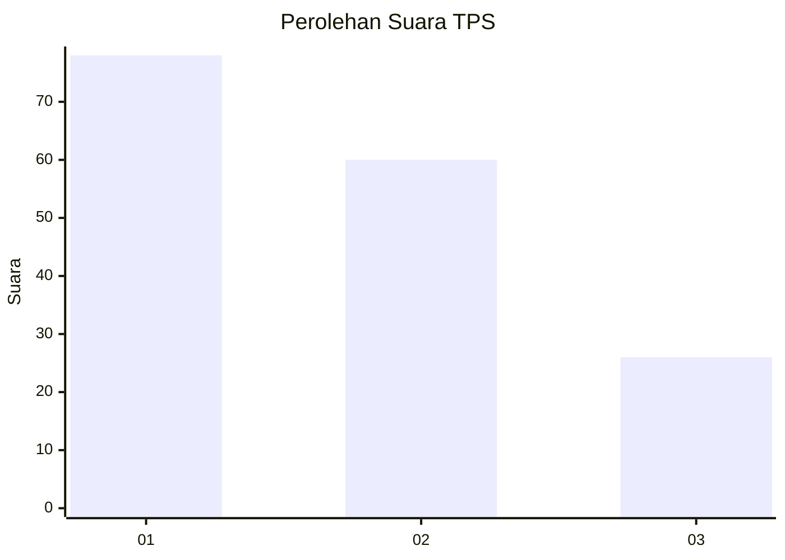
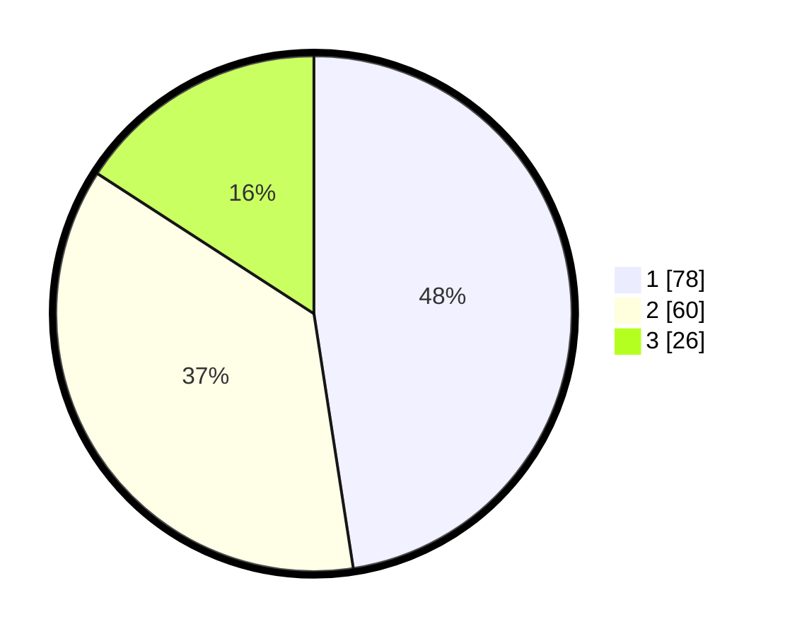

# Hasil

## Grafik

## Tabel

| No. | Nama Paslon    | Suara | Suara (raw) | Persentase |
|:--- |:-------------- | -----:| -----------:| ----------:|
| 1   | ANIES MUHAIMIN | 78    | [78][p-1]   | 47,56      |
| 2   | PRABOWO GIBRAN | 60    | [60][p-2]   | 36,59      |
| 3   | GANJAR MAHFUD  | 26    | [26][p-3]   | 15,85      |

[p-1]: https://github.com/gigit-pemilu/pemilu-2024-11-aceh/blob/main/pilpres/hitung-suara/sub/11-aceh/sub/02-aceh-tenggara/sub/11-babul-rahmah/sub/2007-lawe-sumur/sub/001-tps/sub/paslon-1.txt
[p-2]: https://github.com/gigit-pemilu/pemilu-2024-11-aceh/blob/main/pilpres/hitung-suara/sub/11-aceh/sub/02-aceh-tenggara/sub/11-babul-rahmah/sub/2007-lawe-sumur/sub/001-tps/sub/paslon-2.txt
[p-3]: https://github.com/gigit-pemilu/pemilu-2024-11-aceh/blob/main/pilpres/hitung-suara/sub/11-aceh/sub/02-aceh-tenggara/sub/11-babul-rahmah/sub/2007-lawe-sumur/sub/001-tps/sub/paslon-3.txt

## Foto C Plano

https://sirekap-obj-formc.kpu.go.id/9dc0/pemilu/ppwp/11/02/11/20/07/1102112007001-20240215-034352--dd356d81-a7f3-4c7b-9775-66919c94df8f.jpg

https://sirekap-obj-formc.kpu.go.id/9dc0/pemilu/ppwp/11/02/11/20/07/1102112007001-20240216-160148--166612e3-c90b-41a9-89d7-b08b7fe6a653.jpg

https://sirekap-obj-formc.kpu.go.id/9dc0/pemilu/ppwp/11/02/11/20/07/1102112007001-20240215-170629--971e6201-0a8b-4b0d-a57d-15c64c48cdd2.jpg

## Metadata

| Key        | Value               |
| ---------- | ------------------- |
| Time Stamp | 2024-02-24 22:31:28 |

## DATA PEMILIH TETAP

Jumlah pemilih dalam DPT: **182**.
 * L: **89**.
 * P: **93**.

## DATA PENGGUNA HAK PILIH

Jumlah pengguna hak pilih dalam DPT: **164**.
 * L: **79**.
 * P: **85**.

Jumlah pengguna hak pilih dalam DPTb: **2**.
 * L: **2**.
 * P: **0**.

Jumlah pengguna hak pilih dalam DPK: **0**.
 * L: **0**.
 * P: **0**.

Jumlah pengguna hak pilih: **166**.
 * L: **81**.
 * P: **85**.

## JUMLAH SUARA SAH DAN TIDAK SAH

JUMLAH SELURUH SUARA SAH: **164**.

JUMLAH SUARA TIDAK SAH: **2**.

JUMLAH SELURUH SUARA SAH DAN SUARA TIDAK SAH: **166**.

