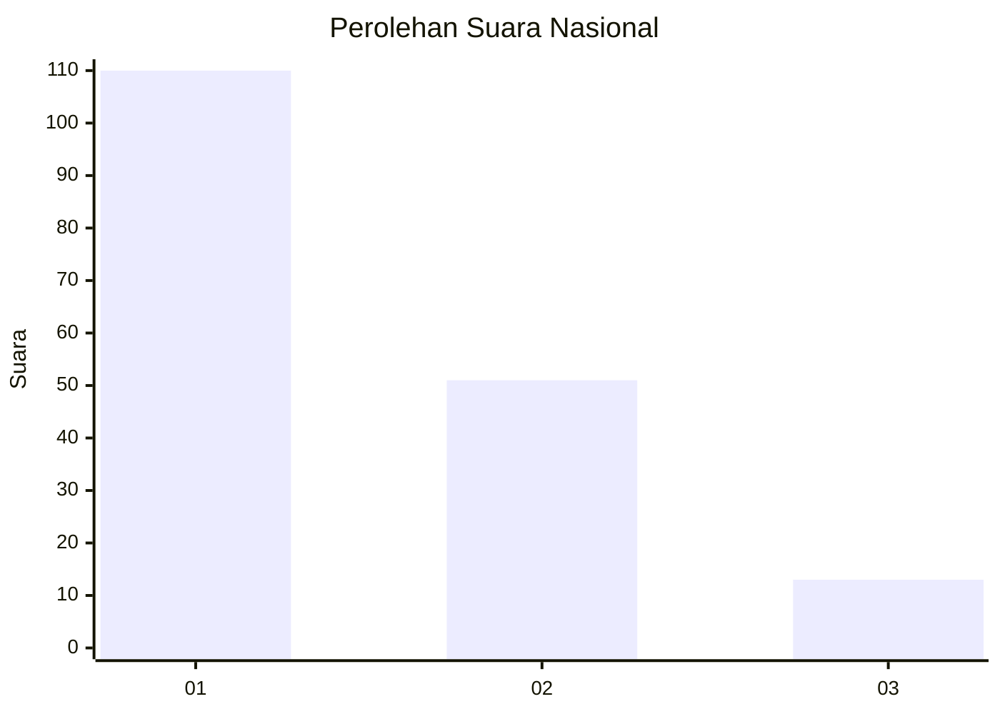
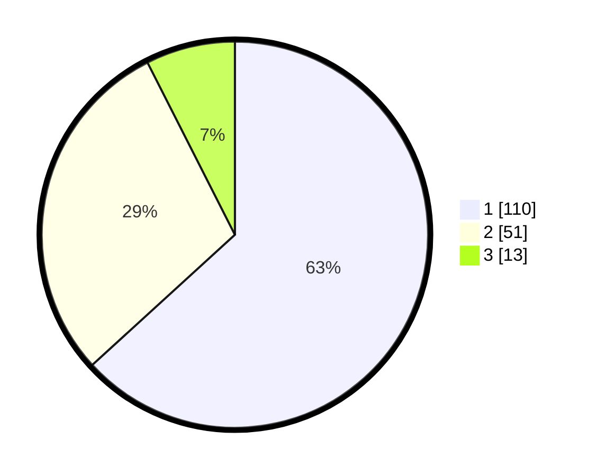

# Hasil

## Grafik

## Tabel

| No. | Nama Paslon    | Suara | Suara (raw) | Persentase |
|:--- |:-------------- | -----:| -----------:| ----------:|
| 1   | ANIES MUHAIMIN | 110   | [110][p-1]  | 63,22      |
| 2   | PRABOWO GIBRAN | 51    | [51][p-2]   | 29,31      |
| 3   | GANJAR MAHFUD  | 13    | [13][p-3]   | 7,47       |

[p-1]: https://github.com/gigit-pemilu/pemilu-2024/blob/main/pilpres/hitung-suara/sub/11-aceh/sub/02-aceh-tenggara/sub/11-babul-rahmah/sub/2007-lawe-sumur/sub/002-tps/sub/paslon-1.txt
[p-2]: https://github.com/gigit-pemilu/pemilu-2024/blob/main/pilpres/hitung-suara/sub/11-aceh/sub/02-aceh-tenggara/sub/11-babul-rahmah/sub/2007-lawe-sumur/sub/002-tps/sub/paslon-2.txt
[p-3]: https://github.com/gigit-pemilu/pemilu-2024/blob/main/pilpres/hitung-suara/sub/11-aceh/sub/02-aceh-tenggara/sub/11-babul-rahmah/sub/2007-lawe-sumur/sub/002-tps/sub/paslon-3.txt

## Foto C Plano

https://sirekap-obj-formc.kpu.go.id/950d/pemilu/ppwp/11/02/11/20/07/1102112007002-20240215-085959--3f7b8e01-1772-4961-a763-a85c37998b58.jpg

https://sirekap-obj-formc.kpu.go.id/950d/pemilu/ppwp/11/02/11/20/07/1102112007002-20240215-090131--c2354959-8254-420f-b112-1db567e94d32.jpg

https://sirekap-obj-formc.kpu.go.id/950d/pemilu/ppwp/11/02/11/20/07/1102112007002-20240215-175749--f474f8e7-e3f4-4b40-9a0f-d6f43cdec91d.jpg

## Metadata

| Key        | Value               |
| ---------- | ------------------- |
| Time Stamp | 2024-02-15 21:30:27 |

