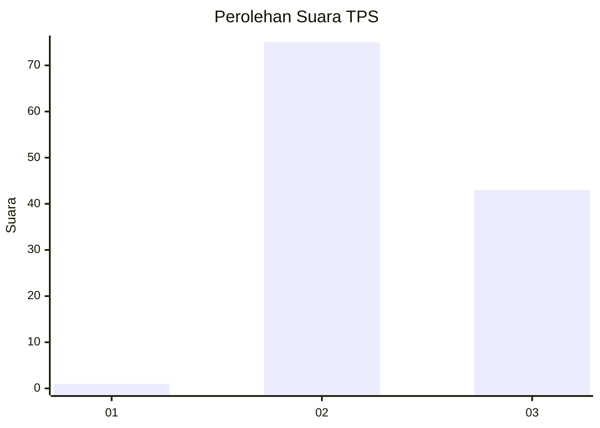
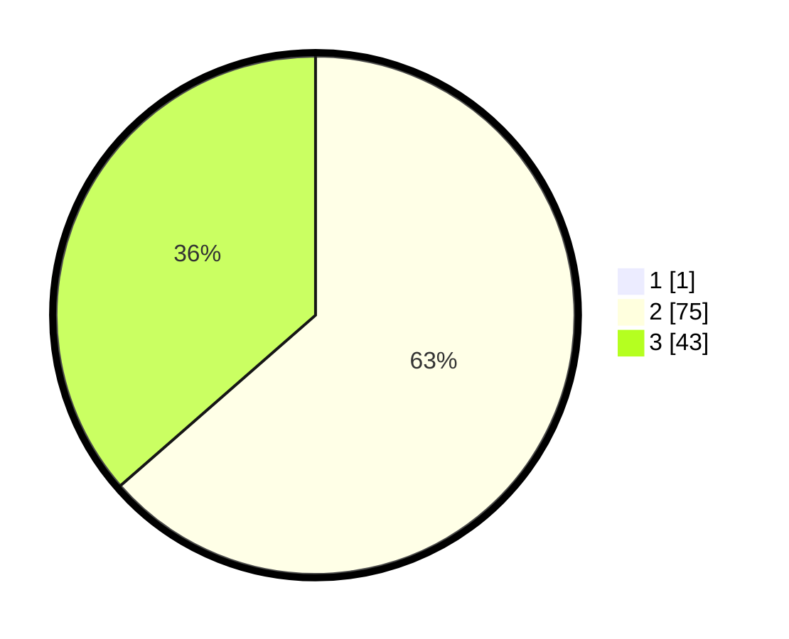

# Hasil

## Grafik

## Tabel

| No. | Nama Paslon    | Suara | Suara (raw) | Persentase |
|:--- |:-------------- | -----:| -----------:| ----------:|
| 1   | ANIES MUHAIMIN | 1     | [1][p-1]    | 0,84       |
| 2   | PRABOWO GIBRAN | 75    | [75][p-2]   | 63,03      |
| 3   | GANJAR MAHFUD  | 43    | [43][p-3]   | 36,13      |

[p-1]: https://github.com/gigit-pemilu/pemilu-2024-11-aceh/blob/main/pilpres/hitung-suara/sub/11-aceh/sub/02-aceh-tenggara/sub/11-babul-rahmah/sub/2008-pardamaian/sub/001-tps/sub/paslon-1.txt
[p-2]: https://github.com/gigit-pemilu/pemilu-2024-11-aceh/blob/main/pilpres/hitung-suara/sub/11-aceh/sub/02-aceh-tenggara/sub/11-babul-rahmah/sub/2008-pardamaian/sub/001-tps/sub/paslon-2.txt
[p-3]: https://github.com/gigit-pemilu/pemilu-2024-11-aceh/blob/main/pilpres/hitung-suara/sub/11-aceh/sub/02-aceh-tenggara/sub/11-babul-rahmah/sub/2008-pardamaian/sub/001-tps/sub/paslon-3.txt

## Foto C Plano

https://sirekap-obj-formc.kpu.go.id/2df9/pemilu/ppwp/11/02/11/20/08/1102112008001-20240216-141124--273837e3-3a30-423e-8a30-d7fe84b39da3.jpg

https://sirekap-obj-formc.kpu.go.id/2df9/pemilu/ppwp/11/02/11/20/08/1102112008001-20240216-141126--4f22b9c8-76c4-4300-9ed0-b750b111b045.jpg

https://sirekap-obj-formc.kpu.go.id/2df9/pemilu/ppwp/11/02/11/20/08/1102112008001-20240216-141125--a2110d90-8730-4355-a932-c8ae5d3dd104.jpg

## Metadata

| Key        | Value               |
| ---------- | ------------------- |
| Time Stamp | 2024-02-24 22:31:28 |

## DATA PEMILIH TETAP

Jumlah pemilih dalam DPT: **169**.
 * L: **81**.
 * P: **88**.

## DATA PENGGUNA HAK PILIH

Jumlah pengguna hak pilih dalam DPT: **118**.
 * L: **54**.
 * P: **64**.

Jumlah pengguna hak pilih dalam DPTb: **0**.
 * L: **0**.
 * P: **0**.

Jumlah pengguna hak pilih dalam DPK: **2**.
 * L: **0**.
 * P: **2**.

Jumlah pengguna hak pilih: **120**.
 * L: **54**.
 * P: **66**.

## JUMLAH SUARA SAH DAN TIDAK SAH

JUMLAH SELURUH SUARA SAH: **119**.

JUMLAH SUARA TIDAK SAH: **1**.

JUMLAH SELURUH SUARA SAH DAN SUARA TIDAK SAH: **120**.

