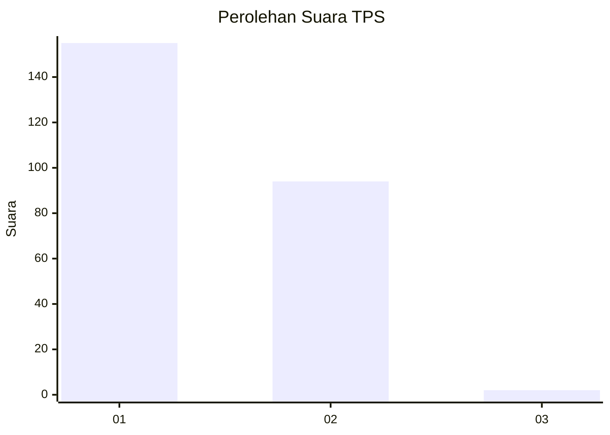
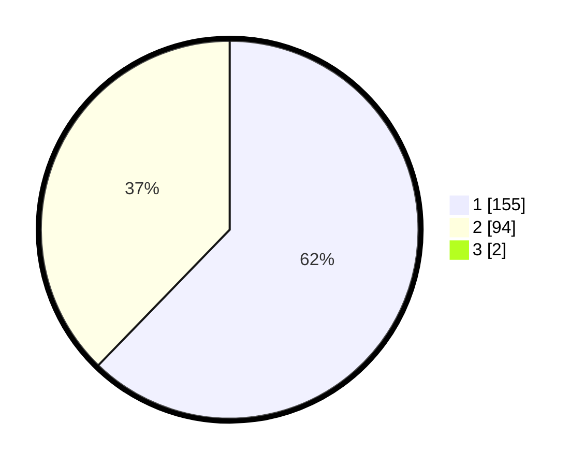

# Hasil

## Grafik

## Tabel

| No. | Nama Paslon    | Suara | Suara (raw) | Persentase |
|:--- |:-------------- | -----:| -----------:| ----------:|
| 1   | ANIES MUHAIMIN | 155   | [155][p-1]  | 61,75      |
| 2   | PRABOWO GIBRAN | 94    | [94][p-2]   | 37,45      |
| 3   | GANJAR MAHFUD  | 2     | [2][p-3]    | 0,80       |

[p-1]: https://github.com/gigit-pemilu/pemilu-2024-11-aceh/blob/main/pilpres/hitung-suara/sub/11-aceh/sub/02-aceh-tenggara/sub/11-babul-rahmah/sub/2012-mutiara-damai/sub/001-tps/sub/paslon-1.txt
[p-2]: https://github.com/gigit-pemilu/pemilu-2024-11-aceh/blob/main/pilpres/hitung-suara/sub/11-aceh/sub/02-aceh-tenggara/sub/11-babul-rahmah/sub/2012-mutiara-damai/sub/001-tps/sub/paslon-2.txt
[p-3]: https://github.com/gigit-pemilu/pemilu-2024-11-aceh/blob/main/pilpres/hitung-suara/sub/11-aceh/sub/02-aceh-tenggara/sub/11-babul-rahmah/sub/2012-mutiara-damai/sub/001-tps/sub/paslon-3.txt

## Foto C Plano

https://sirekap-obj-formc.kpu.go.id/146a/pemilu/ppwp/11/02/11/20/12/1102112012001-20240215-104031--f39feef8-1a5d-44e4-9978-4a7a595b3ab8.jpg

https://sirekap-obj-formc.kpu.go.id/146a/pemilu/ppwp/11/02/11/20/12/1102112012001-20240215-104157--d00a04c4-1fb9-4e47-8482-476d92284077.jpg

## Metadata

| Key        | Value               |
| ---------- | ------------------- |
| Time Stamp | 2024-02-24 22:31:28 |

