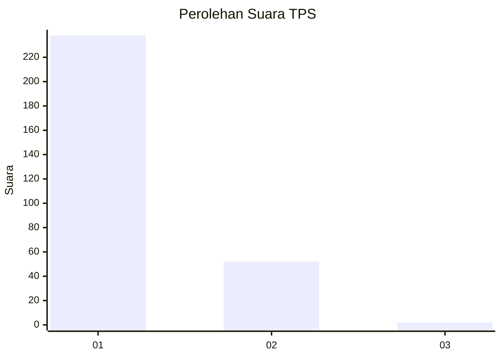
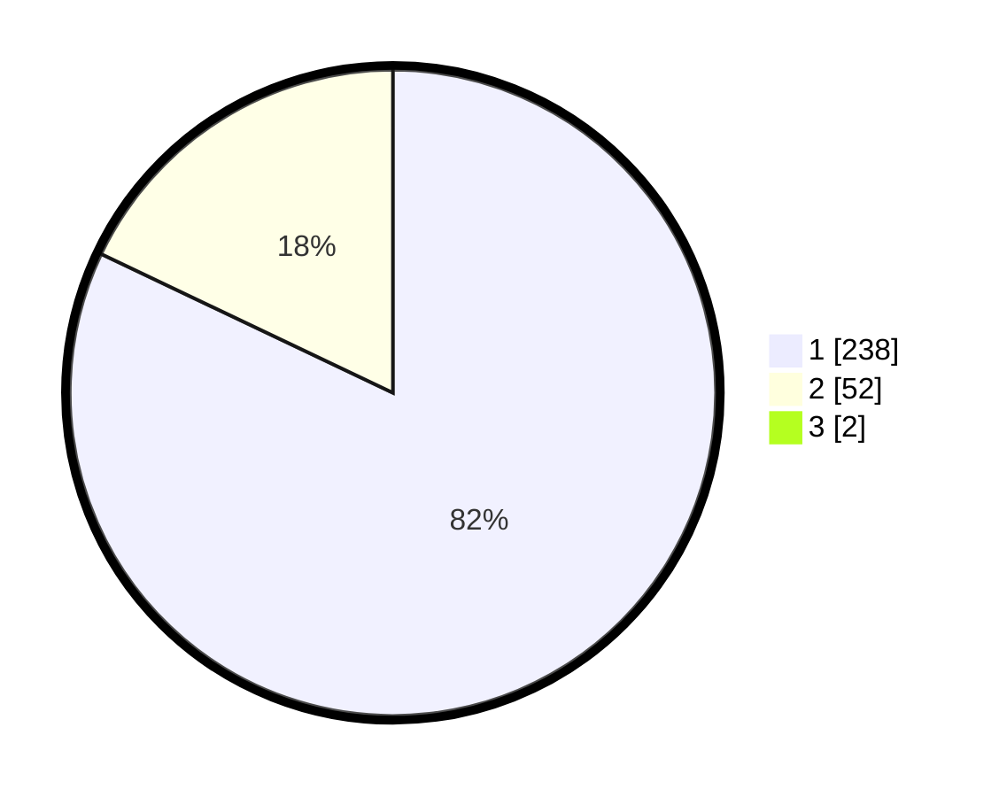

# Hasil

## Grafik

## Tabel

| No. | Nama Paslon    | Suara | Suara (raw) | Persentase |
|:--- |:-------------- | -----:| -----------:| ----------:|
| 1   | ANIES MUHAIMIN | 238   | [238][p-1]  | 81,51      |
| 2   | PRABOWO GIBRAN | 52    | [52][p-2]   | 17,81      |
| 3   | GANJAR MAHFUD  | 2     | [2][p-3]    | 0,68       |

[p-1]: https://github.com/gigit-pemilu/pemilu-2024-11-aceh/blob/main/pilpres/hitung-suara/sub/11-aceh/sub/02-aceh-tenggara/sub/11-babul-rahmah/sub/2014-tuhi-jongkat/sub/001-tps/sub/paslon-1.txt
[p-2]: https://github.com/gigit-pemilu/pemilu-2024-11-aceh/blob/main/pilpres/hitung-suara/sub/11-aceh/sub/02-aceh-tenggara/sub/11-babul-rahmah/sub/2014-tuhi-jongkat/sub/001-tps/sub/paslon-2.txt
[p-3]: https://github.com/gigit-pemilu/pemilu-2024-11-aceh/blob/main/pilpres/hitung-suara/sub/11-aceh/sub/02-aceh-tenggara/sub/11-babul-rahmah/sub/2014-tuhi-jongkat/sub/001-tps/sub/paslon-3.txt

## Foto C Plano

https://sirekap-obj-formc.kpu.go.id/20ea/pemilu/ppwp/11/02/11/20/14/1102112014001-20240215-210309--6570de60-5531-4d70-8283-89a284761c60.jpg

https://sirekap-obj-formc.kpu.go.id/20ea/pemilu/ppwp/11/02/11/20/14/1102112014001-20240215-210524--77d520c7-a36c-4957-873d-90d2e077d77a.jpg

https://sirekap-obj-formc.kpu.go.id/20ea/pemilu/ppwp/11/02/11/20/14/1102112014001-20240215-210804--f43d019d-6ff4-4bb6-a686-a1ff23f05f6e.jpg

## Metadata

| Key        | Value               |
| ---------- | ------------------- |
| Time Stamp | 2024-02-15 23:29:50 |

