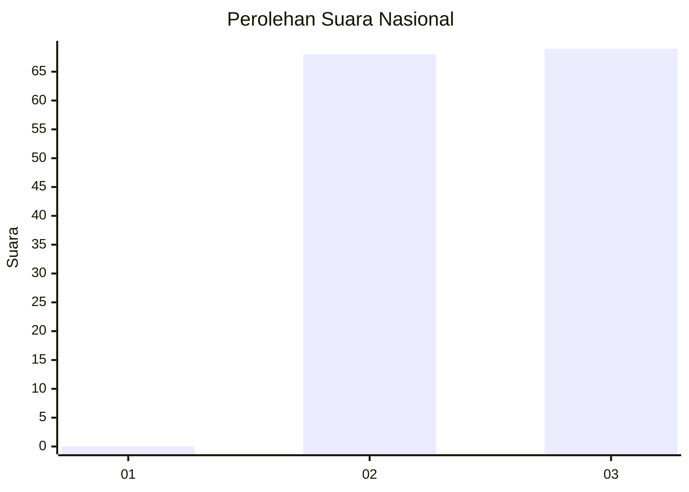
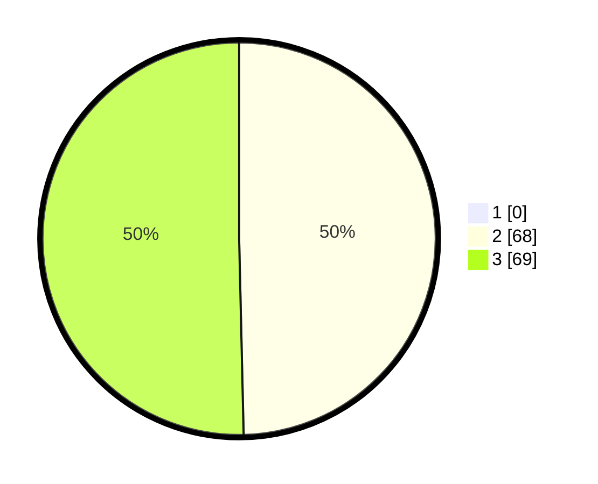

# Hasil

## Grafik

## Tabel

| No. | Nama Paslon    | Suara | Suara (raw) | Persentase |
|:--- |:-------------- | -----:| -----------:| ----------:|
| 1   | ANIES MUHAIMIN | 0     | [0][p-1]    | 0,00       |
| 2   | PRABOWO GIBRAN | 68    | [68][p-2]   | 49,64      |
| 3   | GANJAR MAHFUD  | 69    | [69][p-3]   | 50,36      |

[p-1]: https://github.com/gigit-pemilu/pemilu-2024/blob/main/pilpres/hitung-suara/sub/11-aceh/sub/02-aceh-tenggara/sub/11-babul-rahmah/sub/2016-lumban-sitio-tio/sub/001-tps/sub/paslon-1.txt
[p-2]: https://github.com/gigit-pemilu/pemilu-2024/blob/main/pilpres/hitung-suara/sub/11-aceh/sub/02-aceh-tenggara/sub/11-babul-rahmah/sub/2016-lumban-sitio-tio/sub/001-tps/sub/paslon-2.txt
[p-3]: https://github.com/gigit-pemilu/pemilu-2024/blob/main/pilpres/hitung-suara/sub/11-aceh/sub/02-aceh-tenggara/sub/11-babul-rahmah/sub/2016-lumban-sitio-tio/sub/001-tps/sub/paslon-3.txt

## Foto C Plano

https://sirekap-obj-formc.kpu.go.id/3585/pemilu/ppwp/11/02/11/20/16/1102112016001-20240215-095855--b60f0acb-a287-49cd-9500-53af2d976c19.jpg

https://sirekap-obj-formc.kpu.go.id/3585/pemilu/ppwp/11/02/11/20/16/1102112016001-20240215-100111--f8323de6-0611-4338-9764-02ee75108600.jpg

https://sirekap-obj-formc.kpu.go.id/3585/pemilu/ppwp/11/02/11/20/16/1102112016001-20240214-214223--6910ad1e-8971-47c8-9975-188814262398.jpg

## Metadata

| Key        | Value               |
| ---------- | ------------------- |
| Time Stamp | 2024-02-24 22:31:28 |

