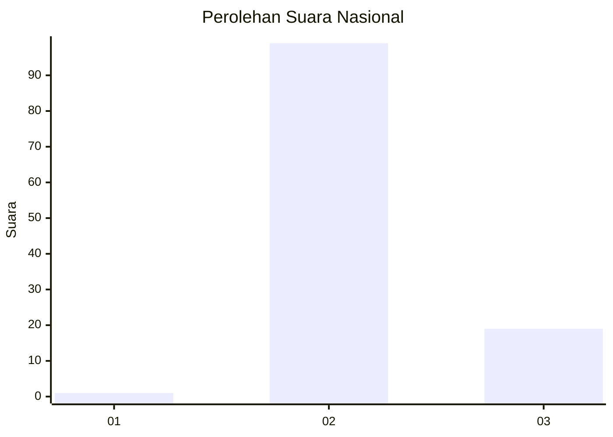
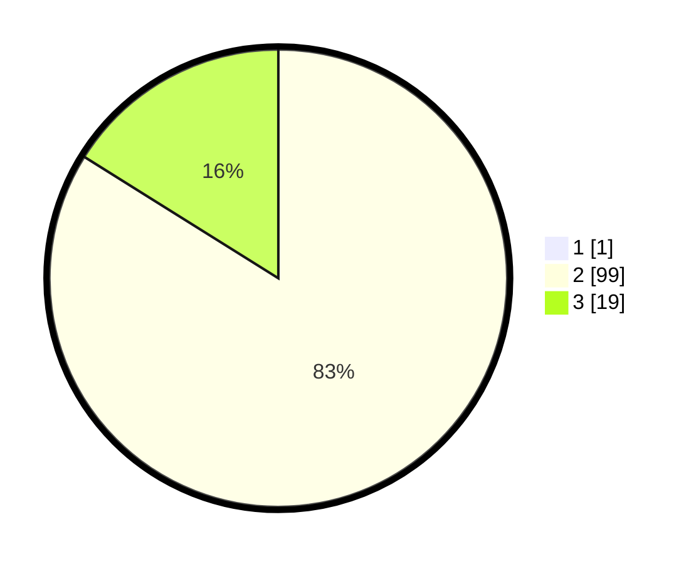

# Hasil

## Grafik

## Tabel

| No. | Nama Paslon    | Suara | Suara (raw) | Persentase |
|:--- |:-------------- | -----:| -----------:| ----------:|
| 1   | ANIES MUHAIMIN | 1     | [1][p-1]    | 0,84       |
| 2   | PRABOWO GIBRAN | 99    | [99][p-2]   | 83,19      |
| 3   | GANJAR MAHFUD  | 19    | [19][p-3]   | 15,97      |

[p-1]: https://github.com/gigit-pemilu/pemilu-2024/blob/main/pilpres/hitung-suara/sub/11-aceh/sub/02-aceh-tenggara/sub/11-babul-rahmah/sub/2023-alukh-bakhu/sub/001-tps/sub/paslon-1.txt
[p-2]: https://github.com/gigit-pemilu/pemilu-2024/blob/main/pilpres/hitung-suara/sub/11-aceh/sub/02-aceh-tenggara/sub/11-babul-rahmah/sub/2023-alukh-bakhu/sub/001-tps/sub/paslon-2.txt
[p-3]: https://github.com/gigit-pemilu/pemilu-2024/blob/main/pilpres/hitung-suara/sub/11-aceh/sub/02-aceh-tenggara/sub/11-babul-rahmah/sub/2023-alukh-bakhu/sub/001-tps/sub/paslon-3.txt

## Foto C Plano

https://sirekap-obj-formc.kpu.go.id/2c02/pemilu/ppwp/11/02/11/20/23/1102112023001-20240216-140656--78331420-5527-4c1f-af30-a1d5324d7f0e.jpg

https://sirekap-obj-formc.kpu.go.id/2c02/pemilu/ppwp/11/02/11/20/23/1102112023001-20240216-140657--64bb80c5-ceec-4b45-8c49-82ea8303e4ee.jpg

https://sirekap-obj-formc.kpu.go.id/2c02/pemilu/ppwp/11/02/11/20/23/1102112023001-20240216-140656--c5a53acb-49b9-47f5-89a7-3c5e341a1f6b.jpg

## Metadata

| Key        | Value               |
| ---------- | ------------------- |
| Time Stamp | 2024-02-24 22:31:28 |

## DATA PEMILIH TETAP

Jumlah pemilih dalam DPT: **154**.
 * L: **76**.
 * P: **78**.

## DATA PENGGUNA HAK PILIH

Jumlah pengguna hak pilih dalam DPT: **113**.
 * L: **57**.
 * P: **56**.

Jumlah pengguna hak pilih dalam DPTb: **2**.
 * L: **1**.
 * P: **1**.

Jumlah pengguna hak pilih dalam DPK: **5**.
 * L: **2**.
 * P: **3**.

Jumlah pengguna hak pilih: **120**.
 * L: **60**.
 * P: **60**.

## JUMLAH SUARA SAH DAN TIDAK SAH

JUMLAH SELURUH SUARA SAH: **119**.

JUMLAH SUARA TIDAK SAH: **1**.

JUMLAH SELURUH SUARA SAH DAN SUARA TIDAK SAH: **120**.

