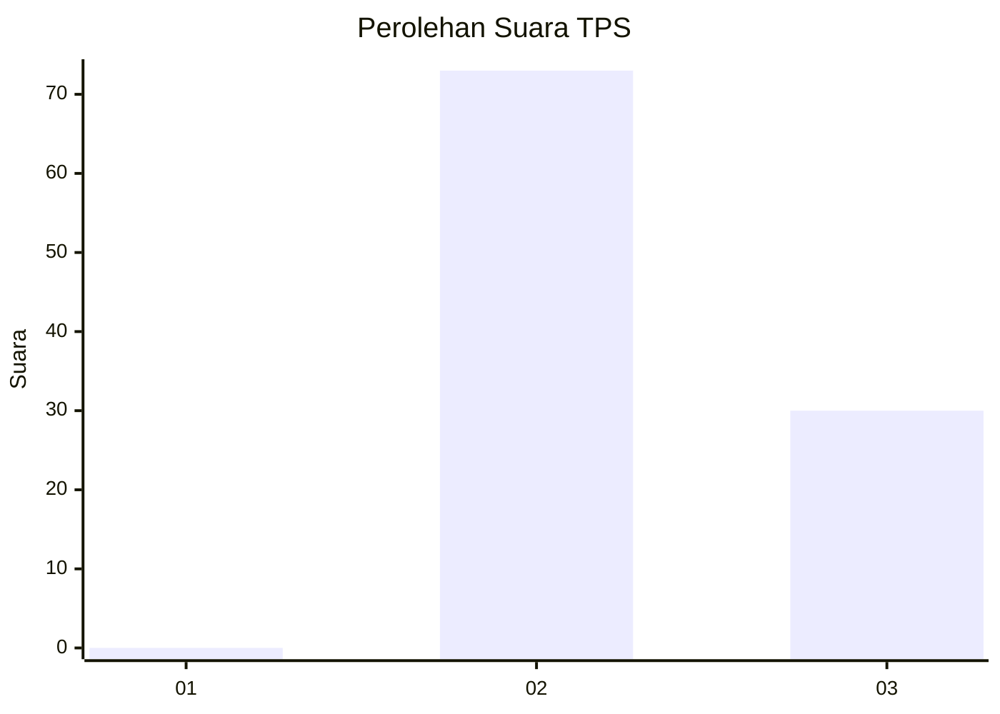
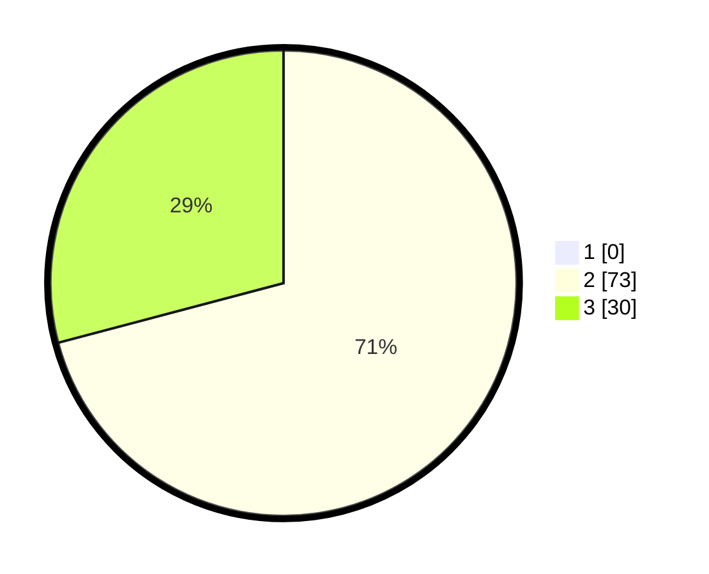

# Hasil

## Grafik

## Tabel

| No. | Nama Paslon    | Suara | Suara (raw) | Persentase |
|:--- |:-------------- | -----:| -----------:| ----------:|
| 1   | ANIES MUHAIMIN | 0     | [0][p-1]    | 0,00       |
| 2   | PRABOWO GIBRAN | 73    | [73][p-2]   | 70,87      |
| 3   | GANJAR MAHFUD  | 30    | [30][p-3]   | 29,13      |

[p-1]: https://github.com/gigit-pemilu/pemilu-2024-11-aceh/blob/main/pilpres/hitung-suara/sub/11-aceh/sub/02-aceh-tenggara/sub/11-babul-rahmah/sub/2025-tanoh-subukh/sub/001-tps/sub/paslon-1.txt
[p-2]: https://github.com/gigit-pemilu/pemilu-2024-11-aceh/blob/main/pilpres/hitung-suara/sub/11-aceh/sub/02-aceh-tenggara/sub/11-babul-rahmah/sub/2025-tanoh-subukh/sub/001-tps/sub/paslon-2.txt
[p-3]: https://github.com/gigit-pemilu/pemilu-2024-11-aceh/blob/main/pilpres/hitung-suara/sub/11-aceh/sub/02-aceh-tenggara/sub/11-babul-rahmah/sub/2025-tanoh-subukh/sub/001-tps/sub/paslon-3.txt

## Foto C Plano

https://sirekap-obj-formc.kpu.go.id/8d94/pemilu/ppwp/11/02/11/20/25/1102112025001-20240215-091401--4a969c0a-333b-41b0-bab7-ba4113176df9.jpg

https://sirekap-obj-formc.kpu.go.id/8d94/pemilu/ppwp/11/02/11/20/25/1102112025001-20240215-114537--e8ff663f-c5d1-467f-95ca-f52723816d15.jpg

https://sirekap-obj-formc.kpu.go.id/8d94/pemilu/ppwp/11/02/11/20/25/1102112025001-20240214-223351--61165e9e-30c8-4b1a-9208-9a18f27ca67a.jpg

## Metadata

| Key        | Value               |
| ---------- | ------------------- |
| Time Stamp | 2024-02-15 16:00:26 |

