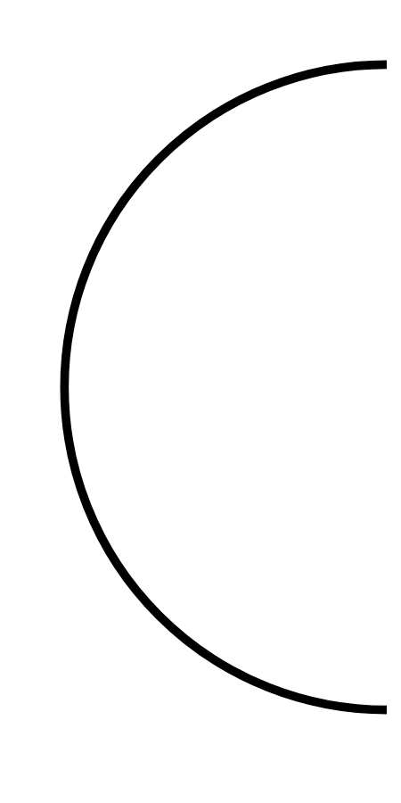

# Hasil

## Grafik

```mermaid
xychart-beta
    title "Perolehan Suara Nasional"
    x-axis []
    y-axis "Suara" 0 --> 0
    bar []
```



## Tabel

| No. | Nama Paslon | Suara | Suara (raw) | Persentase |
|:--- |:----------- | -----:| -----------:| ----------:|


[p-1]: https://github.com/gigit-pemilu/pemilu-2024/blob/main/pilpres/hitung-suara/sub/11-aceh/sub/02-aceh-tenggara/sub/11-babul-rahmah/sub/2028-ukekh-deleng/sub/001-tps/sub/paslon-1.txt
[p-2]: https://github.com/gigit-pemilu/pemilu-2024/blob/main/pilpres/hitung-suara/sub/11-aceh/sub/02-aceh-tenggara/sub/11-babul-rahmah/sub/2028-ukekh-deleng/sub/001-tps/sub/paslon-2.txt
[p-3]: https://github.com/gigit-pemilu/pemilu-2024/blob/main/pilpres/hitung-suara/sub/11-aceh/sub/02-aceh-tenggara/sub/11-babul-rahmah/sub/2028-ukekh-deleng/sub/001-tps/sub/paslon-3.txt

## Foto C Plano

https://sirekap-obj-formc.kpu.go.id/2192/pemilu/ppwp/11/02/11/20/28/1102112028001-20240215-085902--3f6df593-cf02-4184-b689-b98c0915e369.jpg

https://sirekap-obj-formc.kpu.go.id/2192/pemilu/ppwp/11/02/11/20/28/1102112028001-20240215-100245--25aa3832-c689-4c4b-866d-10cc0e2941ce.jpg

https://sirekap-obj-formc.kpu.go.id/2192/pemilu/ppwp/11/02/11/20/28/1102112028001-20240214-195006--6b198d68-f19c-4aa8-9f09-2235ab9a56e3.jpg


## Metadata

| Key        | Value               |
| ---------- | ------------------- |
| Time Stamp | 2024-02-15 20:30:46 |


