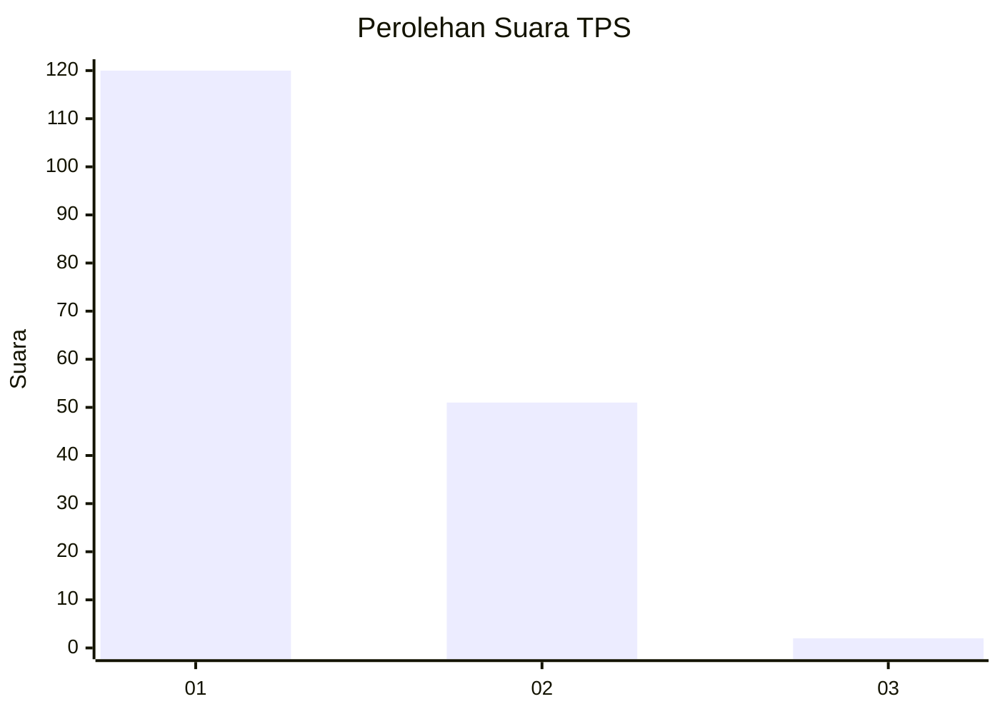
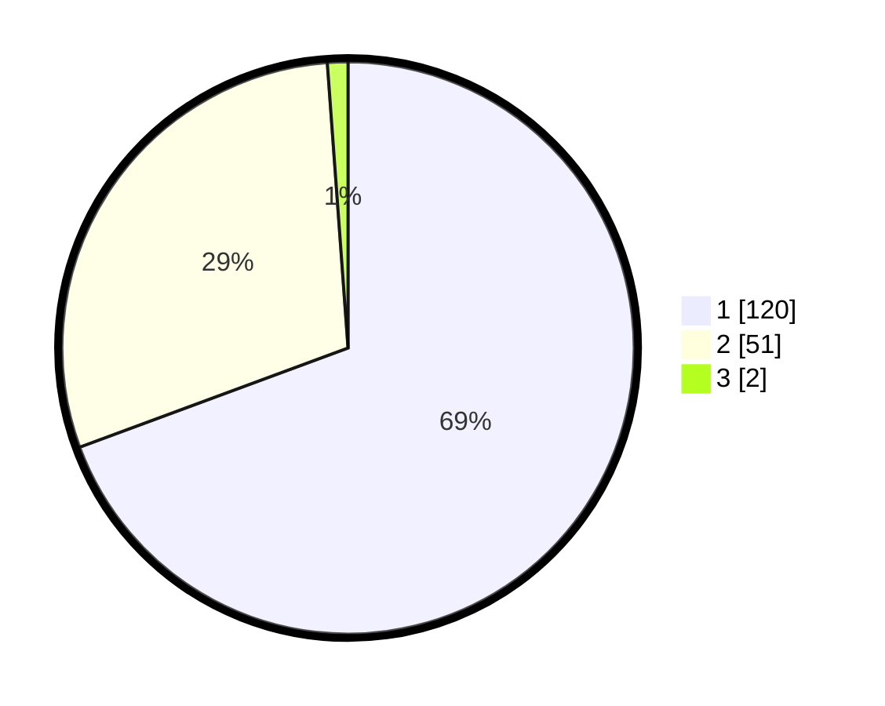

# Hasil

## Grafik

## Tabel

| No. | Nama Paslon    | Suara | Suara (raw) | Persentase |
|:--- |:-------------- | -----:| -----------:| ----------:|
| 1   | ANIES MUHAIMIN | 120   | [120][p-1]  | 69,36      |
| 2   | PRABOWO GIBRAN | 51    | [51][p-2]   | 29,48      |
| 3   | GANJAR MAHFUD  | 2     | [2][p-3]    | 1,16       |

[p-1]: https://github.com/gigit-pemilu/pemilu-2024-11-aceh/blob/main/pilpres/hitung-suara/sub/11-aceh/sub/02-aceh-tenggara/sub/11-babul-rahmah/sub/2029-alas-mesikhat/sub/001-tps/sub/paslon-1.txt
[p-2]: https://github.com/gigit-pemilu/pemilu-2024-11-aceh/blob/main/pilpres/hitung-suara/sub/11-aceh/sub/02-aceh-tenggara/sub/11-babul-rahmah/sub/2029-alas-mesikhat/sub/001-tps/sub/paslon-2.txt
[p-3]: https://github.com/gigit-pemilu/pemilu-2024-11-aceh/blob/main/pilpres/hitung-suara/sub/11-aceh/sub/02-aceh-tenggara/sub/11-babul-rahmah/sub/2029-alas-mesikhat/sub/001-tps/sub/paslon-3.txt

## Foto C Plano

https://sirekap-obj-formc.kpu.go.id/2564/pemilu/ppwp/11/02/11/20/29/1102112029001-20240214-210212--58d16c1b-e012-4637-90a7-7263828045ae.jpg

https://sirekap-obj-formc.kpu.go.id/2564/pemilu/ppwp/11/02/11/20/29/1102112029001-20240214-210238--87ebf5ca-6944-49e6-b4f5-6422183b3bb7.jpg

https://sirekap-obj-formc.kpu.go.id/2564/pemilu/ppwp/11/02/11/20/29/1102112029001-20240215-173359--e14bb8b1-582b-41d6-b369-74cef069b7bf.jpg

## Metadata

| Key        | Value               |
| ---------- | ------------------- |
| Time Stamp | 2024-02-15 18:00:26 |

