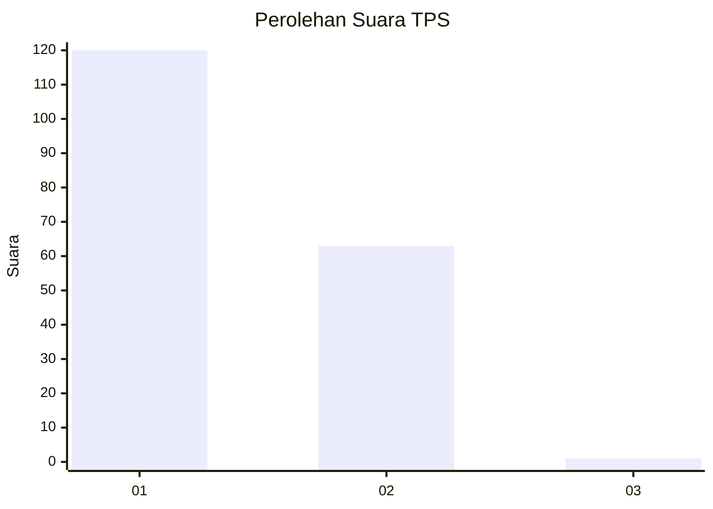
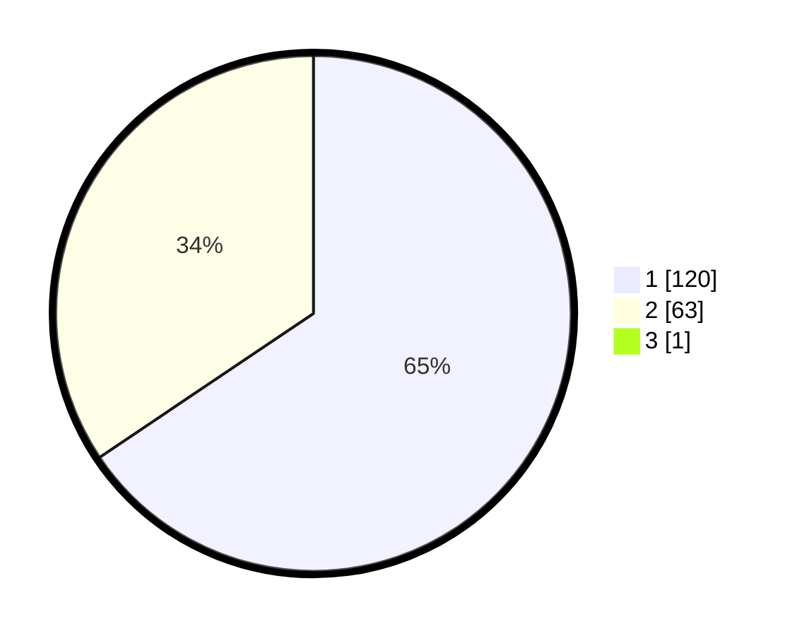

# Hasil

## Grafik

## Tabel

| No. | Nama Paslon    | Suara | Suara (raw) | Persentase |
|:--- |:-------------- | -----:| -----------:| ----------:|
| 1   | ANIES MUHAIMIN | 120   | [120][p-1]  | 65,22      |
| 2   | PRABOWO GIBRAN | 63    | [63][p-2]   | 34,24      |
| 3   | GANJAR MAHFUD  | 1     | [1][p-3]    | 0,54       |

[p-1]: https://github.com/gigit-pemilu/pemilu-2024-11-aceh/blob/main/pilpres/hitung-suara/sub/11-aceh/sub/02-aceh-tenggara/sub/12-ketambe/sub/2002-lawe-penanggalan/sub/001-tps/sub/paslon-1.txt
[p-2]: https://github.com/gigit-pemilu/pemilu-2024-11-aceh/blob/main/pilpres/hitung-suara/sub/11-aceh/sub/02-aceh-tenggara/sub/12-ketambe/sub/2002-lawe-penanggalan/sub/001-tps/sub/paslon-2.txt
[p-3]: https://github.com/gigit-pemilu/pemilu-2024-11-aceh/blob/main/pilpres/hitung-suara/sub/11-aceh/sub/02-aceh-tenggara/sub/12-ketambe/sub/2002-lawe-penanggalan/sub/001-tps/sub/paslon-3.txt

## Foto C Plano

https://sirekap-obj-formc.kpu.go.id/663b/pemilu/ppwp/11/02/12/20/02/1102122002001-20240216-141254--4e05438d-0979-46ca-9a07-391721ea9dd3.jpg

https://sirekap-obj-formc.kpu.go.id/663b/pemilu/ppwp/11/02/12/20/02/1102122002001-20240216-141256--ce51ba48-09f2-4b16-8a78-86a84d7220f2.jpg

https://sirekap-obj-formc.kpu.go.id/663b/pemilu/ppwp/11/02/12/20/02/1102122002001-20240216-141255--db34eed9-0720-47d5-8935-165ea53d7767.jpg

## Metadata

| Key        | Value               |
| ---------- | ------------------- |
| Time Stamp | 2024-02-20 11:00:00 |

## DATA PEMILIH TETAP

Jumlah pemilih dalam DPT: **211**.
 * L: **108**.
 * P: **103**.

## DATA PENGGUNA HAK PILIH

Jumlah pengguna hak pilih dalam DPT: **180**.
 * L: **87**.
 * P: **93**.

Jumlah pengguna hak pilih dalam DPTb: **3**.
 * L: **1**.
 * P: **2**.

Jumlah pengguna hak pilih dalam DPK: **3**.
 * L: **2**.
 * P: **1**.

Jumlah pengguna hak pilih: **186**.
 * L: **90**.
 * P: **96**.

## JUMLAH SUARA SAH DAN TIDAK SAH

JUMLAH SELURUH SUARA SAH: **184**.

JUMLAH SUARA TIDAK SAH: **2**.

JUMLAH SELURUH SUARA SAH DAN SUARA TIDAK SAH: **186**.

