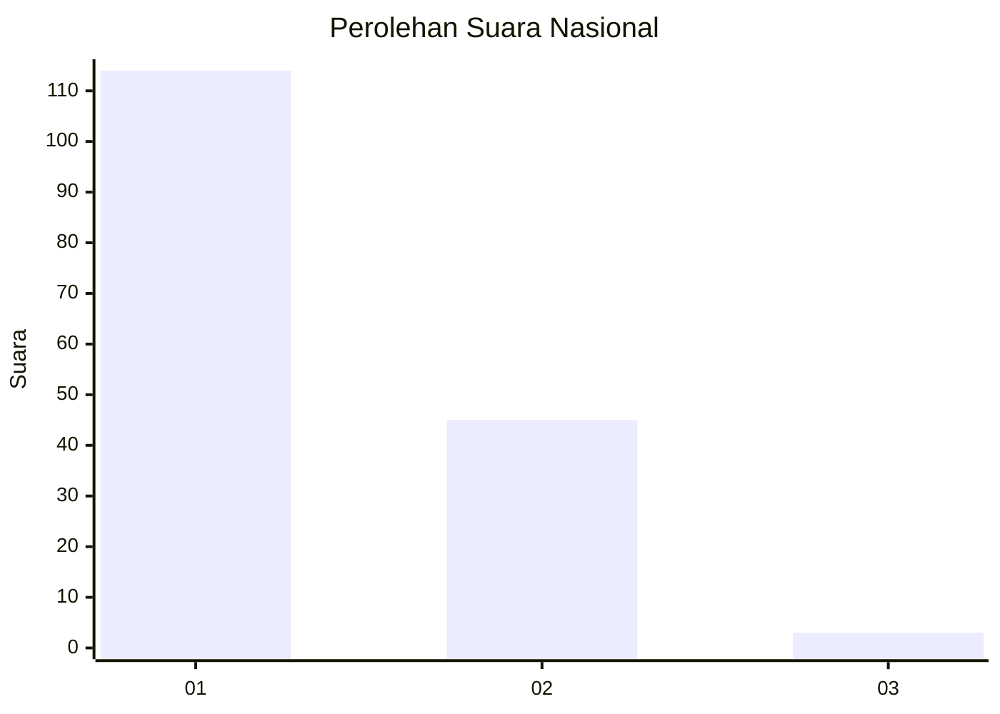
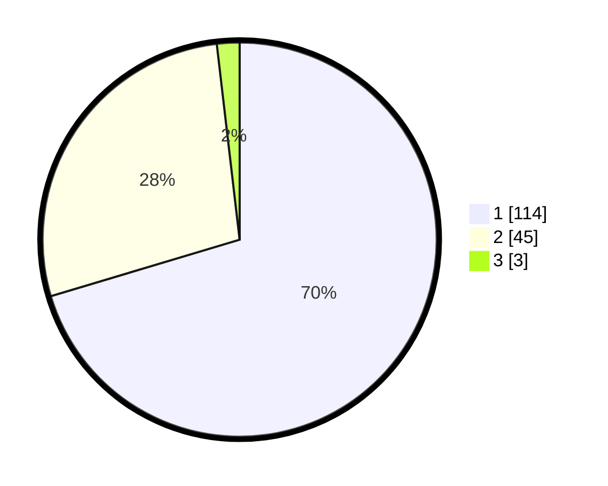

# Hasil

## Grafik

## Tabel

| No. | Nama Paslon    | Suara | Suara (raw) | Persentase |
|:--- |:-------------- | -----:| -----------:| ----------:|
| 1   | ANIES MUHAIMIN | 114   | [114][p-1]  | 70,37      |
| 2   | PRABOWO GIBRAN | 45    | [45][p-2]   | 27,78      |
| 3   | GANJAR MAHFUD  | 3     | [3][p-3]    | 1,85       |

[p-1]: https://github.com/gigit-pemilu/pemilu-2024/blob/main/pilpres/hitung-suara/sub/11-aceh/sub/02-aceh-tenggara/sub/12-ketambe/sub/2003-lawe-mengkudu/sub/001-tps/sub/paslon-1.txt
[p-2]: https://github.com/gigit-pemilu/pemilu-2024/blob/main/pilpres/hitung-suara/sub/11-aceh/sub/02-aceh-tenggara/sub/12-ketambe/sub/2003-lawe-mengkudu/sub/001-tps/sub/paslon-2.txt
[p-3]: https://github.com/gigit-pemilu/pemilu-2024/blob/main/pilpres/hitung-suara/sub/11-aceh/sub/02-aceh-tenggara/sub/12-ketambe/sub/2003-lawe-mengkudu/sub/001-tps/sub/paslon-3.txt

## Foto C Plano

https://sirekap-obj-formc.kpu.go.id/3fb9/pemilu/ppwp/11/02/12/20/03/1102122003001-20240215-112412--0c7ec1d3-9222-4607-a04a-5a1ee831c5de.jpg

https://sirekap-obj-formc.kpu.go.id/3fb9/pemilu/ppwp/11/02/12/20/03/1102122003001-20240219-200239--0877dce5-9be1-47ae-a941-3c51e51ea5e5.jpg

https://sirekap-obj-formc.kpu.go.id/3fb9/pemilu/ppwp/11/02/12/20/03/1102122003001-20240219-200238--f02b233a-1e8d-44f2-b9f1-8a28c58217eb.jpg

## Metadata

| Key        | Value               |
| ---------- | ------------------- |
| Time Stamp | 2024-02-21 12:00:00 |

## DATA PEMILIH TETAP

Jumlah pemilih dalam DPT: **259**.
 * L: **240**.
 * P: **119**.

## DATA PENGGUNA HAK PILIH

Jumlah pengguna hak pilih dalam DPT: **254**.
 * L: **137**.
 * P: **117**.

Jumlah pengguna hak pilih dalam DPTb: **6**.
 * L: **1**.
 * P: **5**.

Jumlah pengguna hak pilih dalam DPK: **2**.
 * L: **1**.
 * P: **1**.

Jumlah pengguna hak pilih: **262**.
 * L: **139**.
 * P: **123**.

## JUMLAH SUARA SAH DAN TIDAK SAH

JUMLAH SELURUH SUARA SAH: **262**.

JUMLAH SUARA TIDAK SAH: **0**.

JUMLAH SELURUH SUARA SAH DAN SUARA TIDAK SAH: **262**.

