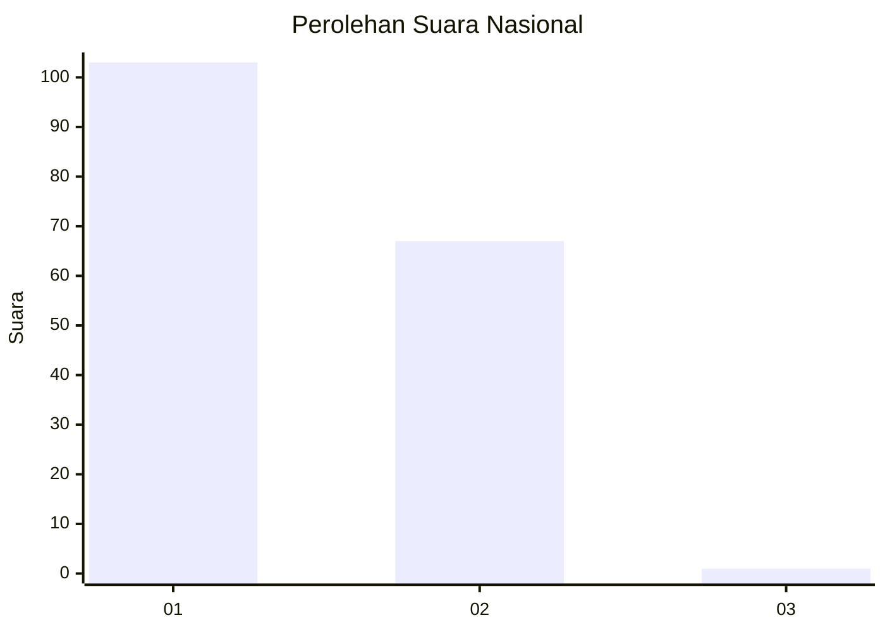
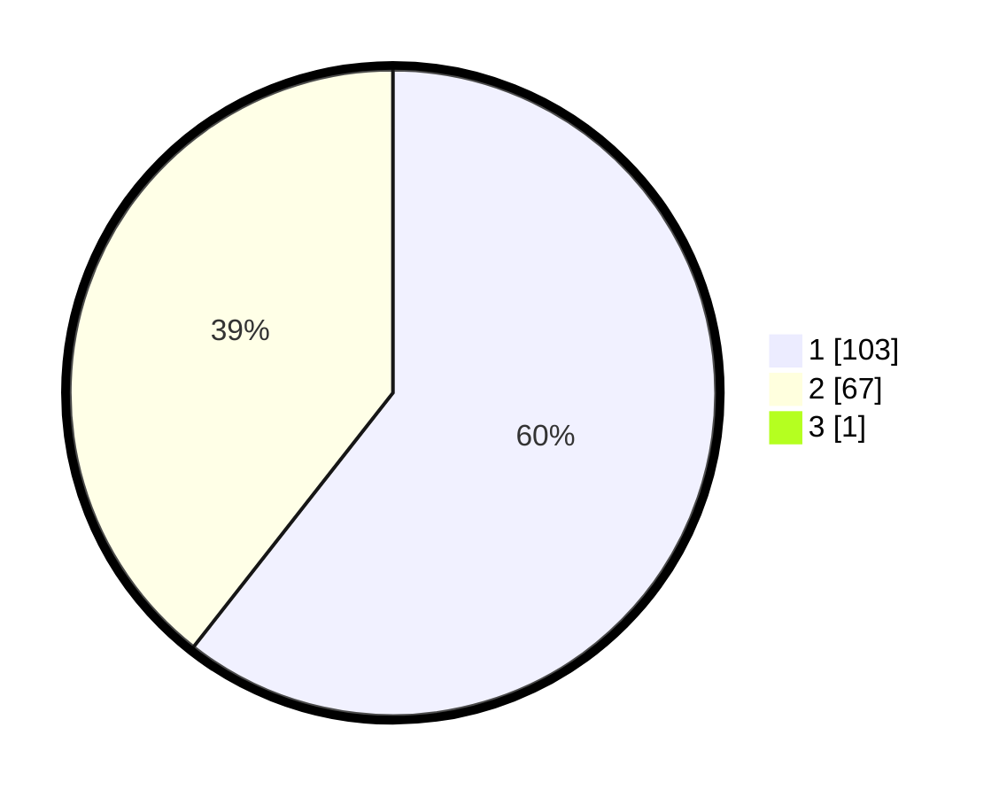

# Hasil

## Grafik

## Tabel

| No. | Nama Paslon    | Suara | Suara (raw) | Persentase |
|:--- |:-------------- | -----:| -----------:| ----------:|
| 1   | ANIES MUHAIMIN | 103   | [103][p-1]  | 60,23      |
| 2   | PRABOWO GIBRAN | 67    | [67][p-2]   | 39,18      |
| 3   | GANJAR MAHFUD  | 1     | [1][p-3]    | 0,58       |

[p-1]: https://github.com/gigit-pemilu/pemilu-2024/blob/main/pilpres/hitung-suara/sub/11-aceh/sub/02-aceh-tenggara/sub/12-ketambe/sub/2004-jambur-lak-lak/sub/001-tps/sub/paslon-1.txt
[p-2]: https://github.com/gigit-pemilu/pemilu-2024/blob/main/pilpres/hitung-suara/sub/11-aceh/sub/02-aceh-tenggara/sub/12-ketambe/sub/2004-jambur-lak-lak/sub/001-tps/sub/paslon-2.txt
[p-3]: https://github.com/gigit-pemilu/pemilu-2024/blob/main/pilpres/hitung-suara/sub/11-aceh/sub/02-aceh-tenggara/sub/12-ketambe/sub/2004-jambur-lak-lak/sub/001-tps/sub/paslon-3.txt

## Foto C Plano

https://sirekap-obj-formc.kpu.go.id/9146/pemilu/ppwp/11/02/12/20/04/1102122004001-20240219-142558--e21dd534-730b-41d4-b3a6-575097bbaf8c.jpg

https://sirekap-obj-formc.kpu.go.id/9146/pemilu/ppwp/11/02/12/20/04/1102122004001-20240219-142600--c14321a6-2139-4fec-acd3-9e4d01636d1a.jpg

https://sirekap-obj-formc.kpu.go.id/9146/pemilu/ppwp/11/02/12/20/04/1102122004001-20240219-142559--dc2e82e7-3d1e-4162-a1aa-02f1e6809985.jpg

## Metadata

| Key        | Value               |
| ---------- | ------------------- |
| Time Stamp | 2024-02-21 22:00:00 |

## DATA PEMILIH TETAP

Jumlah pemilih dalam DPT: **195**.
 * L: **100**.
 * P: **95**.

## DATA PENGGUNA HAK PILIH

Jumlah pengguna hak pilih dalam DPT: **173**.
 * L: **89**.
 * P: **84**.

Jumlah pengguna hak pilih dalam DPTb: **0**.
 * L: **0**.
 * P: **0**.

Jumlah pengguna hak pilih dalam DPK: **0**.
 * L: **0**.
 * P: **0**.

Jumlah pengguna hak pilih: **173**.
 * L: **89**.
 * P: **84**.

## JUMLAH SUARA SAH DAN TIDAK SAH

JUMLAH SELURUH SUARA SAH: **171**.

JUMLAH SUARA TIDAK SAH: **2**.

JUMLAH SELURUH SUARA SAH DAN SUARA TIDAK SAH: **173**.

