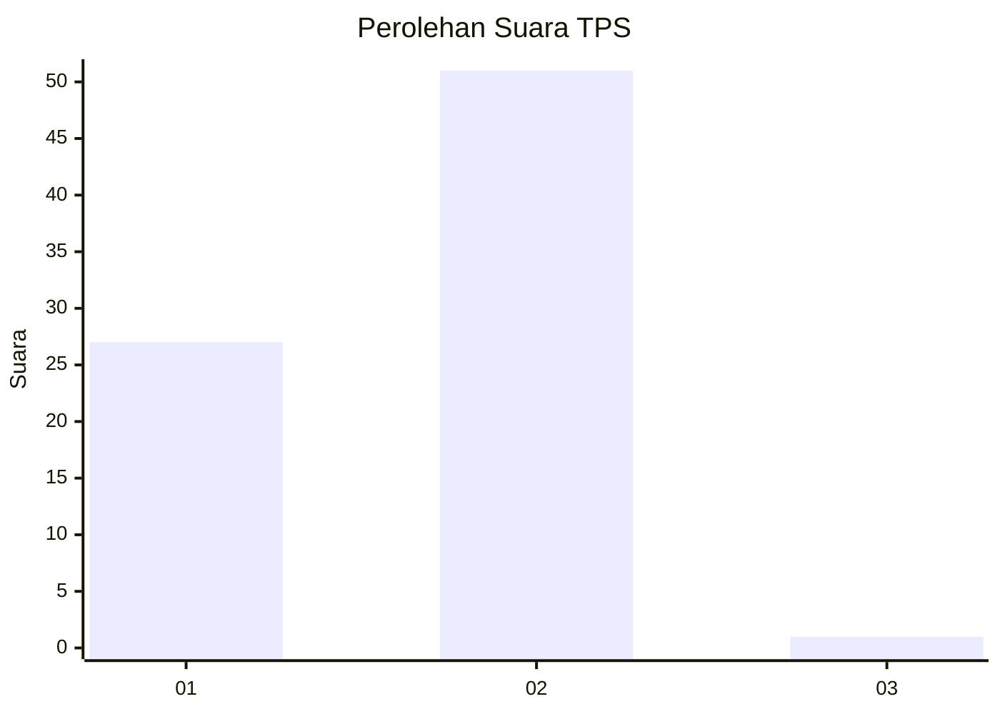
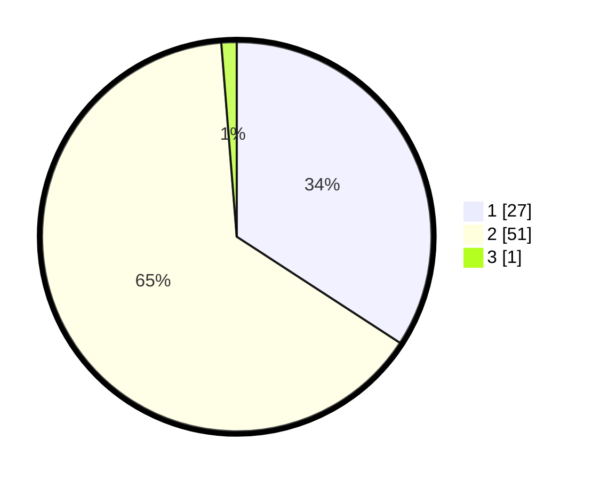

# Hasil

## Grafik

## Tabel

| No. | Nama Paslon    | Suara | Suara (raw) | Persentase |
|:--- |:-------------- | -----:| -----------:| ----------:|
| 1   | ANIES MUHAIMIN | 27    | [27][p-1]   | 34,18      |
| 2   | PRABOWO GIBRAN | 51    | [51][p-2]   | 64,56      |
| 3   | GANJAR MAHFUD  | 1     | [1][p-3]    | 1,27       |

[p-1]: https://github.com/gigit-pemilu/pemilu-2024-11-aceh/blob/main/pilpres/hitung-suara/sub/11-aceh/sub/02-aceh-tenggara/sub/12-ketambe/sub/2005-simpang-tiga-jongar/sub/002-tps/sub/paslon-1.txt
[p-2]: https://github.com/gigit-pemilu/pemilu-2024-11-aceh/blob/main/pilpres/hitung-suara/sub/11-aceh/sub/02-aceh-tenggara/sub/12-ketambe/sub/2005-simpang-tiga-jongar/sub/002-tps/sub/paslon-2.txt
[p-3]: https://github.com/gigit-pemilu/pemilu-2024-11-aceh/blob/main/pilpres/hitung-suara/sub/11-aceh/sub/02-aceh-tenggara/sub/12-ketambe/sub/2005-simpang-tiga-jongar/sub/002-tps/sub/paslon-3.txt

## Foto C Plano

https://sirekap-obj-formc.kpu.go.id/4a6c/pemilu/ppwp/11/02/12/20/05/1102122005002-20240217-152044--fa45a28e-4615-4c82-b13d-4416eb710c57.jpg

https://sirekap-obj-formc.kpu.go.id/4a6c/pemilu/ppwp/11/02/12/20/05/1102122005002-20240217-152424--2658f914-bf39-4a52-84c2-1c0f5ed536e7.jpg

https://sirekap-obj-formc.kpu.go.id/4a6c/pemilu/ppwp/11/02/12/20/05/1102122005002-20240217-152304--c15465ca-632b-4b50-9133-a805edf5e282.jpg

## Metadata

| Key        | Value               |
| ---------- | ------------------- |
| Time Stamp | 2024-02-24 22:31:28 |

